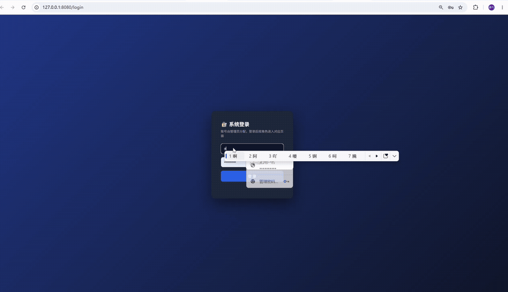
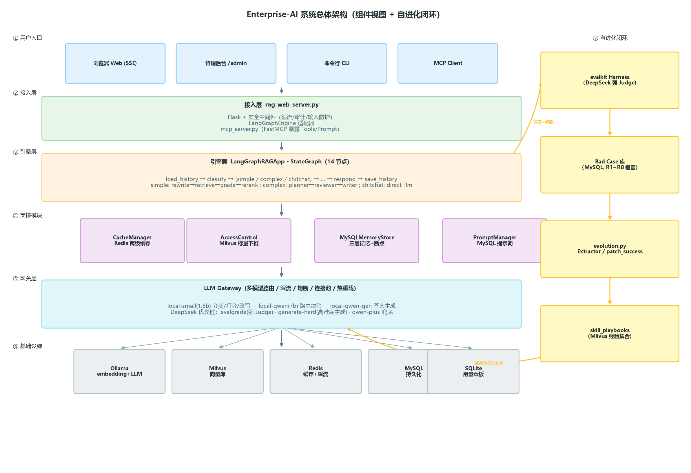
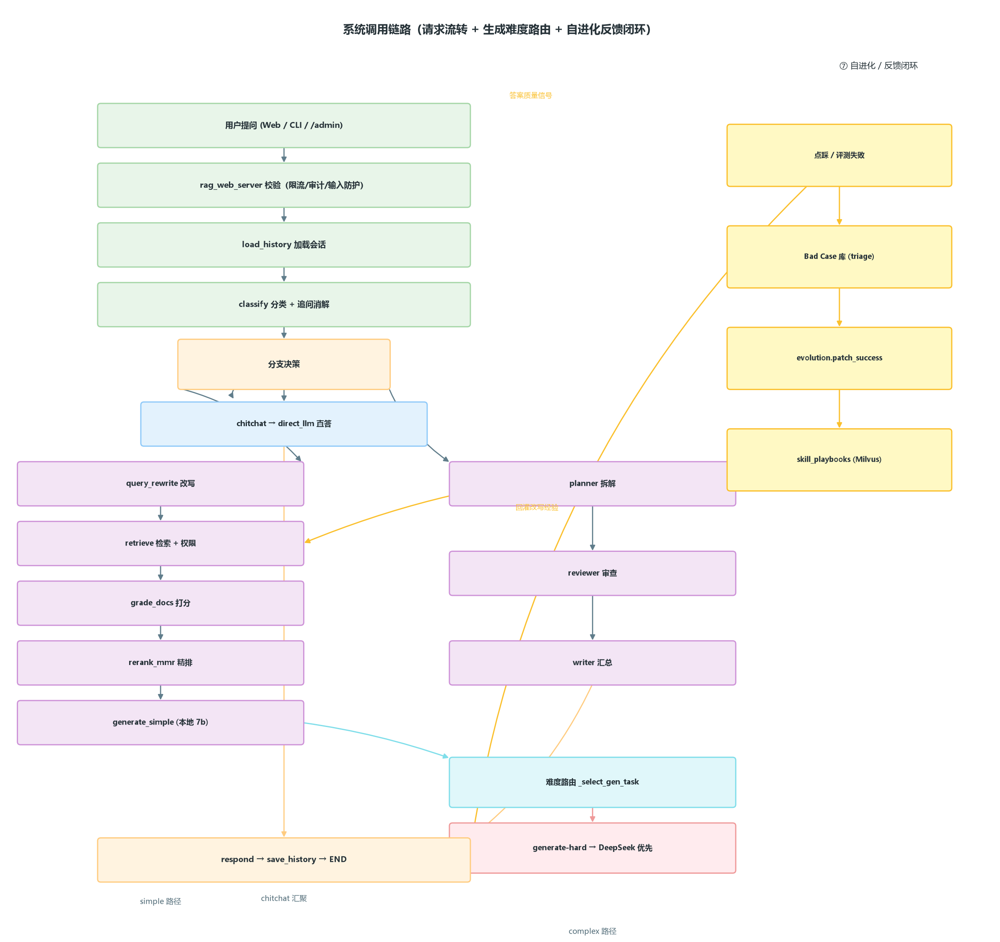
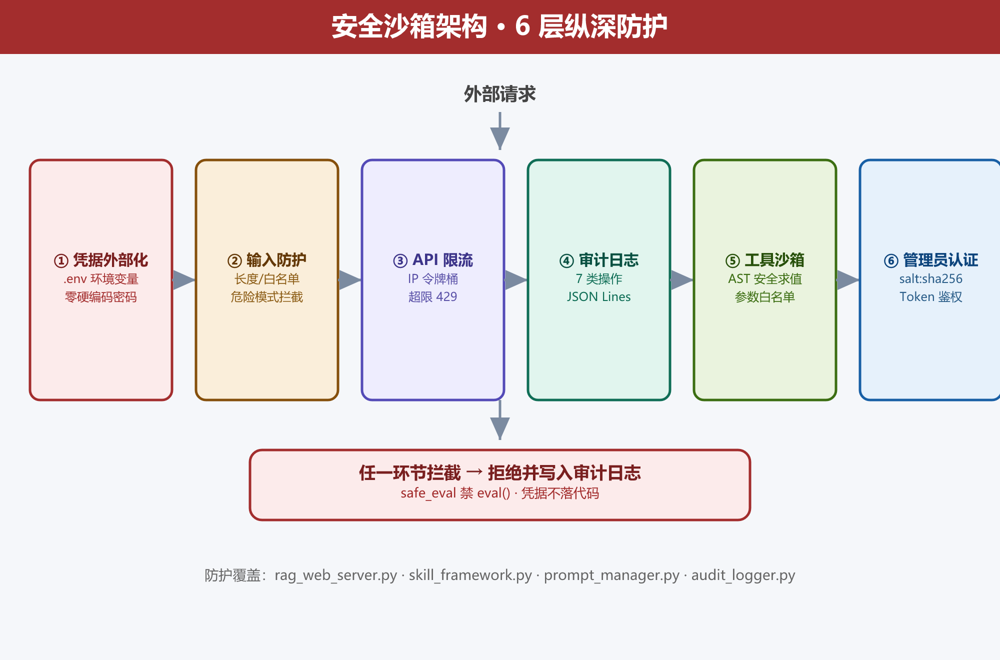
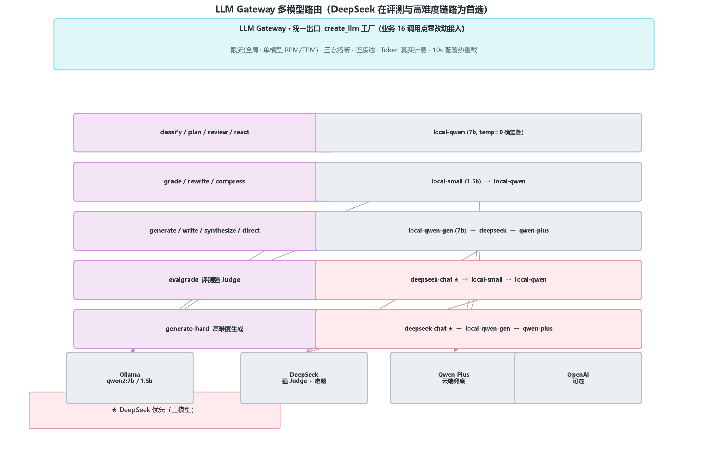
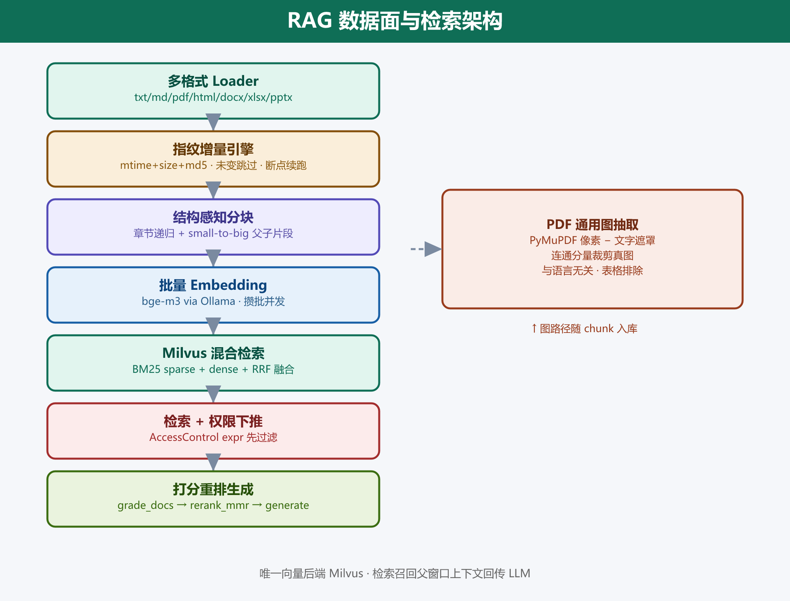
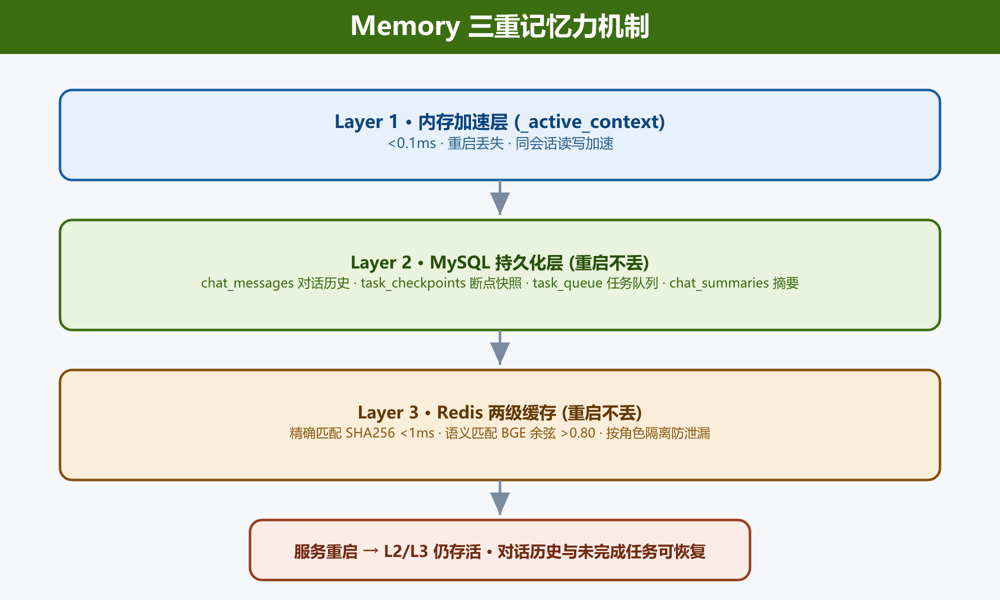
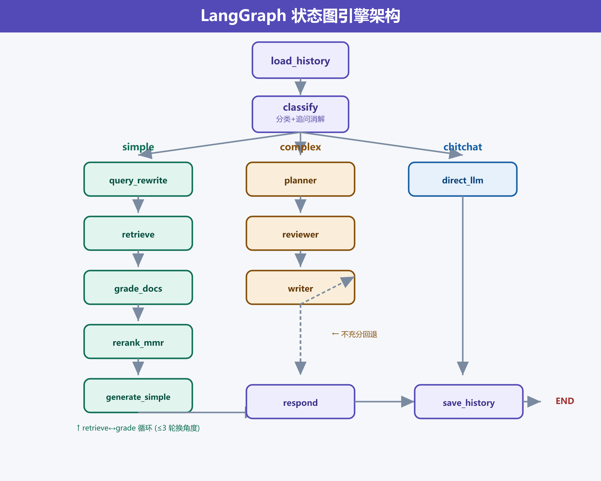

# Enterprise-AI · 企业级 RAG Agent 系统


**企业级自进化 RAG Agent 平台**：基于 LangGraph StateGraph 的多轮检索 + 多智能体引擎 + 企业级 LLM Gateway（评测与高难度生成路由接 DeepSeek）+ 评测 Harness / Bad Case / 自进化闭环；通过 MCP 协议把工具暴露给 Claude Desktop / Cursor / 自研 Agent。

> GitHub: <https://github.com/lingluo1hao/enterprise-ai>

---

## 目录

- [一、项目介绍](#一项目介绍)
- [二、视频演示](#二视频演示)
- [三、技术架构](#三技术架构)
  - [3.1 总体架构（组件视图）](#31-总体架构组件视图)
  - [3.2 系统调用链路（请求流转）](#32-系统调用链路请求流转)
  - [3.3 主要文件说明](#33-主要文件说明)
- [四、依赖项](#四依赖项)
  - [4.1 一键安装](#41-一键安装)
  - [4.2 Python 依赖清单（按分类）](#42-python-依赖清单按分类)
  - [4.3 外部服务依赖](#43-外部服务依赖)
- [五、前置安装](#五前置安装)
- [六、架构详解](#六架构详解)
  - [1. 安全沙箱架构](#1-安全沙箱架构)
  - [2. LLM Gateway 网关架构](#2-llm-gateway-网关架构)
  - [3. RAG 架构](#3-rag-架构)
  - [4. Memory 三重记忆力机制](#4-memory-三重记忆力机制)
  - [5. LangGraph 在本项目的架构](#5-langgraph-在本项目的架构)
  - [6. Harness / Bad Case / 自进化体系](#6-harness--bad-case--自进化体系)
- [七、常见问题](#七常见问题)
- [八、生产部署](#八生产部署)
- [九、文档索引](#九文档索引)

---

## 一、项目介绍

Enterprise-AI 是一套面向企业内部文档的智能知识库 Agent 平台，**核心能力是让系统越用越准**：用评测 Harness 跑出门禁数字、用 Bad Case 库沉淀失败、用自进化闭环把成功经验反向强化回检索，三件套互相闭环把失败样本变成下一次变强的养分。围绕这条主线，平台在引擎、网关、数据面、记忆、安全沙箱、MCP 等维度都做了完整的企业级工程落地。

**系统的两条核心主轴**：

- **自进化主轴**：`evalkit` 评测 Harness（DeepSeek 强 Judge）→ 失败案例沉淀到 `bad_cases` 库 → 后台 triage 写诊断 → `evolution.py` 把成功经验 `patch_success` 到 `skill_playbooks`（Milvus 集合）→ 下次同意图提问直接命中强化后的检索改写经验。
- **难度路由主轴**：生成前 `_select_gen_task(query, tenant)` 按难度分流——硬租户（默认 `jm,yh`，协议类库，幻觉高发）或技术类 query（协议号 `0x..` / 字段 / 组成 / 优先级…）自动切到 `generate-hard`（DeepSeek 优先），普通 query 留本地 qwen2:7b 控成本。

围绕这两条主轴，平台已具备的核心特征：

- **真实环境，无 Mock**：直连 Milvus / Ollama / MySQL / Redis，不依赖任何 mock。
- **LangGraph StateGraph 引擎**：14 节点（13 业务节点 + 内部 START）+ 3 分支路由（simple / complex / chitchat）+ 条件边 + 反馈循环；显式状态机替代手写 ReAct。
- **多模型统一网关**：所有 LLM 调用经 `LLM Gateway`（多模型路由 / 限流 / 熔断 / 连接池 / 热重载 / 真实 Token 计费），业务代码 16 个调用点零改动接入。
- **三重记忆 + 断点重续**：内存加速层 + MySQL 持久化层 + Redis 缓存层，服务重启后对话历史与未完成任务可恢复。
- **百万级数据面**：指纹增量 ingestion 引擎、结构感知分块（章节递归 + small-to-big 父子）、通用 PDF 图抽取。
- **6 层安全沙箱**：凭据外部化、输入防护、API 限流、审计日志、工具 AST 沙箱、管理员认证。
- **MCP 协议对外暴露**：Skill 内核抽到 `skill_framework.py`，经 `mcp_server.py`（FastMCP）暴露为 Tools/Resource/Prompt，Claude Desktop / Cursor / 自研 Agent 零改造复用。
- **多租户 + 三级权限**：基于 Milvus 标量过滤下推的 `super_admin` / `admin` / `user` 三级隔离。
- **提示词工程管理**：11 个提示词模板存于 MySQL，Web 后台在线 CRUD，修改即时生效。

---

## 二、视频演示



> 上方 GIF 为真实页面录屏：管理员登录 `/admin` 后台 → 在线编辑提示词 → 用「管理员在线问答」调试知识库效果 → 查看 Token 用量看板（调用次数 / Token 消耗 / 累计成本 / 平均耗时 / 用户排行 / 每次调用明细）→ 顶部 header 一键「修改密码 / 退出」；普通用户在首页进行企业知识库问答并点击「我的用量」查询个人历史 Token 消耗。所有用量数据通过 SQLite 持久化落盘，重启不丢。

---

## 三、技术架构

本节给读者一张「全局鸟瞰 + 请求如何流 + 每个文件干什么」的速查表。读完后即可对应到代码逐个击破。

### 3.1 总体架构（组件视图）



系统按 **7 层**组织：① 用户入口 → ② 接入层 → ③ 引擎层（LangGraph 14 节点）→ ④ 支撑模块 → ⑤ LLM 网关层 → ⑥ 基础设施，外加 **⑦ 自进化闭环侧栏**。读者沿主列自上而下追一条请求路径，再横向看右侧闭环是怎样把"答案 → 失败 → 经验"反向灌回引擎的。

- **入口层**：浏览器（Web SSE 流式聊天）/ 管理后台 `/admin`（提示词管理 + 在线问答 + Bad Case triage）/ 命令行（`langgraph_rag_agent.py` CLI）/ MCP Client（Claude Desktop / Cursor / 自研 Agent）。
- **接入层**：`rag_web_server.py`（Flask + 6 层安全中间件）+ `LangGraphEngine` 适配器 + `mcp_server.py`（FastMCP 把 Skill 暴露为 Tools/Prompt）。
- **引擎层**：`LangGraphRAGApp` StateGraph 状态机，14 节点（13 业务 + 内部 START），3 分支路由（simple / complex / chitchat），每节点执行后自动写 MySQL 断点快照。
- **支撑模块**：CacheManager（Redis 两级智能缓存）/ AccessControlFilter（Milvus 标量下推）/ MySQLMemoryStore（三层记忆 + 断点）/ PromptManager（MySQL 提示词 + 在线编辑）。
- **LLM 网关层**：所有 LLM 调用必穿 `LLM Gateway`（多模型路由 / 限流 / 熔断 / 连接池 / 10s 热重载 / 真实 Token 计费）。**评测与高难度生成的 DeepSeek 优先链**——`evalgrade`（DeepSeek 强 Judge）与 `generate-hard`（高难度生成）把 DeepSeek 放在链首，这是质量门禁与压幻觉的关键。
- **基础设施**：Ollama（embedding + LLM）/ Milvus（唯一向量库）/ Redis（缓存 + 限流）/ MySQL（持久化）/ SQLite（用量看板）。
- **自进化闭环（核心，详见「6. Harness / Bad Case / 自进化体系」）**：`evalkit` 评测 Harness（DeepSeek 强 Judge）发现失败 → 沉淀进 `bad_cases` 库（MySQL）→ 后台 triage 写诊断 → `evolution.py` 把成功经验 `patch_success` 到 `skill_playbooks`（Milvus 集合）→ 下次同意图提问直接命中强化后的检索改写经验，回灌检索/生成。

### 3.2 系统调用链路（请求流转）



下图按「从上到下」展示一次用户提问经过的全部节点；每层完成一件事后再下沉。

```
用户（浏览器 / CLI / /admin / MCP Client）
    │
    ▼
rag_web_server.py ──Flask + 安全中间件──► 通用流程
    │
    ▼
LangGraphRAGApp · StateGraph（14 节点）
    │
    ├─ load_history ──► classify ──► 分支决策
    │                         │
    │       ┌─────────────────┼──────────────────┐
    │       ▼                 ▼                  ▼
    │   chitchat           simple             complex
    │       │                 │                  │
    │       ▼                 ▼                  ▼
    │   direct_llm    query_rewrite         planner
    │       │             │                   │
    │       │             ▼                   ▼
    │       │          retrieve           reviewer
    │       │             │                   │
    │       │             ▼                   ▼
    │       │        grade_docs            writer
    │       │             │
    │       │             ▼
    │       │      rerank_mmr
    │       │             │
    │       └────────┐    ▼
    │                ▼  generate_simple
    │       ┌────────┘     │
    │       ▼              ▼
    │       └─► 难度路由 _select_gen_task ◄───┘
    │              │  根据 tenant 与 query 关键词分流
    │              ├── 普通 query → generate       (本地 qwen2:7b)
    │              └── 硬租户/技术词 → generate-hard (DeepSeek 优先 ★)
    │                     │
    │                     ▼
    │                  respond ──► save_history ──► END
    │                     │
    │                     └── 答案质量信号 ┐
    │                                      ▼
    │              ┌──── 自进化闭环（右栏）────┐
    │              │  点踩 / 评测失败            │
    │              │       ↓                    │
    │              │  Bad Case 库（triage）     │
    │              │       ↓                    │
    │              │  evolution.patch_success   │
    │              │       ↓                    │
    │              │  skill_playbooks (Milvus)  │
    │              │       ↓                    │
    │              │  回灌检索改写经验 ──────────┘
    │              └──────────────────────────┘
    │
    ├─ CacheManager（Redis 两级智能缓存）
    ├─ AccessControlFilter（Milvus 标量下推）
    ├─ MySQLMemoryStore（三层记忆 + 断点）
    ├─ PromptManager（MySQL 提示词 + 在线编辑）
    │
    ▼
LLM Gateway（llm_gateway.yaml 路由）
    │
    ├─ local-small     (qwen2.5:1.5b)  ← grade / rewrite / compress
    ├─ local-qwen      (qwen2:7b)      ← classify / plan / review / react
    ├─ local-qwen-gen  (qwen2:7b)      ← generate / write / synthesize / direct
    ├─ deepseek-chat   ★ 优先          ← evalgrade（强 Judge）+ generate-hard（高难度）
    └─ qwen-plus / gpt-4o-mini         ← 兜底
    ▼
Ollama（192.168.200.128:11434 / qwen2:7b 等）
Milvus（192.168.200.128:19530，唯一向量库）
Redis（192.168.200.128:6379）
MySQL（192.168.200.128:3306 / rag_agent）
SQLite（llm_usage.db，用量看板）
```

**怎么读这张图**：沿主列自上而下追一条请求路径——浏览器提问 → rag_web_server 校验 → LangGraph 引擎按 `classify` 结果分支 → 命中 **simple** 走 `query_rewrite → retrieve → grade_docs`（最多 3 轮）→ `rerank_mmr → generate_simple` → 难度路由判定；命中 **complex** 走 `planner → reviewer → writer`；命中 **chitchat** 直接 LLM 答 → 全部汇聚到 `respond → save_history → END`，每节点后写 MySQL 断点快照。所有 LLM 调用必穿 LLM Gateway，按 task 路由到合适模型——**生成难度路由** 是关键：硬租户（`jm/yh`）或技术类 query 命中 `generate-hard`（DeepSeek 优先），普通 query 走 `generate`（本地 7b）。**横向看右栏自进化闭环**：答出来的答案经点踩 / 评测失败流入 Bad Case 库 → triage 后 `evolution.py` 强化 playbook → `skill_playbooks` 回灌检索改写经验，闭环生效。

### 3.3 主要文件说明

把上面的链路映射到代码：一个文件对应一层或一组职责。

| 文件 | 作用 |
|------|------|
| `langgraph_rag_agent.py` | **核心引擎**，含 `LangGraphRAGApp` 类、`AgentState` 状态定义、14 个图节点（13 业务节点 + 内部 START）、3 条条件分支（simple/complex/chitchat）、断点保存与恢复。复用 `advanced_rag_agent.py` 的 LLM / 向量库 / 缓存 / 权限过滤等基础组件。**生成难度路由**：`_select_gen_task(query, tenant)` 在生成前按难度切流——硬租户（默认 `jm/yh` 协议库）+ 技术关键词（协议号 `0x..`/字段/组成/优先级…）→ `generate-hard`（DeepSeek 优先），普通 query 留 `generate`（本地 qwen2:7b）；三个环境变量 `GEN_ROUTING_ENABLED` / `GEN_HARD_TENANTS` / `GEN_HARD_PATTERN` 可覆盖。**本次改造点**：reranker 两阶段精排改为 `.env` 驱动（`RERANK_ENABLED` / `RERANK_URL` / `RERANK_TIMEOUT` 去除硬编码）；RRF 融合候选池放大到 `RETRIEVE_CANDIDATE_K=20` 避免 gold 在精排前被 top-k 截断；`_rerank` 增加超长文本防御性截断规避 cross-encoder 长 chunk 500；多租户修复——CLI 新增 `--tenant` 且 `query()` 调用点透传 `tenant_id`（原被 `or "default"` 覆盖）；图查询意图识别拆分为 `figure/table/any`，`generate` 阶段真图（`fig_p*`）优先于表格图（`table_p*`）；`_parse_hits` 出口契约修复（`page_content` 忠实返回子片段，父窗口进 `metadata`，避免同章去重坍缩 / 精排全负 / 命中点被截）。 |
| `advanced_rag_agent.py` | 基础组件库，提供 `OllamaLLM`、`VectorStoreManager`、`CacheManager`、`AccessControlFilter`、`DocSearchSkill` 等可复用类。**`AccessControlFilter` / `search()` / `search_figure_pages()` 的权限下推已扩展为 `tenant_id` + `user_id` + `access_level` 三级标量过滤**（`super_admin` 无 expr、`admin` 仅 `tenant_id`、`user` 加 `access_level/user_id` 约束），所有 LLM 调用统一带 `user=self.username` 以支撑 Token 用量归因。同时保留原 LangChain 版 `RAGOrchestrator` 实现（兼容旧模式）。 |
| `memory_store.py` | **MySQL 持久化记忆模块**，含 `MySQLMemoryStore` 类，管理 4 张表：`chat_messages`（对话历史，按 `user_id` 外键→`admin_users.id` + `session_id` 隔离，列 `speaker_role`=消息说话方 user/assistant/system）、`task_checkpoints`（断点快照）、`task_queue`（任务队列）、`chat_summaries`（对话摘要落库，进程重启不丢）。`save_message` / `save_checkpoint` 使用单条 SQL 原子取号（修复并发撞号）。支持连接池、线程安全、自动降级。 |
| `prompt_manager.py` | **提示词工程管理模块**，含 `PromptManager`（11 个提示词模板的 CRUD + 动态加载）和 `AuthManager`（管理员 `salt:sha256` 密码认证 + `create_user()` 按租户创建用户）。支持从 Web 管理后台在线编辑提示词，修改后即时生效无需重启服务；启动时自动比对 `DEFAULT_PROMPTS` 与 DB 版本，代码更高则同步 MySQL。`generate_answer` / `writer_compose` 系统提示词已加入「保持 Markdown 表格输出 / 原样保留 `[[FIG:...]]` 占位符」要求，配合摄取层的表格与图片抽取。 |
| `audit_logger.py` | **审计日志模块**，JSON Lines 结构化日志。覆盖 `login/logout/query/query_stream/save_prompt/delete_prompt/import_defaults` 7 类操作，字段含 `timestamp/ip/username/action/target/result/detail`。自动轮转（500KB/3 备份）。 |
| `rag_web_server.py` | Web 入口。导入基础组件 + `LangGraphRAGApp`，通过 `LangGraphEngine` 适配器兼容不同引擎。`--langgraph` 开关选择引擎。提供聊天页面（`/`）和管理后台（`/admin`）。内置安全中间件：输入校验、IP 令牌桶限流、审计日志注入。**多租户能力集中在此**：`/api/docs` 按角色+租户过滤知识库列表（admin 直接按租户过滤、user 走 Milvus 标量下推）；`/api/admin/users` 支持按租户创建/管理用户；`/api/docs/upload` 增加实时进度日志（`[docs/upload]`）+ 上传耗时统计；`/api/token-usage` 按 `user_id` 过滤。**`[docs/list]` 日志已收敛**：全盘扫描阶段会标注 `[跨租户-将过滤]`，避免误判越权。**`app.run(threaded=True)` 仅为 Windows 本地开发 fallback**，生产请走下方「生产部署（高并发 · gunicorn）」章节。 |
| `mcp_server.py` | **MCP 协议入口**（FastMCP）。把 `skill_framework.py` 注册的 Skill 重新暴露为 MCP 标准原语：Tools（可调用工具，Claude Desktop / Cursor / 自研 Agent 直接调）、Resources（结构化资源）、Prompts（提示词模板）。外部 Agent 通过 MCP 客户端配置 `mcpServers` 段指向 `mcp_server.py` 即可零改造接入。详见 [MCP_README.md](docs/guides/MCP_README.md)。 |
| `skill_framework.py` | **Skill 内核**：所有可执行能力（计算器 / 文档检索 / 角色权限查询 / 提示词查询 等）的抽象基类 `BaseSkill` + `CalculatorSkill` / `DocSearchSkill` 等。`CalculatorSkill` 弃用 `eval()`，改 AST 白名单安全求值（仅放行数字 + 6 种运算符）；所有 Skill 经 `validate_params()` 参数白名单。这层是工具沙箱的落地点，也是 MCP 暴露的源头。 |
| `gunicorn_config.py` | **高并发生产部署入口**。gunicorn 配置：默认 4 workers × 8 threads（gthread 模式，兼容 SSE 长连接 + 同步 LLM 调用），`post_worker_init` 钩子在**每个 worker 内**调 `init_system()` 完成向量库/编排器初始化——因为 gunicorn 不执行 `__main__`，否则各进程不会初始化、且顶层 `RAG_LANGGRAPH` 已正确默认开启 LangGraph。workers / threads / timeout / worker_class 均可经 `GUNICORN_*` 环境变量覆盖。Linux/VM 上用 `gunicorn -c gunicorn_config.py rag_web_server:app` 启动。注：gunicorn 仅支持 Linux/macOS（依赖 `fcntl`），Windows 本地请用 `waitress-serve` 调试。 |
| `llm_gateway.py` | **企业级 LLM 网关**，统一所有 LLM 调用的出口。内含多模型路由、令牌桶限流（全局+单模型两级 RPM/TPM）、三态熔断降级、HTTP 连接池复用、真实 Token 计数与成本统计、配置热重载。纯标准库实现，零第三方依赖。 |
| `ingest/` | **百万级 RAG 数据面引擎**（改造点落地）。`pipeline.IngestPipeline` 编排「扫 `knowledge/`（递归 `os.walk`，含子目录）→ 指纹增量(`mtime+size+md5`) → 多格式 loader(`txt/md/pdf/html/docx/xlsx/pptx`) → 结构切分 → 批量 embedding(并发池+重试) → 幂等 upsert」；`store.MilvusStoreBackend` 复用现有 Milvus 客户端；`cli` 提供 `ingest/status/delete/rebuild` 子命令。支持增量（仅处理变更文件）、`--force` 全量、`--dry-run` 预检。**单文件上传不再误删其他文件**（显式传入 `files` 时 `removed=[]`）。`loaders._load_pdf` 用 PyMuPDF 抽取表格→Markdown `[TABLE]...[/TABLE]`、抽取插图并在 `chunk.py` 插入 `[[FIG:...]]` 占位符；缺 PyMuPDF 时优雅降级为纯文本。测试见 `tests/test_ingest.py`（零外部依赖，`python tests/test_ingest.py` 直接跑）。 |
| `config/llm_gateway.yaml` | 网关配置文件：模型注册表（本地/云端）、路由表（任务→模型链）、全局流控、连接池、重试与降级参数。改这里不重启进程，10 秒内自动热重载。**关键路由**：`evalgrade: [deepseek-chat, local-small, local-qwen]`（评测强 Judge，DeepSeek 优先）、`generate-hard: [deepseek-chat, local-qwen-gen, qwen-plus]`（高难度生成，DeepSeek 优先）；普通 `generate*/write*` 走本地 7b，DeepSeek 仅兜底。 |
| `config/init_db.sql` | MySQL 建库建表脚本。`admin_users` 表含 `role`（`admin/user/super_admin`）与 `tenant_id`（多租户隔离）字段；已预置 `admin`(default)、`reader`/`viewer`(user,default)、`jm_admin`(admin,jm)、`yh_admin`(admin,yh)、`superadmin`(super_admin,default) 五类演示账号。**8 张业务表**：`chat_messages` / `task_checkpoints` / `task_queue` / `chat_summaries`（记忆）/ `feedback`（用户反馈）/ `bad_cases`（失败样本库，根因 R1~R8）/ `access_rules`（权限规则）/ `tenants`（租户）。 |
| `config/access_rules.yaml` | 文档级权限规则。`JM-S509` 等受限文档名匹配此规则，标 `restricted`，普通用户检索时被 Milvus 标量下推过滤掉。 |
| `config/tenants.yaml` | 多租户注册表。`tenant_id` 与 `admin_users.tenant_id` 一一对应，决定该租户下用户能看哪些文档。 |
| `deploy/` | 部署相关编排。`docker-compose-milvus.yaml`（etcd + MinIO + milvus 单节点三容器 compose，验证过的生产编排）。 |
| `knowledge/` | 存放企业知识库 PDF 文档（ingestion 数据源），首次运行 / `ingest` 时自动构建向量索引（写入 Milvus）。 |
| `scripts/` | 运维 / 验证 / 数据生成脚本集。**核心脚本**：`eval_retrieval_bury.py`（检索召回归一化验证：CURRENT / FIXED-A / RRF 三列对比）、`seed_bad_cases.py`（注入 6 条 Bad Case demo 覆盖 R1~R6 + 三状态）、`mine_golden.py`（从 `task_checkpoints` 在线挖黄金集，待 VM 在线下发）、`gen_pptx.py` / `gen_diagrams.py` / `gen_vertical_video.py` / `gen_youtube_video.py` 等营销物料生成器（基于 matplotlib + edge-tts + ffmpeg，零积分出 PPT/视频）。 |
| `tests/` | 单测集。**逐文件零外部依赖可跑**：`test_ingest.py`（ingestion 链路）、`test_harness_grading.py`（硬化的判分逻辑、16/16 用例验证 4 条历史误判消失）、`test_gen_routing.py`（难度路由决策 7/7）、`test_llm_gateway_models.py`（网关模型注册）。`test_llm_gateway.py` / `test_ingest_integration.py` 需 live Ollama / Milvus，外部依赖不可用时自动跳过。 |
| `evolution.py` | **自进化闭环模块**：`Extractor.evaluate_success`（L1 检索级 / L2 答案级 / L3 反馈级三级成功信号判定）、`patch_success`（Milvus delete+insert 计数回写）、`save_or_merge`（相似去重复用）、`reinforce_feedback`（点赞/踩反馈级强化）、`extract_failure`（失败样本沉淀到 `bad_cases`）。与 Bad Case 库、evalkit 评测 Harness 互哺，详见「6. Harness / Bad Case / 自进化体系」。 |
| `evalkit/` | **评测 Harness 工程**：`runner.py`（CLI 入口，`--suite retrieval\|answer\|both`，落盘 run json + HTML 报表 + 门禁退出码）、`judge.py`（LLM-as-judge，走 `evalgrade` 链 DeepSeek 强 Judge）、`harness_answer.py`（复用真实 `LangGraphRAGApp.query` 跑完整链路）、`triage.py`（R1~R8 自动根因分类）、`schema.py`（聚合 pass_rate / faithfulness / refuse_accuracy）。黄金集 `evalkit/golden/*.jsonl`。 |
| `docs/` | 文档中心：`guides/`（MCP / LLM 网关使用说明）+ `reports/`（RAG 数据面改造、P0 修复、记忆系统升级、Harness/Bad Case/自进化体系等方案与分析报告）。 |

---

## 四、依赖项

### 4.1 一键安装

```bash
pip install langchain langchain-community langgraph \
            "pymilvus~=2.5.0" redis pymysql dbutils \
            flask flask-cors \
            pypdf pymupdf sentence-transformers \
            fastmcp mcp \
            pyyaml
```

> **Milvus 客户端**锁 `2.5.x`（服务端为 v2.5.0，3.x 不兼容 `Function`/BM25 API）。
> **Embedding 走 Ollama**（默认），主进程不加载 torch，无需 `sentence-transformers` 也可跑；仅 `EMBED_BACKEND=local` 时才需要。
> `pyyaml` 用于读取 `llm_gateway.yaml`，缺失则网关回退内置默认配置；缺失 `fastmcp` 仅影响 MCP 子系统，不影响核心问答。

### 4.2 Python 依赖清单（按分类）

| 分类 | 包名 | 用途 | 必需性 |
|------|------|------|--------|
| 核心 RAG | `langchain` / `langchain-community` | 向量检索、文档加载器等 LangChain 基础组件 | 必需 |
| 核心 RAG | `langgraph` | LangGraph 状态图引擎（核心对话 / 多智能体流程） | 必需 |
| 向量库 | `pymilvus` | **唯一向量后端 Milvus**（standalone，`192.168.200.128:19530`）的连接客户端 | 必需 |
| 缓存 | `redis` + `dbutils` | Redis 连接池与两级问答缓存 | 必需（开启缓存时） |
| 持久化 | `pymysql` + `dbutils` | MySQL 连接池（对话历史 / 断点 / 任务队列） | 必需（开启断点重续时） |
| Web | `flask` + `flask-cors` | Web 服务与跨域支持 | 必需（使用 Web 时） |
| 文档处理 | `pypdf` | PDF 文本抽取 | 必需（使用 `knowledge/` 时） |
| 文档图渲染 | `pymupdf` + `numpy` + `scipy` | PDF 真图连通分量裁剪（`fig_p<NNN>_<k>.png`，与语言/caption 无关：靠像素墨迹识别图、长横线计数排除表格） | 可选（任一缺失则优雅降级，仅文字召回、图卡片不可见；`pip install pymupdf numpy scipy pillow`） |
| Embedding | `sentence-transformers` | 仅 `EMBED_BACKEND=local` 时本地 torch 加载 BGE 等模型（自动带 `numpy` 等传递依赖）；默认 `ollama` 模式不装也能跑 | 可选 |
| MCP | `fastmcp` | MCP Server 把 Skill 暴露为 Tools / Resource / Prompt | 可选（使用 MCP 时） |
| MCP | `mcp` | MCP 客户端 SDK（外部调用测试） | 可选（使用 MCP 时） |
| 配置 | `pyyaml` | 解析 `llm_gateway.yaml`（缺失则网关回退内置默认） | 推荐 |

**可选扩展**（按场景按需装）：

| 场景 | 包 | 说明 |
|------|----|------|
| Word / HTML 解析 | `unstructured` | `ingest/` 多格式 loader 完整支持 |
| xlsx 解析 | `openpyxl` | `ingest/` 多格式 loader |
| pptx 解析 | `python-pptx` | `ingest/` 多格式 loader |
| 生产部署（Linux/VM） | `gunicorn` | 4×8 gthread，详见第九节 |
| Windows 本地高并发调试 | `waitress` | 替代 gunicorn 的 WSGI server |

### 4.3 外部服务依赖

| 服务 | 默认地址 | 用途 | 必需性 |
|------|----------|------|--------|
| Ollama | `http://192.168.200.128:11434` | LLM 推理 + bge-m3 嵌入 | 必需 |
| Milvus | `http://192.168.200.128:19530` | 唯一向量后端 | 必需 |
| Redis | `192.168.200.128:6379` | 两级缓存 + 限流 + Token | 可选（降级内存） |
| MySQL | `192.168.200.128:3306` | 记忆持久化 + 断点 | 可选（降级内存） |

---

## 五、前置安装

> 从头到尾约需 15-20 分钟。已有 Python 环境可跳过 5.1。

### 5.1 Python 环境

```bash
# 方式 A：conda（推荐）
conda create -n pythonspace python=3.10
conda activate pythonspace

# 方式 B：venv
python3.10 -m venv venv
# Windows: venv\Scripts\activate  ·  Linux/macOS: source venv/bin/activate
```

### 5.2 安装 Python 依赖

```bash
pip install langchain langchain-community langgraph \
            "pymilvus~=2.5.0" redis pymysql dbutils \
            flask flask-cors \
            pypdf pymupdf sentence-transformers \
            fastmcp mcp \
            pyyaml
```

### 5.3 启动 Ollama 并拉模型

```bash
# 安装：Windows/macOS 从 ollama.com 下载；Linux 用官方脚本
ollama pull qwen2:7b            # 主力生成模型（≈4 GB）
ollama pull qwen2.5:1.5b        # 高频小任务（≈1 GB）
ollama pull bge-m3              # 嵌入模型（≈1.2 GB，必拉，否则检索失败）
ollama list                     # 应输出三条
```

> 本项目默认 Ollama 跑在 VM `192.168.200.128:11434`。如果 Ollama 在本机，把 `.env` 里的 `OLLAMA_URL` 改为 `http://127.0.0.1:11434`。轻量模型 `qwen2.5:1.5b` 拉取慢可走 ModelScope 镜像 `ollama create` 导入，或不拉（自动回落 7b）。

### 5.4 启动 Milvus（向量库，必需）

Milvus 是本项目的**唯一向量后端**（`VectorStoreManager` 已移除本地兜底），不可达时服务启动直接报错。生产采用 **standalone 单节点**（etcd + MinIO + milvus 三个容器，官方 compose 一把起），比分布式省资源，比嵌入式稳定。

**方式 A · 直接用仓库自带编排**（推荐）：

仓库已提供验证过的 `deploy/docker-compose-milvus.yaml`，`scp` 到目标机后一键起：

```bash
# 在部署机上
docker compose -f deploy/docker-compose-milvus.yaml up -d
docker compose -f deploy/docker-compose-milvus.yaml ps      # 三容器 STATE 均 Up
```

**方式 B · 自行创建**（把下面内容存为 `docker-compose-milvus.yaml`）：

```yaml
services:
  etcd:
    image: quay.io/coreos/etcd:v3.5.14
    container_name: milvus-etcd
    restart: always
    environment:
      - ETCD_AUTO_COMPACTION_MODE=revision
      - ETCD_AUTO_COMPACTION_RETENTION=1000
      - ETCD_QUOTA_BACKEND_BYTES=4294967296
    volumes:
      - ./milvus-data/etcd:/etcd
    command: >-
      etcd -advertise-client-urls=http://etcd:2379
      -listen-client-urls http://0.0.0.0:2379 --data-dir /etcd
    healthcheck:
      test: ["CMD", "etcdctl", "endpoint", "health"]
      interval: 5s
      timeout: 8s
      retries: 10
    networks: [milvus-network]

  minio:
    image: minio/minio:RELEASE.2024-05-28
    container_name: milvus-minio
    restart: always
    environment:
      MINIO_ROOT_USER: minioadmin
      MINIO_ROOT_PASSWORD: minioadmin
    volumes:
      - ./milvus-data/minio:/minio_data
    command: minio server /minio_data --console-address ":9001"
    healthcheck:
      test: ["CMD", "curl", "-f", "http://localhost:9000/minio/health/live"]
      interval: 5s
      timeout: 8s
      retries: 10
    networks: [milvus-network]

  milvus:
    image: milvusdb/milvus:v2.5.0
    container_name: milvus-standalone
    restart: always
    command: ["milvus", "run", "standalone"]
    environment:
      ETCD_ENDPOINTS: etcd:2379
      MINIO_ADDRESS: minio:9000
    volumes:
      - ./milvus-data/data:/var/lib/milvus
    ports:
      - "19530:19530"   # gRPC（Python 客户端连这个）
      - "9091:9091"     # HTTP / healthz
    depends_on:
      - etcd
      - minio
    healthcheck:
      test: ["CMD", "curl", "-f", "http://localhost:9091/healthz"]
      interval: 30s
      timeout: 10s
      retries: 10
    networks: [milvus-network]

networks:
  milvus-network:
    driver: bridge
```

> 镜像请用官方源（`quay.io/coreos/etcd`、`minio/minio`、`milvusdb/milvus`）。国内公共镜像站可用性波动，若拉取困难可走能联网机器 `docker pull` + `docker save` + `scp` + 目标机 `docker load` 离线兜底。MinIO 账号 `minioadmin/minioadmin` 可在 compose 中改，但**必须与 Milvus 启动参数一致**。

**配置 `.env`**（Milvus 客户端锁 `pymilvus 2.5.x`，与服务端 v2.5.0 对齐）：

```bash
# .env 新增 / 确认
VECTOR_BACKEND=milvus
MILVUS_URI=http://<MILVUS_HOST>:19530      # 本机用 http://127.0.0.1:19530；VM 用 http://192.168.200.128:19530
MILVUS_COLLECTION=rag_docs
HYBRID_SEARCH=true                          # 混合检索（Dense + BM25），false 则仅向量
```

**资源预估**：standalone 常驻 ~2 GB 内存，最低 4 GB / 2 核 / 10 GB 磁盘，推荐 8 GB（与 Ollama 7B 共存留余量）。

**验证连通**：

```bash
python - <<'PY'
from pymilvus import MilvusClient
c = MilvusClient(uri="http://127.0.0.1:19530")
print("Milvus OK, version:", c.get_server_version())
PY
```

### 5.5 启动 Redis（可选）

```bash
docker run -d --name redis -p 6379:6379 \
  redis --requirepass dev0619
```

### 5.6 启动 MySQL（断点重续依赖，可选）

```bash
docker run -d --name mysql8 \
  -p 3306:3306 \
  -e MYSQL_ROOT_PASSWORD=Root@2026 \
  -e TZ=Asia/Shanghai \
  mysql:8.0.36 \
  --character-set-server=utf8mb4 \
  --collation-server=utf8mb4_unicode_ci
```

**建表**（统一由 `config/init_db.sql` 负责，启动不再自动建表）：

```bash
mysql -h 192.168.200.128 -P 3306 -uroot -pRoot@2026 < config/init_db.sql
```

> 未初始化直接启动 → `memory_store` 提示「缺失表」并降级内存模式，不会崩溃。Redis/MySQL 不可用都不影响核心问答。

### 5.7 准备文档

将企业 PDF 文档放入 `knowledge/` 目录，首次运行 / 执行 `python -m ingest.cli ingest` 自动构建向量索引。

### 5.8 修改配置

```bash
cp .env.example .env
# 编辑 .env：填入真实的 MySQL / Redis / Milvus 密码与地址等
```

# RAG 检索增强（默认已开启，reranker 两阶段精排）
RERANK_ENABLED=true
RERANK_URL=http://<RERANK_HOST>:11436/v1/rerank
RERANK_TIMEOUT=45      # 精排超时（秒）：不可超过 Gunicorn 超时/(RERANK_RETRIES+1)，否则重试还没跑完网关先断

### 5.9 启动 Web 服务

```bash
python rag_web_server.py
# 打开 http://<服务器IP>:8080，使用 admin/admin123 登录
```

---

## 六、架构详解

### 1. 安全沙箱架构



外部请求经 6 层防护后才进入核心逻辑，任一环节拦截即拒绝并写入审计日志。

| # | 防护层 | 机制 | 文件 / 函数 |
|---|--------|------|-------------|
| ① | **凭据外部化** | 所有密码 / 连接串走 `.env` 环境变量，代码零硬编码；`.env` 已在 `.gitignore` | 各模块 `os.getenv()` |
| ② | **输入防护** | 长度上限 + 非空 + 危险模式拦截（`__import__` / `exec()` 等） | `rag_web_server.py` `validate_input()` |
| ③ | **API 限流** | IP 令牌桶：查询 10/min、流式 10/min、登录 20/min、通用 60/min，超限 HTTP 429 | `rag_web_server.py` `RateLimiter` |
| ④ | **审计日志** | JSON Lines 结构化日志（timestamp/ip/username/action/target/result），7 类操作，自动轮转 500KB/3 备份 | `audit_logger.py` |
| ⑤ | **工具沙箱** | `CalculatorSkill` 弃用 `eval()`，改为 AST 白名单安全求值（仅放行数字 + 6 种运算符）；所有 Skill 经 `validate_params()` 参数白名单 | `skill_framework.py` `safe_eval` / `BaseSkill` |
| ⑥ | **管理员认证** | 密码 salt:sha256 哈希，Token 存 Redis（TTL 默认 7 天），所有特权接口验 token | `prompt_manager.py` `AuthManager` |

> 完整设计见 [MCP_README.md](docs/guides/MCP_README.md) 与 `rag_web_server.py` 安全中间件部分。

---

### 2. LLM Gateway 网关架构



**统一 LLM 出口**，对标大厂的多模型治理层。业务代码 16 个调用点零改动接入（统一走 `create_llm()` 工厂）。

#### 核心能力

| 能力 | 说明 |
|------|------|
| **多模型路由** | 按 `task` 分发：`classify/plan/review/react` 死守 7b；`grade/rewrite/compress` 下放 1.5b；`generate/write/synthesize/direct` 走本地 qwen2:7b（temp=0.3），主模型挂了回落 deepseek-chat → qwen-plus。**两条链 DeepSeek 优先（主模型）**：`evalgrade`（评测强 Judge，faithfulness/relevancy 打分）与 `generate-hard`（高难度/硬租户生成，压幻觉）——详见下方路由表与「6. Harness / Bad Case / 自进化体系」。 |
| **令牌桶限流** | 全局 + 单模型两级 RPM/TPM 限流；多实例部署时升级为 `RedisTokenBucket`（Lua 原子）共享配额 |
| **三态熔断降级** | 连续失败自动打开熔断器；半开探活；全链路挂了返回兜底文案 |
| **HTTP 连接池** | 按 host 复用 keep-alive，避免每次请求新建连接 |
| **真实 Token 计费** | 落盘 SQLite 用量看板（`llm_usage.db`）；Web 端「我的用量」+ 管理后台「Token 用量看板」开箱即用 |
| **配置热重载** | 改 `llm_gateway.yaml` 后 10 秒内自动重建运行时，无需重启 |

#### 路由表（`config/llm_gateway.yaml`）

```yaml
routing:
  classify:   [local-qwen]                       # 路由决策（temp=0）
  grade:      [local-small, local-qwen]          # 文档打分（temp=0）
  evalgrade:  [deepseek-chat, local-small, local-qwen]  # 评测强 Judge：DeepSeek 优先（faithfulness/relevancy 精准），未配 key 回落本地零成本
  rewrite:    [local-small, local-qwen]          # 查询改写（temp=0）
  compress:   [local-small, local-qwen]          # 历史压缩（temp=0）
  generate:   [local-qwen-gen, deepseek-chat, qwen-plus]  # 答案生成（temp=0.3），本地优先、云端兜底
  generate-hard: [deepseek-chat, local-qwen-gen, qwen-plus]  # 高难度/硬 tenant(jm,yh)/技术关键词 → DeepSeek 优先生成（压幻觉）
  write:      [local-qwen-gen, deepseek-chat, qwen-plus]
  synthesize: [local-qwen-gen, deepseek-chat, qwen-plus]
  direct:     [local-qwen-gen, deepseek-chat, qwen-plus]
  plan:       [local-qwen, deepseek-chat]
  review:     [local-qwen, deepseek-chat]
  react:      [local-qwen, deepseek-chat]
default_chain: [local-qwen, deepseek-chat, qwen-plus]      # 未命中上表 task 时的兜底链
```

> **为什么 DeepSeek 是「主」而不是「备」**：普通生成（`generate/write/...`）本地 7b 优先、DeepSeek 仅兜底；但 **`evalgrade`（质量门禁的裁判）与 `generate-hard`（高难度生成）把 DeepSeek 放在链首**——评测裁判若用本地 1.5B 会把幻觉判成"相关"（faithfulness 虚高），高难度协议类 query 用本地 CPU 模型易幻觉。两条链的具体触发逻辑见「6. Harness / Bad Case / 自进化体系」。

#### 三个真实修复

1. **全局配额被重复扣减**：原把全局令牌获取放在 fallback 循环内，一次请求试 3 模型扣 3 个全局令牌 → 移到循环外只调一次，加回归测试验证。
2. **AST 字节偏移坑**：批量给 16 处插入 `task=` 时，`ast.end_col_offset` 是 UTF-8 字节偏移，含中文按字符切片崩溃 → 改按字节切片 + 从后往前插入。
3. **流式 `started` 被当时间戳**：`stream_chat` 中 `started`（布尔"已吐首字"）落盘时写成 `time.time() - started`，`latency_s` = 17.8 亿 → 改用独立 `t0`，加钳制。

#### 开关

```bash
USE_LLM_GATEWAY=true   # 默认
USE_LLM_GATEWAY=false  # 一键回退改造前单模型直连（对照/应急）
```

> 完整架构 / 选型权衡 / 踩坑细节见 [LLM_GATEWAY_README.md](docs/guides/LLM_GATEWAY_README.md)。

---

### 3. RAG 架构



RAG 数据面是项目的"地基改造"，围绕**百万级文档**的可观测、可重跑、可恢复重新设计。

#### Ingestion 引擎（`ingest/`）

| 阶段 | 实现 |
|------|------|
| **多格式 Loader** | `txt / md / pdf / html / docx / xlsx / pptx`（缺包则优雅跳过） |
| **指纹增量** | `mtime + size + md5` 三级指纹 → SQLite manifest → 未变文件零开销跳过，崩溃可从断点续跑 |
| **结构感知分块** | Markdown 按 `#`~`####`、HTML 按 `h1`~`h6` 切章节（父子层级透传）；代码块与表格作为原子片段不切断；子片段（默认 400 字）携带父窗口（默认 1200 字） |
| **批量 Embedding** | 攒批（默认 64）+ 线程池并发 + 失败重试，摊薄 Ollama bge-m3 HTTP RTT |
| **幂等 upsert** | `chunk_id = md5(content+source)` → 内容不变同主键覆盖 |

#### 检索链路

```
问题 → Embedding → Milvus 混合检索（BM25 sparse + dense + RRF）
     → AccessControl 标量下推（tenant/user/access_level expr）
     → grade_docs LLM 打分
     → rerank_mmr 去冗余
     → 生成答案（生成时父窗口上下文回传）
```

- **混合检索**：Milvus 原生 `Function` + `FunctionType.BM25`，无需 `rank_bm25` / `jieba`。可用 `HYBRID_SEARCH=false` 关闭。
- **权限下推**：标量 `expr` 在距离计算前过滤；普通用户不会泄露受限文档片段。
- **缓存按角色隔离**：Redis 缓存键含角色，避免 admin 答案通过缓存泄漏给 user。

#### 两阶段精排与图查询意图
- **两阶段精排**：混合检索（Dense + BM25）→ RRF 融合（候选池 `RETRIEVE_CANDIDATE_K=20`）→ cross-encoder rerank（`bge-reranker-v2-m3`，由 `RERANK_URL` / `RERANK_TIMEOUT` 经 `.env` 驱动，超时或失败自动回退 RRF）。候选池放大避免 gold 在精排前被 top-k 截断。**reranker 稳定性做三层防御**：L3 应用端遇 5xx 重试 2 次再回退 RRF（`langgraph_rag_agent.py` `_rerank`）；L1 VM 端 systemd 守护（`-b 4096 -ub 4096` + `Restart=always` + `MemoryMax=2G`）；L2 cron 看门狗兜底「假死」。详见 [Harness_BadCase_自进化体系改造方案.md](docs/reports/Harness_BadCase_自进化体系改造方案.md)。
- **图查询意图识别**：`figure / table / any` 三态拆分，`generate` 阶段真图（`fig_p*`）优先于表格图（`table_p*`），避免协议表格图淹没真正的示意图。

#### PDF 通用图抽取（与语言/caption 无关）

```
渲染整页像素 → 减去文字块遮罩 → 仅留图形墨迹
→ scipy.ndimage 连通分量逐块判定（面积 / 宽高比 / 墨迹密度）
→ 长横线计数 ≤ 0 排除表格
→ 裁剪为 assets/figures/<stem>/fig_p<NNN>_<k>.png
→ chunk 中插入 [[FIG:...]] 占位符 → 问答前端原样还原真图
```

缺 `pymupdf / numpy / scipy` 时优雅降级为纯文本召回。

#### CLI

```bash
python -m ingest.cli ingest                  # 增量
python -m ingest.cli ingest --force          # 全量重建
python -m ingest.cli ingest --dry-run        # 预检
python -m ingest.cli status                  # 已追踪文件清单
python -m ingest.cli delete <path>           # 单文件删除（含本地 PNG 清理）
python -m ingest.cli rebuild <path>          # 单文件强制重建
```

> 详细改造方案见 [docs/reports/RAG数据面改造方案.md](docs/reports/RAG数据面改造方案.md)。

---

### 4. Memory 三重记忆力机制



三层架构解决"服务重启后对话丢失"和"任务中断无法恢复"两个核心问题。所有持久化记录带 `user_id`（外键→`admin_users.id`，符合 3NF），多用户数据零串户。

| 层级 | 存储介质 | 速度 | 持久性 | 用途 |
|------|----------|------|--------|------|
| **Layer 1** | 内存 `_active_context` | <0.1 ms | 重启丢失 | 同会话读写加速 |
| **Layer 2** | MySQL `192.168.200.128:3306` | ~1-5 ms | **重启不丢** | 对话历史 + 断点快照 + 任务队列 + 摘要 |
| **Layer 3** | Redis `192.168.200.128:6379` | <1 ms | 重启不丢 | Q&A 缓存（精确 + 语义） |

#### MySQL 业务表（与记忆相关 4 张，全库共 6 张）

| 表名 | 作用 |
|------|------|
| `chat_messages` | 对话历史，按 `user_id`(外键)+`session_id` 隔离；列 `speaker_role` 标识 user/assistant/system |
| `task_checkpoints` | 断点快照，LangGraph 每个节点执行后自动保存 `state` JSON |
| `task_queue` | 任务生命周期 `pending → running → completed/failed/interrupted` |
| `chat_summaries` | 长对话压缩摘要落库，重启后仍可回放 |

#### Redis 两级缓存

1. **精确匹配**：问题标准化后 SHA256 → 完全相同提问直返（<1 ms）。
2. **语义匹配**：BGE embedding → 扫描历史缓存，余弦 > 0.80 命中。命中时自动补写精确键。**按角色隔离**避免越权。**命中缓存也补录本轮对话历史**（修复此前"缓存命中导致历史空洞"缺陷）。

#### 断点重续流程

```
用户提问
  ├─ MySQL task_queue 创建 status=running
  ├─ LangGraph 每节点执行后 → MySQL task_checkpoints 保存 state JSON
  ├─ 服务宕机 / 用户关闭 → task_queue 中 status 仍为 running
  ├─ 服务重启 → mark_interrupted_tasks() 批量改为 interrupted
  ├─ 用户下次登录 → /api/tasks/unfinished 检测未完成 → 弹窗提示
  └─ 用户点「确定恢复」→ /api/tasks/resume → 读最后快照 → 重新执行图
```

#### 范式整改要点（2026-08）

- `user_id` 从冗余字符串改为 `BIGINT` 外键，4 张表加 `FOREIGN KEY ... ON DELETE CASCADE`。
- `g.current_user["user_id"]` 贯穿 `save_message` / `save_checkpoint` / `create_task` / `get_unfinished_tasks` / `load_messages` / `save_summary` 全链路。
- `/api/history`、`/api/tasks/unfinished`、`/api/tasks/resume` 一律后端派生 `session_id`，前端不再传。
- `save_message` / `save_checkpoint` 用单条 `INSERT ... SELECT COALESCE(MAX(...))+1` 原子取号，修复高并发撞号。

> 完整升级方案见 [docs/reports/UPGRADE_PLAN_MEMORY_KB.md](docs/reports/UPGRADE_PLAN_MEMORY_KB.md)。

---

### 5. LangGraph 在本项目的架构



项目已经从 LangChain 的手写 ReAct 字符串循环，全面迁移到 **LangGraph StateGraph** 显式状态机。

#### 为什么迁移

| 维度 | LangChain 旧版 | LangGraph 新版 |
|------|----------------|-----------------|
| 控制流 | 手写字符串循环，隐式状态 | StateGraph + 条件边，状态可观测 |
| 分支路由 | prompt 分类 + if/else | `add_conditional_edges` 精细路由 |
| 检索循环 | 一次性检索无反馈 | `query_rewrite → retrieve → grade_docs` 闭环（≤3 轮） |
| 多智能体 | 无 | Planner → Researcher → Reviewer → Writer |
| 多轮对话 | 无上下文 | session_id 隔离 + 追问消解 + 摘要压缩 |
| 断点重续 | 无 | 每节点后 state JSON 持久化 |
| 扩展性 | 改核心循环 | 加节点 / 边，不影响现有流程 |

#### 13 个图节点（附详细作用）

| 节点 | 作用 |
|------|------|
| `load_history` | 加载当前会话的对话历史 |
| `classify` | 问题分类（simple/complex/chitchat）+ 上下文消解（追问补全） |
| `query_rewrite` | 查询改写：第 1 轮正常改写，后续轮换角度改写 |
| `retrieve` | 向量库检索（Milvus）+ 权限过滤 |
| `grade_docs` | LLM 批量评分文档相关性 |
| `rerank_mmr` | MMR 重排序（过滤不相关 + 去冗余） |
| `generate_simple` | 基于检索文档生成答案 |
| `planner` | Planner Agent：拆解子任务 + 逐子任务多轮检索 RAG |
| `reviewer` | Reviewer Agent：审查研究结果是否充分 |
| `writer` | Writer Agent：汇总子任务结果撰写最终答案 |
| `direct_llm` | 闲聊分支：直接 LLM 回答 |
| `respond` | 最终回答节点（所有分支汇聚） |
| `save_history` | 保存对话历史，超窗自动摘要压缩 |

> 项目实际图节点数 = 上表 13 个图节点 + LangGraph 内部 `__start__` 入口节点，共 14 个节点参与状态机；状态机入口在项目里被叫做 `START`，但作为执行节点对外可见的就是上面 13 个业务节点。

#### 三条路由分支

1. **simple（简单查询）**：单事实问题 → `query_rewrite → retrieve → grade_docs` 闭环 → `rerank_mmr → generate_simple`。
2. **complex（复杂查询）**：多维度复合（如"定位精度？几种方式？续航如何？"）→ Planner 拆 2-4 子任务 → 各子任务独立多轮检索 → Reviewer 审查（不充分回 Planner） → Writer 汇总。
3. **chitchat（闲聊）**：问候 / 感谢等 → `direct_llm` 直答，不触发检索。

所有分支汇聚到 `respond → save_history → END`，每节点执行后自动保存 state 快照，服务重启可恢复。

---

### 6. Harness / Bad Case / 自进化体系

把「评测 Harness 工程 + Bad Case 失败样本库 + 模型自进化闭环」三件事做成互相打通的完整体系。**主线**：Harness 跑评测发现失败 → 沉淀进 Bad Case 库 → triage 后喂给自进化闭环强化 playbook → 强化结果回灌提升质量。其中 **DeepSeek 被放在两条核心链路的首位**——评测裁判（`evalgrade`）与高难度生成（`generate-hard`），详见各小节。

#### 6.1 评测 Harness 工程（`evalkit/`）

可重复跑的**评测工程**：用一批标注好的黄金问答对（`evalkit/golden/{retrieval,answer}.jsonl`）驱动真实 `LangGraphRAGApp.query` 链路，自动打分，把"靠人眼盯答案"变成"门禁数字"。

```bash
python -m evalkit.runner --suite retrieval|answer|both [--judge-task evalgrade]
```

- `retrieval`：纯检索召回（秒级、零 LLM），输出 MRR / Recall@K / nDCG。
- `answer`：答案层，需 LLM + DeepSeek Judge 打 `faithfulness / relevancy / refuse_accuracy`。
- 落盘 `evalkit/runs/*.json` + `evalkit/reports/*.html`；CI 门禁退出码 `2` 表示有 case 失败。

**关键能力 1 · DeepSeek 强 Judge**（`evalgrade: [deepseek-chat, local-small, local-qwen]`）。原 judge 用本地 1.5B 会把明显幻觉判成"相关"（faithfulness=0.9 虚高）；换 DeepSeek 后同 case 打 0.4 并精准指出"某字段在 context 无出处"。**强 Judge 是"测得准"的基石**——后续 4 条测试框架误判正是 DeepSeek 帮我们识别出来的。

**关键能力 2 · 测试判分硬化**（`evalkit/` 修复）。首跑答案层通过率 11.1%，逐条核对发现 8 条失败 = 4 真问题（幻觉）+ 4 测试框架误判（false positive：否定句子串误杀、拒答关键词表漏匹配等）。判分逻辑已硬化（否定感知禁词 + 语义正则双路拒答判定 + 禁词支持 `regex:` 前缀），4 条误判在冻结答案上由单测 `tests/test_harness_grading.py`（16/16）确认消失。

#### 6.2 生成难度路由（高难度 → DeepSeek）

`langgraph_rag_agent.py` 的 `_select_gen_task(query, tenant)` 在生成前按难度切流：

| 触发条件 | 路由 task | 主模型 |
|---|---|---|
| 命中硬租户（默认 `jm,yh`，幻觉高发的协议库）/ query 命中技术关键词（协议号 `0x..`、字段、组成、优先级、格式、结构…） | `generate-hard` | **DeepSeek 优先** |
| 其它普通 query | `generate` | 本地 qwen2:7b（免费、快） |

三个环境变量可覆盖：`GEN_ROUTING_ENABLED`（总开关）、`GEN_HARD_TENANTS`（硬租户名单）、`GEN_HARD_PATTERN`（技术关键词正则）。DeepSeek 未启用时 `generate-hard` 自动回落本地 qwen，**不崩**。4 条已知真幻觉（jm/yh tenant 的协议类 query）经此路由转 DeepSeek 生成，幻觉预期缓解（非根治，根治需更强本地模型）。

#### 6.3 Bad Case 失败样本库

把失败样本沉淀为可 triage 的资产，闭环入口有三：

| 入口 | 触发 | 落点 |
|---|---|---|
| 用户点踩 | 聊天答案下方「踩 / 反馈」 | `POST /api/feedback` → `memory_store.add_bad_case()`（rating=-1 自动建 `open` 状态） |
| 评测失败 | Harness 跑出失败 case | `pipeline` 来源 |
| pipeline 异常 | 检索未命中 / 负信号 | `pipeline` 来源 |

- **库表** `bad_cases`（`config/init_db.sql` 表 8）：`query/answer/expected/root_cause/diagnosis/status/...`；根因自动分 **R1~R8**（检索缺失 / 噪声 / 改写失败 / 生成偏离 / 答案不符 / 引用错误 / 超时 / 其他）。
- **管理后台** `/admin/bad_cases`：左列表状态分段 + 根因下拉 + 搜索；右抽屉看问题 / 用户答案 / 标准答案 / 自动根因 / 处理记录，可标记 已解决 / 处理中 / 退回重测；统计卡显示待处理 / 处理中 / 已解决率。
- **API**：`GET /api/admin/bad_cases`（筛选）、`PATCH /api/admin/bad_cases/<id>`（更新状态/诊断，`resolved` 自动写 `resolved_at`）、`POST /api/feedback`（点踩沉淀）。
- 想立刻看效果：`python scripts/seed_bad_cases.py` 注入 6 条 demo（覆盖 R1~R6 + 三状态）。

#### 6.4 自进化闭环（`evolution.py`）

用失败样本反向强化 playbook：某条问答被判定"成功"（检索命中 + 答案可信 + 用户点赞），经验 `patch_success` 回写到 `skill_playbooks` 集合，让同意图的后续提问直接命中强化后的经验。

`Extractor.evaluate_success` 返回 `(success, level)`，三级成功信号：

| 级别 | 信号 | 来源 | 状态 |
|---|---|---|---|
| L1 | 检索级 | `doc_grades` 相关文档数达标 | ✅ 已生效 |
| L2 | 答案级 | faithfulness（DeepSeek judge）达标 | 🔧 设计就绪，待接线（管线尚未回写 `faithfulness_score`） |
| L3 | 反馈级 | 用户 rating=+1 赞 / -1 踩归零 | 🔧 设计就绪，待接线（反馈接口尚未把 rating 透传给 `evaluate_success`） |

命中即 `patch_success(pk)`：Milvus 无原地 update，实现为真实 `delete(old) + insert(updated)`，`success_count+1`。`save_or_merge` 做相似去重（命中则合并计数不重复插）。

**Milvus 距离失真坑（已修）**：standalone 的 `AUTOINDEX+COSINE` 距离失真——相同向量 search 返回 `distance=1.0`、top3 非升序。playbook 用纯 dense COSINE，**不能信距离**。`query_similar` 加 `_is_match` 文本相似度兜底（`intent_text` 完全相同 / `difflib≥0.92` 即判命中）+ `consistency_level="Strong"`（刚插入立即可搜）+ `_ensure` 维度漂移自修复。经验：任何基于 Milvus 余弦距离做阈值判定的逻辑都要加文本兜底。

**与 Bad Case 互哺**：Bad Case 的 `open` 案例 → triage 后喂给自进化（失败样本反向指导 playbook 修复）；自进化强化后的 playbook → 提升生成质量 → 减少新 Bad Case。

> **诚实边界**：当前"自进化"沉淀的是**检索改写经验 `rewrite_text`**（让类似问题走已知好的首轮改写），**不是预写答案**——答案仍由 LLM 实时生成。L2/L3 强化通路代码已写好但尚未接线，属可验证的诚实状态，非"已全自动进化"。

#### 6.5 怎么跑这套体系

```bash
# 注入 .env（含 DEEPSEEK_API_KEY，否则 evalgrade 回落本地、generate-hard 回落 qwen，功能降级但不崩）
set -a && source .env && set +a

# 检索层门禁（秒级）
python -m evalkit.runner --suite retrieval --mode pipeline

# 答案层门禁（需 LLM + DeepSeek Judge）
python -m evalkit.runner --suite answer --judge-task evalgrade

# 全量
python -m evalkit.runner --suite both --judge-task evalgrade

# 注入 Bad Case demo 数据
python scripts/seed_bad_cases.py
```

> 完整设计、验收数字与遗留项见 [Harness_BadCase_自进化体系改造方案.md](docs/reports/Harness_BadCase_自进化体系改造方案.md)。

---

## 七、常见问题

### 安装与启动

**Q1. pip install 报错 / 依赖冲突？**
- 确认已激活虚拟环境；先装 `langchain` 再装 `langgraph` 再装 `pymilvus` 逐步排错。
- `pymilvus` 必须锁 **2.5.x**，3.x 与服务端 v2.5 不兼容。

**Q2. 启动 Web 服务后无法访问？**
- Windows 上必须用 PowerShell / CMD 启动（Milvus 走网络不受 Shell 限制）。
- 检查端口：`netstat -ano | findstr :8080`。

**Q3. 连接 Ollama 失败？**
```bash
ollama list                        # 看已装模型
curl http://192.168.200.128:11434/api/tags   # 测试 API
ollama pull bge-m3                 # 必须拉取！否则检索失败
```

### 数据层

**Q4. 连接 Redis 失败 / 缓存不生效？**
- `redis-cli -h <IP> -p 6379 -a <密码> ping` 应返回 `PONG`。
- 缓存不可用会自动降级，不影响核心问答。

**Q5. 连接 MySQL 失败 / 断点恢复不生效？**
- 检查 `rag_agent` 库及 6 张业务表是否已创建（先执行 `config/init_db.sql`）。
- MySQL 不可用会自动降级内存模式，断点恢复仅在 LangGraph 模式下可用。

**Q6. 向量库未构建（Milvus）？**
- 首次运行 / `python -m ingest.cli ingest` 会自动扫描 `knowledge/` 构建索引。

### 安全与权限

**Q7. 权限没有生效？**
- 文件名包含 `JM-S509` 才标记为受限文档（`config/access_rules.yaml`）。
- 普通用户只能在聊天页 `/` 提问（看公开文档）；admin 在 `/admin` 后台「在线问答」可看全部。

**Q8. `.env` 文件不见了 / 部署后服务启动不了？**
- `.env` 已 `.gitignore` 排除，新环境需手动 `cp .env.example .env` 并填真实密码。

**Q9. API 返回 429 Too Many Requests？**
- IP 令牌桶限流触发（查询 10/min 等）。等几秒重试即可恢复。
- 修改阈值：`rag_web_server.py` `_get_rate_limit_for_route()`。

### 引擎相关

**Q10. LangGraph 模式 vs 旧版模式如何选择？**
- LangGraph（`python rag_web_server.py` 默认）：多轮检索 + 多智能体 + 多轮对话 + 断点。**推荐**。
- 旧版（`--no-langgraph`）：单次检索 + 一次生成，速度快但可能遗漏。应急/对照用。

**Q11. 回答与问题不相关 / 明显在"编"答案？**
- 系统两层防护：① `grade_docs` 收紧为"直接相关"；② `generate_answer` / `writer_compose` 提示词要求"文档无法回答时必须回答：未检索到相关内容"。
- 可到管理后台检查 `generate_answer` 与 `grade_docs` 提示词是否为最新默认版本（v10+），或点「恢复默认」一键同步。

**Q12. 提示词修改后没生效？**
- 修改后即时生效，无需重启。确认点过「保存」按钮。
- 可在管理后台「在线问答」立即测试效果。

**Q13. 管理后台登录不了 / 忘记密码？**
- 默认 `admin/admin123`。
- 手动重置（MySQL 中）：
  ```sql
  -- Python 先生成新密码哈希：
  -- salt = os.urandom(16).hex()
  -- pwd = salt + ":" + hashlib.sha256((salt + "新密码").encode()).hexdigest()
  UPDATE admin_users SET password_hash = '<生成的值>' WHERE username = 'admin';
  ```

### 高级

**Q14. 怎么开关 LLM 网关 / 回退单模型直连？**
- `export USE_LLM_GATEWAY=false` 一键回退，业务代码无需改动。
- 改 `llm_gateway.yaml` 后 10 秒内自动热重载。

**Q15. 怎么让别的 AI 客户端（Claude Desktop / Cursor / 自研 Agent）用上我的工具？**
- 详见 [docs/guides/MCP_README.md](docs/guides/MCP_README.md)：安装 `fastmcp` → 客户端 MCP 配置加 `mcpServers` 段指向 `mcp_server.py` → 或远程 `python mcp_server.py --http` → 或跑 `python mcp_client_example.py` 自验证。

**Q16. 运行时 segfault / 闪退？**
- 本项目 Embedding 默认 **Ollama 模式**（`EMBED_BACKEND=ollama`），主进程**完全不加载 torch**，历史上「SentenceTransformer + fork 多 worker 触发 OpenMP/MKL segfault」已根除。
- 仍遇崩溃请排查：① Python 3.10 环境；② Linux VM 用 `gunicorn --preload`（父进程先 import 再 fork）。

**Q17. Token 用量怎么用 SQLite 而不是 MySQL？**
- 故意边界隔离：网关保持零依赖契约；故障域隔离（MySQL 挂了账本要活到最后）；写入模型简单（单进程 INSERT 追加）；降低开源上手门槛（无需装数据库）。**多实例部署 / 千 QPS / 联表计费**任一成立就该迁 MySQL——所有 DB 操作收敛在 `UsageStore` 一个类，换库只改这一处。

---

## 八、生产部署

> gunicorn 仅支持 **Linux/macOS**（依赖 `fcntl`）。本项目实际部署在 Linux VM（`192.168.200.128`），请在 VM 内启动。

```bash
# VM 内
pip install gunicorn
gunicorn -c gunicorn_config.py rag_web_server:app
# 或覆盖参数
GUNICORN_WORKERS=8 GUNICORN_THREADS=16 PORT=8080 \
  gunicorn -c gunicorn_config.py rag_web_server:app
```

**关键设计**：
- 默认 4 workers × 8 threads（gthread 模式，兼容 SSE 长连接 + 同步 LLM 调用）。
- `post_worker_init` 钩子在每个 worker 内调 `init_system()`（gunicorn 不执行 `__main__`）。
- 多 worker 同时初始化向量库时用 Redis 分布式锁（`rag:init:vectorstore:lock`）保证唯一重建。
- LangGraph 开关由 `RAG_LANGGRAPH`（默认 `true`）控制，不再写死。
- LLM 网关的 RPM/TPM 令牌桶在多实例部署时升级为 `RedisTokenBucket`（Lua 原子），全局配额一致不被放大。

**Windows 本地调试替代**：
```bash
pip install waitress
waitress-serve --threads=8 --port=8080 rag_web_server:app
```

**调优参数（环境变量）**：

| 变量 | 默认 | 说明 |
|------|------|------|
| `GUNICORN_WORKERS` | 4 | worker 数，建议 `2×CPU+1` |
| `GUNICORN_THREADS` | 8 | 每 worker 线程数 |
| `GUNICORN_TIMEOUT` | 120 | 单请求超时（LLM 慢要给足） |
| `RAG_LANGGRAPH` | true | false 关闭 LangGraph 引擎 |

---

## 九、文档索引

| 文档 | 内容 |
|------|------|
| [LLM_GATEWAY_README.md](docs/guides/LLM_GATEWAY_README.md) | LLM Gateway 完整设计：路由表 / 配置字段 / 选型权衡 / 踩坑 |
| [MCP_README.md](docs/guides/MCP_README.md) | MCP 改造：原语映射 / 客户端接入 / 安全延续 |
| [docs/reports/RAG数据面改造方案.md](docs/reports/RAG数据面改造方案.md) | 数据面改造方案：背景 / 目标 / 设计 / 前后对比 |
| [docs/reports/UPGRADE_PLAN_MEMORY_KB.md](docs/reports/UPGRADE_PLAN_MEMORY_KB.md) | 记忆系统升级：分阶段方案 / P0 落地 / 验证 |
| [docs/reports/P0_FIX_PLAN.md](docs/reports/P0_FIX_PLAN.md) | P0 修复计划：隔离 / 角色矩阵 / 上传流程 |
| [docs/reports/RAG自进化与修复方案.md](docs/reports/RAG自进化与修复方案.md) | RAG 自进化方案 + 回答不准根因修复：num_ctx 截断 / PyMuPDF 伪表格 / 整章图透传 / 上下文暴涨 |
| [docs/reports/rag_retrieval_upgrade/RAG检索大厂化改造方案.md](docs/reports/rag_retrieval_upgrade/RAG检索大厂化改造方案.md) | RAG 检索召回链路优化：reranker 两阶段精排 .env 化 + RRF 候选池放大 + 多租户 tenant 透传修复 + 图查询真图意图优先；含 CURRENT/FIXED-A/RRF 三列量化验证（配图见同目录 `images/`） |
| [docs/reports/Harness_BadCase_自进化体系改造方案.md](docs/reports/Harness_BadCase_自进化体系改造方案.md) | Harness / Bad Case / 自进化 体系改造方案：以「评测 Harness 工程 + Bad Case 失败样本库 + 模型自进化闭环」三件事为主线，含 DeepSeek 强 Judge、生成难度路由、测试判分硬化、reranker 三层防御、evalkit 框架修复，及第七部分环境/部署/外部依赖坑记录 |
| [docs/reports/BadCase9_答非所问_根因诊断报告.md](docs/reports/BadCase9_答非所问_根因诊断报告.md) | Bad Case #9 根因复盘：`_parse_hits` 出口契约错位（`page_content` 被偷换为整章父文本 + 入库字节截断导致答案在写库时被物理删除）导致答非所问；含 A/B 对照验证与修复，是「检索层铁律」的实证来源 |

---

**License**: MIT · **Maintainer**: <https://github.com/lingluo1hao>