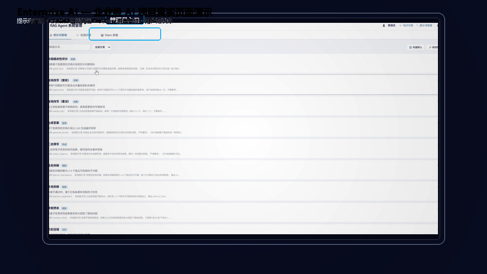

# enterprise-ai


企业智能知识库问答系统 —— 基于 LangGraph RAG 的私有文档问答 Agent，支持多层记忆与断点重续。

---

## 项目简介

本项目是一个面向企业文档的智能问答系统，能够对 PDF 文档进行向量化存储，并通过自然语言提问快速返回准确答案。核心已从 LangChain 迁移至 **LangGraph StateGraph**，实现了精细条件分支、多轮检索反馈循环、多智能体协作和多轮对话。

后端使用本地部署的 **Ollama** 大模型进行推理，数据存储在 **ChromaDB** 向量数据库中，支持 **Redis 两级智能缓存**加速重复问题，并通过 **MySQL 多层记忆**实现对话历史持久化和任务断点重续。系统同时提供了命令行交互界面和 Web 图形界面。

## 核心特性

- **真实环境，无 Mock**：直接连接本地 ChromaDB 向量数据库与 Ollama 大模型。
- **企业级 LLM 网关（LLM Gateway）**：所有 LLM 调用经统一网关出口，支持多模型路由（小模型接管分类/打分/改写/压缩等高频任务，大模型负责生成/规划）、令牌桶限流（全局+单模型两级 RPM/TPM）、三态熔断降级、HTTP 连接池复用、真实 Token 计数与成本统计、配置热重载（改 yaml 不重启）。业务代码 16 个调用点零改动接入，可一键回退单模型直连。
- **LangGraph 状态机驱动**：显式 StateGraph 替代手写 ReAct 循环，14 个节点 + 条件边精细路由。
- **三路智能分支**：简单查询走「多轮检索」、复杂问题走「多智能体协作」、闲聊直接回答。
- **多轮检索反馈循环**：query_rewrite → retrieve → grade_docs，不相关自动换角度重新检索（最多 3 轮）。
- **多智能体协作**：Planner 拆解子任务 → Researcher 并行检索 → Reviewer 审查把关 → Writer 汇总成稿。
- **多轮对话**：session_id 隔离上下文，追问自动消解（"那它的续航呢？" → 完整问题），超窗摘要压缩。
- **三层记忆架构**：内存加速层 + MySQL 持久化层 + Redis 缓存层，服务重启后对话历史不丢失。
- **断点重续**：LangGraph 每个节点执行后自动保存 state 快照到 MySQL，服务宕机或用户关闭客户端后，下次登录可检测并恢复未完成的任务。
- **MMR 重排序 & 多样性补搜**：最大边际相关性去冗余，避免信息遗漏。
- **Redis 两级缓存**：精确匹配（SHA256 <1ms）+ 语义匹配（BGE embedding 余弦相似度 > 0.80）。
- **文档级访问控制**：支持普通用户与特权用户，敏感文档按权限隔离，缓存也按角色隔离。
- **提示词工程管理系统**：11 个提示词模板存储于 MySQL，通过管理后台（`/admin`）在线 CRUD，修改后即时生效无需重启。内置管理员认证（salt:sha256），支持版本化默认提示词升级。
- **安全沙箱加固**：密码 `.env` 环境变量管理（不落代码）、输入防护（长度/字符白名单/危险模式拦截）、API 令牌桶限流（4 档阈值 + HTTP 429）、结构化 JSON 审计日志（7 类操作）、工具沙箱（AST 安全求值器 + 参数白名单校验）。
- **MCP 生态暴露**：Skill 内核抽到 `skill_framework.py`，经 `mcp_server.py`（FastMCP）暴露为标准 MCP `Tools` / `Resource` / `Prompt`，任意兼容 MCP 的 AI 客户端（Claude Desktop / Cursor / 自研 Agent）可零改造复用你的工具（详见下方「MCP 生态」章节）。
- **Web 图形界面**：基于 Flask + SSE 实时推送推理进度，自动检测未完成任务并弹窗提示恢复。聊天页面（`/`）与管理后台（`/admin`）权限隔离。

## 界面预览



> 上图 GIF 为 **Enterprise AI** 项目真实页面录屏制作：管理员在 `/admin` 后台管理提示词、使用「管理员在线问答」调试知识库效果、查看全站 **Token 用量看板**（调用次数 / Token 消耗 / 累计成本 / 平均耗时 / 用户排行榜 / 每次调用明细）；普通用户在首页进行企业知识库问答并点击「我的用量」查询个人历史 Token 消耗。所有用量数据通过 SQLite 持久化落盘，重启不丢。

## 项目结构

```
enterprise-ai/
├── langgraph_rag_agent.py  # 【核心】LangGraph 引擎：StateGraph + 多轮检索 + 多智能体 + 多轮对话 + 断点重续
├── advanced_rag_agent.py   # 基础模块（OllamaLLM / VectorStoreManager / CacheManager / AccessControlFilter）
├── memory_store.py         # MySQL 多层记忆持久化（对话历史 + 断点快照 + 任务队列）
├── prompt_manager.py       # 提示词工程管理 + 管理员认证（PromptManager + AuthManager）
├── audit_logger.py         # 审计日志模块（JSON Lines 结构化日志，7 类操作记录）
├── rag_web_server.py       # Flask Web 服务 + SSE 进度推送 + 聊天界面 + 管理后台 + 安全中间件
├── skill_framework.py          # 【MCP 改造】协议无关的 Skill 共享内核（BaseSkill/CalculatorSkill/SkillRegistry/safe_eval）
├── mcp_server.py           # 【MCP 改造】MCP Server（FastMCP）：把 Skill 暴露为 Tools / Resource / Prompt
├── mcp_client_example.py   # 【MCP 改造】外部调用示例：验证别的 AI 客户端如何复用工具
├── MCP_README.md           # 【MCP 改造】改造说明（改造前后对比 / 能力映射 / 复用方式）
├── llm_gateway.py         # 【LLM 网关】统一 LLM 出口：多模型路由/限流/熔断/连接池/Token 计费/热重载（纯标准库）
├── llm_gateway.yaml       # 【LLM 网关】模型注册表 + 路由表 + 限流熔断配置（支持热切换）
├── LLM_GATEWAY_README.md  # 【LLM 网关】改造说明（架构/路由/踩坑/验证）
├── test_llm_gateway.py    # 【LLM 网关】网关端到端测试（32 项断言）
├── test_llm_gateway_models.py # 【LLM 网关】小模型 vs 大模型任务对比验证
├── bench_routing_speed.py # 【LLM 网关】路由改版前后时延基准
├── main.py                 # PyCharm 默认示例脚本（未使用）
├── docs/                   # 企业 PDF 文档目录
├── chroma_db/              # ChromaDB 向量数据库持久化目录
├── screenshots/            # 项目截图
├── .env                    # 环境变量（MySQL/Redis/Ollama 密码等敏感配置，不提交 Git）
├── .env.example            # 环境变量模板（可提交 Git，部署时复制为 .env）
├── .gitignore              # Git 排除规则（含 .env / chroma_db/ / logs/）
└── README.md               # 本文件
```

### 主要文件说明

| 文件 | 作用 |
|------|------|
| `langgraph_rag_agent.py` | **核心引擎**，含 LangGraphRAGApp 类、AgentState 状态定义、14 个图节点、3 条条件分支、断点保存与恢复。复用 `advanced_rag_agent.py` 的 LLM / 向量库 / 缓存 / 权限过滤等基础组件。 |
| `advanced_rag_agent.py` | 基础组件库，提供 OllamaLLM、VectorStoreManager、CacheManager、AccessControlFilter、DocSearchSkill 等可复用类。同时保留原 LangChain 版 RAGOrchestrator 实现（兼容旧模式）。 |
| `memory_store.py` | **MySQL 持久化记忆模块**，含 MySQLMemoryStore 类，管理 3 张表：`chat_messages`（对话历史）、`task_checkpoints`（断点快照）、`task_queue`（任务队列）。支持连接池、线程安全、自动降级。 |
| `prompt_manager.py` | **提示词工程管理模块**，含 PromptManager（11 个提示词模板的 CRUD + 动态加载）和 AuthManager（管理员 salt:sha256 密码认证）。支持从 Web 管理后台在线编辑提示词，修改后即时生效无需重启服务。 |
| `audit_logger.py` | **审计日志模块**，JSON Lines 结构化日志。覆盖 login/logout/query/query_stream/save_prompt/delete_prompt/import_defaults 7 类操作，字段含 timestamp/ip/username/action/target/result/detail。自动轮转（500KB/3 备份）。 |
| `rag_web_server.py` | Web 入口。导入基础组件 + LangGraphRAGApp，通过 `LangGraphEngine` 适配器兼容不同引擎。`--langgraph` 开关选择引擎。提供聊天页面（`/`）和管理后台（`/admin`）。内置安全中间件：输入校验、IP 令牌桶限流、审计日志注入。 |
| `llm_gateway.py` | **企业级 LLM 网关**，统一所有 LLM 调用的出口。内含多模型路由、令牌桶限流（全局+单模型两级 RPM/TPM）、三态熔断降级、HTTP 连接池复用、真实 Token 计数与成本统计、配置热重载。纯标准库实现，零第三方依赖。 |
| `llm_gateway.yaml` | 网关配置文件：模型注册表（本地/云端）、路由表（任务→模型链）、全局流控、连接池、重试与降级参数。改这里不重启进程，10 秒内自动热重载。 |
| `docs/` | 存放企业 PDF 文档，首次运行时会自动构建向量索引到 `chroma_db/`。 |
| `chroma_db/` | ChromaDB 持久化目录，保存文档切片与向量。 |

## 技术架构

```
用户（浏览器 / 命令行）
    │
    ▼
rag_web_server.py ──Flask──► Web 聊天界面 (SSE 流式)
    │               ──Flask──► 管理后台 /admin（提示词管理 + admin 问答）
    │                        langgraph_rag_agent.py (CLI)
    ├─ LangGraphEngine 适配器
    │
    ▼
langgraph_rag_agent.py — StateGraph 状态图引擎
    │
    ├─ load_history ──► classify ──► [条件边]
    │      │                │
    │      │      ┌─────────┼──────────┐
    │      │      ▼         ▼          ▼
    │      │   simple    complex    chitchat
    │      │      │         │          │
    │      │      ▼         ▼          ▼
    │      │  query_rewrite planner  direct_llm
    │      │      │         │          │
    │      │      ▼         ▼          │
    │      │  retrieve ↑  reviewer ←───┘
    │      │      │    │    │
    │      │      ▼    │    ▼
    │      │  grade_docs│  writer
    │      │      │    │    │
    │      │  不够相关且 │    │
    │      │  <3轮则循环 │    │
    │      │      ▼    │    │
    │      │  rerank_mmr│   │
    │      │      │    │    │
    │      │      ▼    │    │
    │      │ generate_simple │
    │      │      │         │
    │      └──────┼─────────┘
    │             ▼
    │          respond ──► save_history ──► END
    │                          │
    │             每个节点执行后自动保存 state 快照
    │
    ├─ CacheManager（Redis 两级智能缓存）
    ├─ AccessControlFilter（文档级权限过滤）
    ├─ MySQLMemoryStore（三层记忆 + 断点重续）
    ├─ PromptManager（提示词动态加载，MySQL 存储，在线编辑即时生效）
    │
    ▼
LLM Gateway（llm_gateway.yaml：多模型路由 / 限流 / 熔断 / 连接池 / 热重载）
    │
    ├─ local-small  (qwen2.5:1.5b)  ← 分类/打分/改写/压缩等高频小任务
    ├─ local-qwen   (qwen2:7b)      ← 生成/规划等核心任务
    └─ deepseek-chat / qwen-plus    ← 云端备选，主模型挂了顶上
    ▼
Ollama（192.168.200.128:11434 / qwen2:7b 等）
ChromaDB（本地 ./chroma_db）
Redis（192.168.200.128:6379）
MySQL（192.168.200.128:3306 / rag_agent）
```

### LangGraph 图节点一览（共 14 个节点）

| 节点 | 作用 |
|------|------|
| `load_history` | 加载当前会话的对话历史 |
| `classify` | 问题分类（simple/complex/chitchat）+ 上下文消解（追问补全） |
| `query_rewrite` | 查询改写：第 1 轮正常改写，后续轮换角度改写 |
| `retrieve` | ChromaDB 向量检索 + 权限过滤 |
| `grade_docs` | LLM 批量评分文档相关性 |
| `rerank_mmr` | MMR 重排序（过滤不相关 + 去冗余） |
| `generate_simple` | 基于检索文档生成答案 |
| `planner` | Planner Agent：拆解子任务 + 逐子任务多轮检索 RAG |
| `reviewer` | Reviewer Agent：审查研究结果是否充分 |
| `writer` | Writer Agent：汇总子任务结果撰写最终答案 |
| `direct_llm` | 闲聊分支：直接 LLM 回答 |
| `respond` | 最终回答节点（所有分支汇聚） |
| `save_history` | 保存对话历史，超窗自动摘要压缩 |

## 环境搭建

以下按顺序完成环境搭建，从头到尾约需 15-20 分钟。

### 1. Python 环境

推荐使用 Python 3.10，可选用 conda 或 venv 创建虚拟环境：

```bash
# 方式 A：conda（推荐）
conda create -n pythonspace python=3.10
conda activate pythonspace

# 方式 B：venv
python3.10 -m venv venv
# Windows
venv\Scripts\activate
# Linux / macOS
source venv/bin/activate
```

### 2. 安装 Python 依赖

```bash
# 核心依赖（LangChain + LangGraph + ChromaDB + Ollama + Redis + MySQL）
pip install langchain langchain-community langgraph chromadb redis pymysql dbutils

# Web 服务（Flask + CORS 跨域支持）
pip install flask flask-cors

# 文档处理 + Embedding 模型
pip install pypdf sentence-transformers

# MCP 生态（mcp_server.py 依赖 fastmcp，mcp_client_example.py 依赖 mcp）
pip install fastmcp mcp

# 配置解析（llm_gateway.yaml 需要 pyyaml 才能加载你改的路由/限流；缺失则回退内置默认值）
pip install pyyaml
```

> **零依赖说明**：企业级 LLM 网关（`llm_gateway.py`，统一多模型路由 / 限流 / 熔断 / 连接池 / Token 计费 / 热重载）的核心逻辑完全基于 **Python 标准库**实现；但读取你编辑的 `llm_gateway.yaml` 配置需要 `pyyaml`（轻量、已并入上方安装命令）。**若未安装 `pyyaml`，网关会自动回退到内置默认配置，你在 `llm_gateway.yaml` 里的路由/限流/熔断改动将不生效**。MCP 改造所需的 `fastmcp` / `mcp` 也已合并进上方命令；若暂时不用 MCP 或网关，跳过对应部分不影响核心问答功能。

### 3. 搭建 Ollama 服务

Ollama 是一个本地大模型运行平台。安装后可直接在本地运行 `qwen2:7b` 等开源模型。

**安装 Ollama：**

- Windows / macOS：从 [ollama.com](https://ollama.com) 下载安装包
- Linux：`curl -fsSL https://ollama.com/install.sh | sh`

> 本项目的 Ollama 运行在一台虚拟机上（`192.168.200.128`），所以你只需确保该虚拟机或本机的 Ollama 服务已启动即可。

**拉取模型：**

```bash
# 拉取主力模型 qwen2:7b（约 4GB，首次需下载）
ollama pull qwen2:7b

# 拉取轻量模型 qwen2.5:1.5b（约 1GB，网关用于分类/打分/改写/压缩等高频小任务）
ollama pull qwen2.5:1.5b

# 验证模型已加载
ollama list
```

> **轻量模型 `qwen2.5:1.5b` 拉取慢怎么办？** 它在部分网络下 `ollama pull` 极慢（官方仓库在国外）。国内加速：从 ModelScope / HuggingFace 镜像下载 `Qwen2.5-1.5B-Instruct-GGUF`（如 `qwen2.5-1.5b-instruct-q4_0.gguf`），再用 `ollama create` 导入并命名为 `qwen2.5:1.5b`（详见 `LLM_GATEWAY_README.md`）。**不拉取也行**——`local-small` 未启用时，网关会自动回落到 7b，功能不受影响。

**启动 Ollama 并允许远程访问（如果 Ollama 不在本机）：**

```bash
# 在 Ollama 所在机器上设置监听地址
# Linux / macOS
OLLAMA_HOST=0.0.0.0:11434 ollama serve

# Windows（PowerShell）
$env:OLLAMA_HOST="0.0.0.0:11434"; ollama serve
```

### 4. 搭建 Redis 服务（可选）

Redis 用于缓存问答结果，跳过可正常运行，但每次提问都会走完整推理流程。

**安装 Redis：**

- Windows：从 [github.com/tporadowski/redis/releases](https://github.com/tporadowski/redis/releases) 下载 `.msi` 安装包
- Linux：`sudo apt install redis-server`
- macOS：`brew install redis`

**或使用 Docker（推荐）：**

```bash
docker run -d --name redis -p 6379:6379 \
  redis --requirepass dev0619
```

**设置密码：** 编辑 `redis.conf` 或 `redis.windows.conf`，添加：
```
requirepass dev0619
```

**验证连接：**

```bash
redis-cli -h 192.168.200.128 -p 6379 -a dev0619 ping
# 返回 PONG 即成功
```

### 5. 搭建 MySQL 服务（断点重续功能依赖）

MySQL 用于实现三层记忆架构的持久化层，包括对话历史存储和任务断点快照。跳过可正常运行，但服务重启后对话历史会丢失且无法恢复未完成的任务。

**或使用 Docker（推荐）：**

```bash
docker run -d --name mysql8 \
  -p 3306:3306 \
  -e MYSQL_ROOT_PASSWORD=Root@2026 \
  -e TZ=Asia/Shanghai \
  mysql:8.0.36 \
  --character-set-server=utf8mb4 \
  --collation-server=utf8mb4_unicode_ci
```

系统首次连接时会自动创建 `rag_agent` 数据库和 6 张表（`chat_messages`、`task_checkpoints`、`task_queue`、`prompt_templates`、`admin_users`、`prompt_categories`），无需手动建表。

**验证连接：**

```bash
mysql -h 192.168.200.128 -P 3306 -uroot -pRoot@2026 -e "SHOW DATABASES;"
# 看到 rag_agent 数据库即成功
```

> 如果 MySQL 不可用，系统会自动降级为内存模式（与旧版行为一致），不影响核心问答功能。

### 6. 准备文档

将企业 PDF 文档放入 `docs/` 目录下。首次运行时会自动读取并构建 ChromaDB 向量索引。

### 7. 修改配置

配置文件统一在 `.env` 中管理，无需修改代码。敏感信息（密码、连接串）通过环境变量注入，由 `.gitignore` 排除不提交 Git。

```bash
# 首次使用：复制 .env.example 为 .env（仅需一次）
cp .env.example .env
```

然后编辑 `.env` 文件：

```bash
# --- LLM 服务 ---
OLLAMA_URL="http://192.168.200.128:11434"    # 如果 Ollama 在本机，改为 http://localhost:11434
OLLAMA_MODEL="qwen2:7b"

# --- MySQL 数据库 ---
MYSQL_HOST="192.168.200.128"
MYSQL_PORT="3306"
MYSQL_USER="root"
MYSQL_PASSWORD="你的 MySQL 密码"
MYSQL_DATABASE="rag_agent"

# --- Redis 缓存 ---
REDIS_HOST="192.168.200.128"
REDIS_PORT="6379"
REDIS_PASSWORD="你的 Redis 密码"
REDIS_DB="0"
```

> 系统启动时自动从 `.env` 加载配置，`os.getenv()` 读取。所有配置项都有合理默认值，`.env` 缺失也不影响启动，但请务必填写真实密码以确保各服务正常连接。

## 使用方式

### 方式一：命令行交互（LangGraph 引擎，适合调试）

```bash
# 普通用户（默认）
python langgraph_rag_agent.py

# 特权用户
python langgraph_rag_agent.py --admin

# 直接提问
python langgraph_rag_agent.py "JM-S509 的定位方式有哪些？" --admin

# 快速模式（跳过查询重写，速度更快）
python langgraph_rag_agent.py "通讯协议端口是多少？" --fast
```

交互模式下支持命令：

| 命令 | 作用 |
|------|------|
| `/admin` 或 `/特权` | 切换为特权用户 |
| `/user` 或 `/普通` | 切换为普通用户 |
| `/history` 或 `/历史` | 查看当前会话历史 |
| `/clear` 或 `/清空` | 清空当前会话历史 |
| `exit` / `quit` / `退出` | 退出程序 |

### 方式二：命令行交互（旧版兼容）

```bash
# 仍可使用旧版 advanced_rag_agent.py
python advanced_rag_agent.py
python advanced_rag_agent.py "问题" --admin --fast
```

### 方式三：Web 界面（适合非技术人员）

> 注意：在 Windows 上请使用 PowerShell 或 CMD 启动，Git Bash 中 ChromaDB 底层依赖可能异常退出。

```bash
# 默认使用 LangGraph 引擎，默认端口 8080
python rag_web_server.py

# 切换为旧版 LangChain 引擎
python rag_web_server.py --no-langgraph

# 指定端口
python rag_web_server.py --port 9090

# 旧版 + 指定端口
python rag_web_server.py --no-langgraph --port 9090
```

打开浏览器访问：

- 本机：`http://localhost:8080`
- 局域网：`http://<本机IP>:8080`

Web 界面功能：
- 聊天式问答（固定普通用户角色，仅访问公开文档）
- 实时显示推理进度（SSE 流式推送）
- 快捷示例问题
- LangGraph 模式：支持多轮对话追问
- 断点恢复：登录时自动检测未完成任务，弹窗提示恢复
- **管理后台**（`/admin`）：管理员登录后可在线编辑提示词、使用 admin 角色问答测试

## MCP 生态（工具对外暴露）

本项目已把「可被 LLM 调用的能力（Skill）」从单体进程内调用，升级为**标准 MCP（Model Context Protocol）协议暴露**，让任意兼容 MCP 的 AI 客户端零改造复用你的工具。MCP 被称为「AI 的 USB-C 接口」——你的工具只需写一次，就能被 Claude Desktop、Cursor、自研 Agent 等任意 MCP 客户端调用。

### 改造前 vs 改造后

- **改造前**：`CalculatorSkill` / `DocSearchSkill` 锁在 `advanced_rag_agent.py` 的 `SkillRegistry` 内存字典里，只有你自己的 ReAct / Planning Agent 能调，别的客户端进不来。
- **改造后**：抽出协议无关的共享内核 `skill_framework.py`，in-process Agent 与 `mcp_server.py`（FastMCP）**共用同一份实现**；Server 把 Skill 暴露为标准 MCP 原语，任意 MCP 客户端可跨进程 / 跨机器调用。

```
skill_framework.py（共享内核：BaseSkill / CalculatorSkill / SkillRegistry / safe_eval）
      │
      ├──► 原 ReAct / Planning Agent（零改动，照旧 import 使用）
      └──► mcp_server.py（FastMCP）
              ├── Tools:    calculator / doc_search
              ├── Resource: skills://list（能力清单，客户端自动发现）
              └── Prompt:   security_review（可复用安全体检提示词）
                        │
            ┌───────────┼────────────┐
            ▼           ▼            ▼
      Claude Desktop  Cursor/IDE   自研 AI 客户端
```

### 能力映射（Skill → MCP 原语）

| 项目概念 | 改造前 | 改造后（MCP 原语） |
|----------|--------|--------------------|
| `CalculatorSkill` | `registry.get_skill("calculator").execute()` | **Tool** `calculator(expression)` |
| `DocSearchSkill` | `registry.get_skill("doc_search").execute()` | **Tool** `doc_search(query, top_k)` |
| `SkillRegistry.get_all_descriptions()` | Agent 内部拼提示词 | **Resource** `skills://list` |
| 安全评审口径 | 散落在代码注释 | **Prompt** `security_review(skill_name)` |
| `validate_params()` / `safe_eval()` | 调用前守门 | Tool 内部**原样复用**（安全未降级） |

### 方式四：MCP Server / 外部调用测试

下面的测试会拉起 `mcp_server.py` 子进程，模拟「别的 AI 客户端」通过 MCP 协议连接、发现工具、调用工具，验证你的能力确实能被外部复用。

```bash
# 1) 安装 MCP SDK（需 Python 3.10+）
pip install fastmcp

# 2) 运行外部调用测试（自动拉起 mcp_server.py 子进程）
python mcp_client_example.py
```

预期输出（要点）：

```
[发现工具] 服务端暴露了：
   - calculator: 执行数学计算……
   - doc_search: 搜索企业文档知识库……

[调用工具] calculator('120/24')
   返回: 计算结果：120/24 = 5          ← 复用 AST 安全求值，正确

[调用工具] calculator("__import__('os').system('rm -rf /')")
   返回: 计算失败：[calculator] 参数包含不被允许的字符模式   ← 沙箱原样生效

[调用工具] doc_search('JM-S509 定位精度')
   返回: [doc_search] 参数校验通过……  ← 复用同一份 validate_params 安全守门

[读取资源] skills://list
   返回: [{"name": "calculator", ...}]   ← 客户端自动发现能力

[获取提示词] security_review(calculator)
   返回: 请对技能 `calculator` 做一次上线前安全体检……
```

> 演示环境中 `mcp_server.py` 未挂载 ChromaDB / Ollama，故 `doc_search` 仅完成安全守门；在真实运行环境（已装 chromadb + ollama）中，按 `mcp_server.py` 内标注的接缝把 `DocSearchSkill(llm, vector_db, fast_mode=True)` 实例接上即可返回真实文档片段。

### 别的 AI 客户端如何复用你的工具

**方式 A：Claude Desktop / Cursor（改配置即可）**

把下面这段加进对应客户端的 MCP 配置文件（`claude_desktop_config.json` 或 Cursor 的 MCP 设置），重启客户端即可自动发现工具，无需写一行客户端代码：

```json
{
  "mcpServers": {
    "enterprise-rag": {
      "command": "python",
      "args": ["D:/work/workspace/pythonspace/mcp_server.py"]
    }
  }
}
```

**方式 B：远程暴露（Streamable HTTP）**

```bash
python mcp_server.py --http --host 0.0.0.0 --port 8000
```

其它机器上的客户端用 `http://<你的IP>:8000/mcp` 连接，实现团队级工具共享。

**方式 C：自研 AI 客户端（代码集成）**

见 `mcp_client_example.py`——它用官方 `mcp` SDK 的 `stdio_client` + `ClientSession` 完成「握手 → list_tools → call_tool → read_resource → get_prompt」，证明任何语言/框架只要实现 MCP 客户端就能调你的工具。

### 安全延续

MCP 改造**不降级任何安全机制**：所有 Tool 调用都必须先过 `BaseSkill.validate_params()` 参数白名单；计算器仍走 `safe_eval()`（AST 白名单），禁止任何新代码写 `eval()`；凭据已在 `.env` 外部化，Server 本身不持有密钥。

> 完整改造说明（含改造前后维度对比表、迁移要点）见 [`MCP_README.md`](MCP_README.md)。

## 企业级 LLM 网关（LLM Gateway）

本项目已把"所有 LLM 调用"从裸调 `OllamaLLM` 升级为**统一的企业级网关**（对标大厂的多模型治理层）。业务代码 16 个调用点**零改动**接入：统一走 `create_llm()` 工厂出口，原 `OllamaLLM` 仅作为网关未启用时的兜底直连。

### 改造前 vs 改造后

| 维度 | 改造前（裸调） | 改造后（网关） |
|------|---------------|----------------|
| 调用方式 | 每个 Agent 直接 `OllamaLLM().chat()` | 统一走 `create_llm()` → `LLMGateway`，业务代码不变 |
| 模型选择 | 写死 `qwen2:7b` | 按 `task` 路由到不同模型（小模型/大模型/云端） |
| 限流 | 仅 Web 层按 IP 限流 | 网关层全局 + 单模型两级 RPM/TPM 令牌桶 |
| 容错 | 单点失败即报错 | 三态熔断 + fallback 链 + 全挂兜底文案 |
| 连接 | 每次请求新建连接 | 按 host 复用 keep-alive 连接池 |
| 成本 | 无统计 | 真实 Token 计数 + 分模型成本统计 |
| 配置 | 改代码重启 | 改 `llm_gateway.yaml` 热重载，10 秒内生效 |

### 多模型路由

网关按任务类型分流，把"够用就行"的判断题交给小模型，把"要质量"的论述题交给大模型：

```yaml
routing:
  classify:   [local-qwen]                # 是否走 RAG，判错后果严重，死守 7b
  grade:      [local-small, local-qwen]    # 文档相关性打分，下放 1.5b
  rewrite:    [local-small, local-qwen]    # 查询改写，下放 1.5b
  compress:   [local-small, local-qwen]    # 历史压缩，下放 1.5b
  generate:   [local-qwen, deepseek-chat, qwen-plus]  # 论述题走大模型，云端兜底
  write/plan/review/...: [local-qwen, deepseek-chat]   # 同论述题
```

> **实测结论**：`qwen2.5:1.5b` 在 `grade` / `rewrite` / `compress` 上质量与 7b 相当、速度更快，已下放小模型；`classify` 在"是否需要联网搜索"上仍会把"是"判成"否"，错不起，继续走 7b。

### 如何开关 / 回退

网关通过环境变量 `USE_LLM_GATEWAY` 控制（默认 `true`）：

```bash
# 关闭网关，退回改造前单模型直连（对照 / 应急回滚）
export USE_LLM_GATEWAY=false

# 开启（默认）
export USE_LLM_GATEWAY=true
```

配置文件 `llm_gateway.yaml` 默认与代码同目录，也可用环境变量 `LLM_GATEWAY_CONFIG` 指定绝对路径。修改路由、限流阈值、熔断参数后**无需重启**，网关每 10 秒检查一次文件 mtime，变更自动重建运行时（未启用或拉取不到的模型会被自动过滤出链路，不会报错）。

### 三个真实缺陷（均已修复并加测试锁死）

1. **全局配额被重复扣减**：原实现把全局令牌获取放在 fallback 循环内，一次请求试 3 个模型就扣 3 个全局令牌，等于把全局限流悄悄收紧 3 倍。已把获取逻辑提到循环外只调一次，并加回归测试验证——实测真实扣减 **1.00**（修复前 3.00）。
2. **AST 字节偏移坑**：批量给 16 处调用点插入 `task=` 参数时，`ast` 的 `end_col_offset` 是 UTF-8 字节偏移，含中文的行按字符切片直接越界崩溃。改为按字节切片 + 从后往前插入，16 处零越界完成。
3. **流式分支把布尔量当时间戳**：`stream_chat` 里 `started` 本是「是否已吐首字」的布尔标志，落盘时却被写成 `time.time() - started`，于是 `latency_s` 记成了 17.8 亿（Unix 时间戳）。这是接了用量看板后从真实数据里发现的——单独看日志根本看不出来，一画图就露馅。已改用独立的 `t0` 计时，并在 `UsageStore.record` 加一道钳制（`latency_s` 超 24h 视为异常置 0），历史脏数据一并修正。

### 验证结果

- `test_llm_gateway.py`：**43 项端到端断言全通过**（连接池复用、真实 Token、限流、熔断恢复、fallback、流式、成本，以及 Token 用量持久化 + 按用户/按时间查询 + 全用户排行）。
- 路由改版基准 `bench_routing_speed.py`：一次 RAG 回合（classify→rewrite→grade→compress）时延 **1.18s vs 全 7b 的 2.64s，提速约 2.23x（快 55%）**。

### Token 用量持久化与按用户查询

真实 token 不能只打日志——进程一重启就没了，也无法区分用户。配置 `usage_db`（如 `./llm_usage.db`）后，每次调用的真实 token 数会**落盘到 SQLite**（纯标准库 `sqlite3`，零新增依赖）；`user` 标识从 Web 层（真实用户名/角色）经 Agent 一路透传到 `chat()`，因此天然支持「某用户查自己的历史用量」。

```python
# 配置 llm_gateway.yaml
usage_db: ./llm_usage.db   # 非空落盘；留空则仅进程内累计，重启即丢

# 查询（gateway 实例上）
gw.user_usage("alice")              # 累计：calls / prompt+completion tokens / 成本 / 最近活跃时间
gw.usage_log("alice", limit=50)     # 最近明细（不传 user 看全部，管理员视角）
gw.usage_range(start_ts, end_ts)    # 某时间区间（如「本月烧了多少」）
gw.top_users(limit=50)              # 全用户排行（按 token 降序，后台看板用）
gw.metrics()["usage_persisted"]     # True 表示已落盘，重启后历史仍在
```

> 不配置 `usage_db` 也能跑，但用量只在内存累计，重启即丢——这正是改之前的老问题。

#### 网页上直接看用量

用量不只有 Python API，网页端已经内建两个入口，开箱即用：

| 入口 | 位置 | 看到什么 |
|------|------|----------|
| **我的用量** | 主页 `http://localhost:8080` 右上角 📊 按钮 | 弹窗展示当前账号的调用次数 / token 总量 / 输入输出拆分 / 累计成本，以及最近 100 条调用明细（时间、模型、任务、耗时、成本），支持「今日 / 近 7 天 / 近 30 天 / 全部」切换 |
| **Token 用量看板** | 管理后台 `/admin` → 📊 Token 用量 Tab | 全站汇总 + **用户排行榜**（谁烧的 token 最多）+ 全量调用明细，同样支持时间范围切换 |

主页右上角的 👤 chip 可以切换「用量归属账号」（存 localStorage），提问时随请求上报，token 就记到该账号名下——这样多人共用一个部署时，每个人查到的是自己的账单。

对应后端接口：

```
GET /api/usage/me?user=alice&range=today|7d|30d|all&limit=100   # 单用户（公开）
GET /api/admin/usage/top?range=7d&limit=100                     # 全用户排行（需管理员 Token）
```

#### 为什么用 SQLite 而不是现成的 MySQL？

本项目明明已经跑着 MySQL（`memory_store.py` 存对话历史和断点快照），用量却另起一个 SQLite 文件——这是**刻意的边界隔离**，不是没数据库可用：

- **保住网关的零依赖契约**：`llm_gateway.py` 只依赖标准库，才能被 Agent / MCP Server / 单测任意端搬走复用。引入 `pymysql` 就把网关绑死在本项目基础设施上了。
- **故障域隔离**：MySQL 挂了业务记忆降级是可接受的；但计量系统不该跟着一起死——**账本要活到最后**，那是排障时唯一还能看的东西。
- **写入模型压根用不上 MySQL**：单进程、纯 INSERT 追加、一次 LLM 调用才写一条（而调用本身耗时 0.5~3s），写库那 0.1ms 完全被淹没。库文件跑一段时间才 12KB。
- **查询全是标准 SQL**：`SUM` / `GROUP BY user` / `WHERE ts BETWEEN` / `ORDER BY LIMIT`，换 MySQL 收益为零。
- **降低他人上手门槛**：开源项目，不该让人为了看一眼 token 先装一个数据库。

天花板也说清楚：**网关多实例部署（如 K8s 多副本）、写入超千 QPS、需要和业务库联表计费**——任一条成立就该迁 MySQL。为此所有 DB 操作都收敛在 `UsageStore` 一个类里，真要换**只改这一个类**，16 处调用点和前端一行都不用动。

> 完整改造说明（架构图 / 配置字段详解 / 路由策略 / 选型权衡 / 踩坑细节）见 [`LLM_GATEWAY_README.md`](LLM_GATEWAY_README.md)。

## 系统管理后台

访问 `http://localhost:8080/admin` 进入管理后台，默认管理员账号：`admin` / `admin123`。

### 功能概览

| 功能 | 说明 |
|------|------|
| **提示词工程** | 在线编辑 11 个提示词模板（classify / rewrite / generate 等），支持搜索、按分类过滤、一键恢复默认。修改后即时生效，无需重启服务。 |
| **在线问答（admin）** | 以管理员角色提问，可访问全部文档（含受限文档），方便验证修改后的提示词效果。 |
| **登录认证** | salt:sha256 密码哈希存储，token 持久化到 localStorage，刷新页面保持登录状态。 |

### 权限隔离设计

| 页面 | 角色 | 可访问文档 | 是否需要登录 |
|------|------|------------|:----------:|
| `/` 聊天页 | 固定 `user` | 仅公开文档 | ❌ 无需 |
| `/admin` 管理后台 | 登录后 `admin` | 全部文档 | ✅ 需登录 |

> 聊天页面不再提供角色切换功能，管理员如需访问受限文档，请从右上角「⚙️ 系统管理」进入管理后台的「在线问答」标签页。

### 提示词模板列表

系统内置 11 个提示词模板，均可在管理后台在线编辑。每次启动时，若代码中的默认提示词版本高于数据库中的版本，会自动升级覆盖；用户手动编辑后会保留用户版本，不会被自动覆盖。

| 模板 | 作用 |
|------|------|
| `classify` | 问题分类 + 上下文消解 |
| `chitchat` | 闲聊直接回答 |
| `rewrite_first` | 第 1 轮查询改写 |
| `rewrite_retry` | 换角度重新改写 |
| `grade_docs` | 文档相关性评分 |
| `generate_simple` | 基于检索文档生成答案 |
| `plan_decompose` | Planner：拆解复杂问题 |
| `plan_supplement` | Planner：补充新子问题 |
| `reviewer` | Reviewer：审查研究结果 |
| `writer` | Writer：汇总撰写最终回答 |
| `compress_history` | 对话历史超窗摘要压缩 |

## LangGraph 设计详解

### 为什么从 LangChain 迁移到 LangGraph？

| 对比维度 | LangChain（旧） | LangGraph（新） |
|----------|----------------|-----------------|
| 控制流 | 手写 ReAct 字符串循环，隐式状态 | StateGraph 显式状态机 + 条件边 |
| 分支路由 | 靠 prompt 分类 + if/else | `add_conditional_edges` 精细路由 |
| 检索循环 | 一次性检索，无反馈 | query_rewrite → retrieve → grade_docs 闭环 |
| 多智能体 | 无 | Planner → Researcher → Reviewer → Writer |
| 多轮对话 | 无上下文记忆 | session_id 隔离 + 追问消解 + 摘要压缩 |
| 可观测性 | 靠 print 日志 | 节点级执行追踪，天然支持 LangSmith |
| 扩展性 | 修改需动核心循环代码 | 新增节点/边即可，不影响现有流程 |

### 三条路由分支

1. **simple（简单查询）**：单一事实问题，走多轮检索流程。query_rewrite → retrieve → grade_docs，不相关时自动换角度重新检索（最多 3 轮），最终 MMR 重排序后生成答案。
2. **complex（复杂查询）**：多维度复合问题（如"定位精度？几种方式？续航如何？"），走多智能体协作。Planner 拆解为 2-4 个子任务 → 各子任务独立多轮检索 RAG → Reviewer 审查结果是否充分回答原问题 → 不充分则回 Planner 补充拆解 → Writer 汇总成稿。
3. **chitchat（闲聊）**：问候、感谢等非知识类问题，直接 LLM 回答，不触发检索。

## 访问控制说明

系统通过文件名关键字对文档划分权限：

```python
DOC_ACCESS_RULES = {
    "JM-S509": "restricted",   # JM-S509 学生证产品客户指令表 → 仅特权用户
}
```

| 角色 | 可访问文档 | 入口 |
|------|------------|------|
| 普通用户（user） | 仅公开文档（如 Jimi IoT 个人定位终端通讯协议） | 聊天页 `/` |
| 特权用户（admin） | 全部文档（含 JM-S509 指令表） | 管理后台 `/admin` → 在线问答 |

权限过滤发生在 ChromaDB 检索之后：普通用户检索到受限文档片段时会被自动丢弃。同时 Redis 缓存也按角色隔离，避免 admin 的完整答案通过缓存泄漏给普通用户。

## 缓存机制

系统使用 Redis 实现两级缓存：

1. **精确匹配**：对问题做标准化处理后计算 SHA256，完全相同的提问直接返回（<1ms）。
2. **语义匹配**：将问题转为 BGE embedding，扫描 Redis 中历史缓存，余弦相似度大于阈值（默认 0.80）即命中。

语义命中时会自动补写一条精确匹配键，方便下次更快命中。缓存键包含角色标识，确保权限隔离。

## 三层记忆架构

系统采用三层记忆架构，解决服务重启后对话丢失和任务中断无法恢复的问题：

| 层级 | 存储介质 | 速度 | 持久性 | 用途 |
|------|----------|------|--------|------|
| **Layer 1** | 内存 `_active_context` | <0.1ms | 重启丢失 | 加速同会话读写 |
| **Layer 2** | MySQL `192.168.200.128:3306` | ~1-5ms | **重启不丢** | 对话历史 + 断点快照 + 任务队列 |
| **Layer 3** | Redis `192.168.200.128:6379` | <1ms | 重启不丢 | Q&A 缓存（精确 + 语义） |

### MySQL 三张表说明

| 表名 | 作用 |
|------|------|
| `chat_messages` | 对话历史持久化，每条 user/assistant 消息一行，按 `session_id` 隔离不同会话 |
| `task_checkpoints` | 断点快照，每个 LangGraph 节点执行后自动保存 `state` 的 JSON 序列化 |
| `task_queue` | 任务队列，记录任务生命周期：`pending → running → completed/failed/interrupted` |

### 断点重续流程

```
用户提问
  │
  ├─ MySQL task_queue 创建 status=running 记录
  │
  ├─ LangGraph 每个节点执行后
  │    └─ MySQL task_checkpoints 保存 state 快照（含 query、retrieved_docs 等）
  │
  ├─ 服务宕机 / 用户关闭客户端
  │    └─ task_queue 中 status 仍为 running
  │
  ├─ 服务重启
  │    └─ 自动调用 mark_interrupted_tasks() → running 批量改为 interrupted
  │
  ├─ 用户下次登录
  │    └─ 前端调用 /api/tasks/unfinished → 检测到未完成任务 → 弹窗提示
  │
  └─ 用户点击「确定恢复」
       └─ 调用 /api/tasks/resume → 读取最后一条快照 → 恢复 state → 重新执行图
```

### 断点恢复 API

| 接口 | 方法 | 作用 |
|------|------|------|
| `/api/tasks/unfinished?session_id=web_session` | GET | 查询指定会话的未完成任务列表 |
| `/api/tasks/resume` | POST | 从断点恢复执行（body: `{"task_id": "xxx"}`） |

> **容错策略**：如果 MySQL 不可用，系统自动降级为内存模式（与旧版行为一致），打印警告但不阻断服务。所有数据库操作都有 try-except 兜底。

## 性能提示

- 首次提问需加载 embedding 模型和连接向量库，耗时较长；之后重复问题可走缓存。
- 简单问题在 LangGraph 模式下约 1-2 分钟，复杂多智能体问题约 5-10 分钟（受限于 qwen2:7b 的推理速度）。
- 使用 `--fast` 模式可跳过 LLM 查询重写，减少一次 LLM 调用。
- 引入企业级 LLM 网关后，高频预处理（`grade` / `rewrite` / `compress`）已下放 `qwen2.5:1.5b`，一次 RAG 回合整体时延较全 7b 方案提速约 **2.23x（快 55%）**；最终 `generate` 仍走 7b，保证答案质量。
- 断点快照保存在 MySQL 中，每个节点执行后写入一次 JSON（~1-5ms），对整体性能影响可忽略。
- 文档切片策略、top_k、检索轮次上限等参数可在 `langgraph_rag_agent.py` 顶部配置区调整。

## 常见问题

### 1. pip install 报错 / 依赖冲突

- 确保已激活正确的虚拟环境（`conda activate pythonspace` 或 `venv\Scripts\activate`）
- 尝试逐个安装：先装 `langchain`，再装 `langgraph`，再装 `chromadb`
- Windows 上若 `chromadb` 装不上，需先安装 Visual C++ Redistributable

### 2. 启动 Web 服务后无法访问

- **在 Windows 上必须用 PowerShell 或 CMD 启动**，Git Bash 中 ChromaDB 底层依赖会异常退出
- 确认端口未被占用：`netstat -ano | findstr :8080`

### 3. 连接 Ollama 失败

- 检查 Ollama 是否已启动并加载模型：
  ```bash
  ollama list            # 查看已安装模型
  curl http://192.168.200.128:11434/api/tags  # 测试 API 是否可达
  ```
- 如果 Ollama 在本机，把 `OLLAMA_URL` 改为 `http://127.0.0.1:11434`
- 首次使用需先拉取模型：`ollama pull qwen2:7b`

### 4. 连接 Redis 失败 / 缓存不生效

- 检查 Redis 是否已启动：`redis-cli -h <IP> -p 6379 -a <密码> ping`（密码见 `.env` 中的 `REDIS_PASSWORD`）
- 如果返回 `PONG` 则正常，否则启动 Redis 服务
- 缓存不可用不影响核心问答功能，系统会自动降级

### 5. 连接 MySQL 失败 / 断点恢复不生效

- 检查 MySQL 是否已启动：`mysql -h <IP> -P 3306 -uroot -p<密码> -e "SHOW DATABASES;"`（密码见 `.env` 中的 `MYSQL_PASSWORD`）
- 确认 `rag_agent` 数据库已自动创建（首次启动时会自动建库建表）
- MySQL 不可用不影响核心问答功能，系统会自动降级为内存模式
- 断点恢复仅在 LangGraph 引擎模式下可用（`python rag_web_server.py` 默认即为 LangGraph）

### 6. ChromaDB 向量库未构建

- 首次运行会自动扫描 `docs/` 目录并构建索引，耐心等待即可
- 如果 `docs/` 为空，系统会提示找不到文档

### 7. 权限没有生效

- 确认文件名包含 `JM-S509` 才会被标记为受限文档
- 聊天页固定为普通用户，如需访问全部文档请从右上角「⚙️ 系统管理」进入管理后台，登录后在「在线问答」中提问
- 命令行加 `--admin` 参数启动

### 8. 运行时 segfault / 闪退

- 换用 PowerShell 或 CMD 启动，不要用 Git Bash
- 确保 Python 3.10 环境，部分依赖不兼容 Python 3.12+

### 9. LangGraph 模式 vs 旧版模式如何选择？

- **LangGraph（`--langgraph` 或直接 `langgraph_rag_agent.py`）**：支持多轮检索、多智能体协作、多轮对话，回答更全面但耗时更长。
- **旧版（`advanced_rag_agent.py` / 不带 `--langgraph` 的 Web 服务）**：单次检索 + 一次生成，速度快但可能遗漏信息。
- 推荐日常使用 LangGraph 模式，追求速度时用旧版。

### 10. 管理后台登录不了 / 忘记密码

- 默认管理员账号：`admin` / `admin123`
- 如果忘记了修改后的密码，可以在 MySQL 中手动重置：
  ```sql
  -- 先生成新密码哈希（Python 中运行）：
  -- import hashlib, os
  -- salt = os.urandom(16).hex()
  -- pwd_hash = salt + ":" + hashlib.sha256((salt + "新密码").encode()).hexdigest()
  -- print(pwd_hash)
  UPDATE admin_users SET password_hash = '<上面生成的值>' WHERE username = 'admin';
  ```
- 登录状态通过 localStorage 持久化，刷新页面不会丢失，直到点击「退出」

### 11. 提示词修改后没生效

- 提示词修改后即时生效，无需重启服务
- 确保修改后点击了「保存」按钮（弹窗中）
- 可在管理后台「在线问答」中立即测试修改后的提示词效果
- 「恢复默认」可一键还原为内置初始值

### 12. 管理后台「在线问答」页面空白

- 确保已登录管理后台（token 存在）
- 刷新页面后会自动调用 `tryAutoLogin()` 恢复登录状态
- 如果仍然空白，检查浏览器控制台是否有 CORS 或网络错误

### 13. 回答与问题不相关 / 明显在“编”答案

- 系统已做两层防护：
  1. **评分收紧**：`grade_docs` 要求文档与问题“直接相关”，仅含个别关键词不再算相关；
  2. **生成兜底**：`generate_answer` / `writer_compose` 提示词明确要求“文档无法回答时必须回答：未检索到相关内容”，且代码层在文档为空时直接返回该兜底文案。
- 如果仍出现幻觉，请到管理后台检查 `generate_answer` 和 `grade_docs` 提示词是否已被升级到最新版本（默认 v10）。
- 也可以点击对应提示词的「恢复默认」按钮强制同步最新内置提示词。

### 14. 如何保障系统安全？

系统已实施全面的安全沙箱加固，包含以下 6 层防护：

| 防护层 | 机制 | 位置 |
|--------|------|------|
| **凭据外部化** | 密码/连接串统一通过 `.env` 环境变量管理，代码中零硬编码密码。`.env` 已加入 `.gitignore`，不会提交到 Git。 | `.env` / 各模块 `os.getenv()` |
| **输入防护** | 所有用户输入（question/用户名/密码/提示词字段）经过三层校验：长度上限、非空检查、危险模式拦截（如 `__import__`、`exec()`）。 | `rag_web_server.py` validate_input() |
| **API 限流** | 令牌桶算法按 IP 限流：查询 10/min、流式 10/min、登录 20/min、通用 60/min。超限返回 HTTP 429 + retry_after。 | `rag_web_server.py` RateLimiter |
| **审计日志** | 全部关键操作（登录/问答/提示词修改/删除/导入）记录到 `logs/audit.log`，JSON Lines 结构化格式（timestamp/ip/username/action/target/result）。自动轮转，500KB/3 备份。 | `audit_logger.py` |
| **工具沙箱** | `CalculatorSkill` 的 `eval()` 已替换为基于 AST 模块的安全求值器，仅放行数字 + 6 种运算符，拒绝任意代码执行。所有 Skill 通过 `validate_params()` 钩子做参数白名单校验。 | `advanced_rag_agent.py` |
| **管理员认证** | 管理后台需登录，密码 salt:sha256 哈希存储，Token 持久化到 localStorage。修改密码/编辑提示词等操作均需有效 Token。 | `prompt_manager.py` AuthManager |

### 15. 为什么 `.env` 文件不见了 / 部署后服务启动不了？

- `.env` 文件已在 `.gitignore` 中排除，不会随 Git 推送。新环境部署时需手动创建：
  ```bash
  cp .env.example .env     # 复制模板
  vim .env                 # 填入真实的数据库密码和连接串
  ```
- `.env.example` 是模板文件，不含真实密码，可以安全提交到 Git。

### 16. API 返回 429 Too Many Requests 是什么意思？

- 系统为了保护 LLM 服务不被滥用，对每个 IP 实施了请求频率限制。
- 查询接口限流 10 次/分钟，等待几秒后重试即可自动恢复（令牌桶自动补充）。
- 如需调整限流参数，修改 `rag_web_server.py` 中的 `_get_rate_limit_for_route()` 函数。

### 17. 怎么让别的 AI 客户端（Claude Desktop / Cursor / 自研 Agent）用上我的工具？

本项目已支持 **MCP 协议暴露**（详见上方「MCP 生态」章节）：

1. 安装 SDK：`pip install fastmcp`
2. 在客户端 MCP 配置里加一段 `mcpServers`（指向 `mcp_server.py`），重启即自动发现 `calculator` / `doc_search` 两个工具；
3. 或远程共享：`python mcp_server.py --http --port 8000`，其它机器连 `http://<IP>:8000/mcp`；
4. 想验证「外部到底能不能调」，直接跑 `python mcp_client_example.py`，它会模拟一个客户端完成握手、列工具、调工具的全过程。

> 所有工具调用仍经过 `validate_params()` 沙箱与 `safe_eval()` 安全求值，安全机制不降级。

### 18. 怎么开关 LLM 网关 / 想回退单模型直连怎么办？

- 网关默认开启（`USE_LLM_GATEWAY=true`）。临时关闭：`export USE_LLM_GATEWAY=false`，业务代码会自动退回改造前的单模型直连，用于对照或应急回滚，无需改代码。
- 路由、限流、熔断等参数都在 `llm_gateway.yaml`，修改后 10 秒内自动热重载，无需重启。
- 想新增云端模型（如 DeepSeek / 通义千问），在 yaml 的 `models` 里配好 `provider` + `api_key_env`，并把 `enabled` 改为 `true` 即可，无需动业务代码。
- 网关改造说明、路由策略与已修复的真实缺陷见 [`LLM_GATEWAY_README.md`](LLM_GATEWAY_README.md)。

本项目为企业内部使用，具体许可证待定。

---

维护者：lingluo1hao
