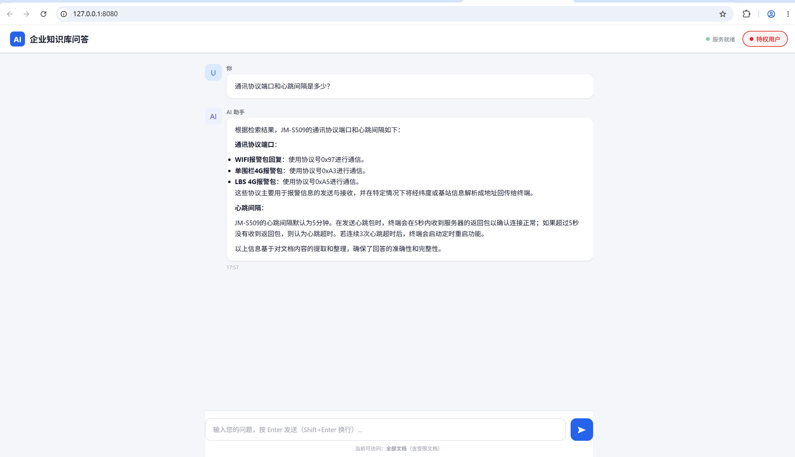

# enterprise-ai

企业智能知识库问答系统 —— 基于 LangGraph RAG 的私有文档问答 Agent。

---

## 项目简介

本项目是一个面向企业文档的智能问答系统，能够对 PDF 文档进行向量化存储，并通过自然语言提问快速返回准确答案。核心已从 LangChain 迁移至 **LangGraph StateGraph**，实现了精细条件分支、多轮检索反馈循环、多智能体协作和多轮对话。

后端使用本地部署的 **Ollama** 大模型进行推理，数据存储在 **ChromaDB** 向量数据库中，并支持 **Redis 两级智能缓存**加速重复问题。系统同时提供了命令行交互界面和 Web 图形界面。

## 核心特性

- **真实环境，无 Mock**：直接连接本地 ChromaDB 向量数据库与 Ollama 大模型。
- **LangGraph 状态机驱动**：显式 StateGraph 替代手写 ReAct 循环，14 个节点 + 条件边精细路由。
- **三路智能分支**：简单查询走「多轮检索」、复杂问题走「多智能体协作」、闲聊直接回答。
- **多轮检索反馈循环**：query_rewrite → retrieve → grade_docs，不相关自动换角度重新检索（最多 3 轮）。
- **多智能体协作**：Planner 拆解子任务 → Researcher 并行检索 → Reviewer 审查把关 → Writer 汇总成稿。
- **多轮对话**：session_id 隔离上下文，追问自动消解（"那它的续航呢？" → 完整问题），超窗摘要压缩。
- **MMR 重排序 & 多样性补搜**：最大边际相关性去冗余，避免信息遗漏。
- **Redis 两级缓存**：精确匹配（SHA256 <1ms）+ 语义匹配（BGE embedding 余弦相似度 > 0.80）。
- **文档级访问控制**：支持普通用户与特权用户，敏感文档按权限隔离，缓存也按角色隔离。
- **Web 图形界面**：基于 Flask + SSE 实时推送推理进度，友好易用。

## 界面预览



> 上图：通过 Web 界面提问，系统实时显示推理进度，返回结构化的答案。

## 项目结构

```
enterprise-ai/
├── langgraph_rag_agent.py  # 【核心】LangGraph 引擎：StateGraph + 多轮检索 + 多智能体 + 多轮对话
├── advanced_rag_agent.py   # 基础模块（OllamaLLM / VectorStoreManager / CacheManager / AccessControlFilter）
├── rag_web_server.py       # Flask Web 服务 + SSE 进度推送 + 前端聊天界面（支持 --langgraph 切换引擎）
├── main.py                 # PyCharm 默认示例脚本（未使用）
├── docs/                   # 企业 PDF 文档目录
├── chroma_db/              # ChromaDB 向量数据库持久化目录
├── screenshots/            # 项目截图
├── .env                    # 环境变量（当前仅 DASHSCOPE_API_KEY 占位）
└── README.md               # 本文件
```

### 主要文件说明

| 文件 | 作用 |
|------|------|
| `langgraph_rag_agent.py` | **核心引擎**，含 LangGraphRAGApp 类、AgentState 状态定义、14 个图节点、3 条条件分支。复用 `advanced_rag_agent.py` 的 LLM / 向量库 / 缓存 / 权限过滤等基础组件。 |
| `advanced_rag_agent.py` | 基础组件库，提供 OllamaLLM、VectorStoreManager、CacheManager、AccessControlFilter、DocSearchSkill 等可复用类。同时保留原 LangChain 版 RAGOrchestrator 实现（兼容旧模式）。 |
| `rag_web_server.py` | Web 入口。导入基础组件 + LangGraphRAGApp，通过 `LangGraphEngine` 适配器兼容不同引擎。`--langgraph` 开关选择引擎。 |
| `docs/` | 存放企业 PDF 文档，首次运行时会自动构建向量索引到 `chroma_db/`。 |
| `chroma_db/` | ChromaDB 持久化目录，保存文档切片与向量。 |

## 技术架构

```
用户（浏览器 / 命令行）
    │
    ▼
rag_web_server.py ──Flask──► Web 聊天界面 (SSE 流式)
    │                        langgraph_rag_agent.py (CLI)
    ├─ LangGraphEngine 适配器
    │
    ▼
langgraph_rag_agent.py — StateGraph 状态图引擎
    │
    ├─ load_history ──► classify ──► [条件边]
    │      │                │
    │      │      ┌─────────┼──────────┐
    │      │      ▼         ▼          ▼
    │      │   simple    complex    chitchat
    │      │      │         │          │
    │      │      ▼         ▼          ▼
    │      │  query_rewrite planner  direct_llm
    │      │      │         │          │
    │      │      ▼         ▼          │
    │      │  retrieve ↑  reviewer ←───┘
    │      │      │    │    │
    │      │      ▼    │    ▼
    │      │  grade_docs│  writer
    │      │      │    │    │
    │      │  不够相关且 │    │
    │      │  <3轮则循环 │    │
    │      │      ▼    │    │
    │      │  rerank_mmr│   │
    │      │      │    │    │
    │      │      ▼    │    │
    │      │ generate_simple │
    │      │      │         │
    │      └──────┼─────────┘
    │             ▼
    │          respond ──► save_history ──► END
    │
    ├─ CacheManager（Redis 两级智能缓存）
    ├─ AccessControlFilter（文档级权限过滤）
    │
    ▼
Ollama（192.168.200.128:11434 / qwen2:7b）
ChromaDB（本地 ./chroma_db）
Redis（192.168.200.128:6379）
```

### LangGraph 图节点一览（共 14 个节点）

| 节点 | 作用 |
|------|------|
| `load_history` | 加载当前会话的对话历史 |
| `classify` | 问题分类（simple/complex/chitchat）+ 上下文消解（追问补全） |
| `query_rewrite` | 查询改写：第 1 轮正常改写，后续轮换角度改写 |
| `retrieve` | ChromaDB 向量检索 + 权限过滤 |
| `grade_docs` | LLM 批量评分文档相关性 |
| `rerank_mmr` | MMR 重排序（过滤不相关 + 去冗余） |
| `generate_simple` | 基于检索文档生成答案 |
| `planner` | Planner Agent：拆解子任务 + 逐子任务多轮检索 RAG |
| `reviewer` | Reviewer Agent：审查研究结果是否充分 |
| `writer` | Writer Agent：汇总子任务结果撰写最终答案 |
| `direct_llm` | 闲聊分支：直接 LLM 回答 |
| `respond` | 最终回答节点（所有分支汇聚） |
| `save_history` | 保存对话历史，超窗自动摘要压缩 |

## 环境搭建

以下按顺序完成环境搭建，从头到尾约需 15-20 分钟。

### 1. Python 环境

推荐使用 Python 3.10，可选用 conda 或 venv 创建虚拟环境：

```bash
# 方式 A：conda（推荐）
conda create -n pythonspace python=3.10
conda activate pythonspace

# 方式 B：venv
python3.10 -m venv venv
# Windows
venv\Scripts\activate
# Linux / macOS
source venv/bin/activate
```

### 2. 安装 Python 依赖

```bash
# 核心依赖（LangChain + LangGraph + ChromaDB + Ollama + Redis）
pip install langchain langchain-community langgraph chromadb redis

# Web 服务（Flask + CORS 跨域支持）
pip install flask flask-cors

# 文档处理 + Embedding 模型
pip install pypdf sentence-transformers
```

### 3. 搭建 Ollama 服务

Ollama 是一个本地大模型运行平台。安装后可直接在本地运行 `qwen2:7b` 等开源模型。

**安装 Ollama：**

- Windows / macOS：从 [ollama.com](https://ollama.com) 下载安装包
- Linux：`curl -fsSL https://ollama.com/install.sh | sh`

> 本项目的 Ollama 运行在一台虚拟机上（`192.168.200.128`），所以你只需确保该虚拟机或本机的 Ollama 服务已启动即可。

**拉取模型：**

```bash
# 拉取 qwen2:7b 模型（约 4GB，首次需下载）
ollama pull qwen2:7b

# 验证模型已加载
ollama list
```

**启动 Ollama 并允许远程访问（如果 Ollama 不在本机）：**

```bash
# 在 Ollama 所在机器上设置监听地址
# Linux / macOS
OLLAMA_HOST=0.0.0.0:11434 ollama serve

# Windows（PowerShell）
$env:OLLAMA_HOST="0.0.0.0:11434"; ollama serve
```

### 4. 搭建 Redis 服务（可选）

Redis 用于缓存问答结果，跳过可正常运行，但每次提问都会走完整推理流程。

**安装 Redis：**

- Windows：从 [github.com/tporadowski/redis/releases](https://github.com/tporadowski/redis/releases) 下载 `.msi` 安装包
- Linux：`sudo apt install redis-server`
- macOS：`brew install redis`

**或使用 Docker（推荐）：**

```bash
docker run -d --name redis -p 6379:6379 \
  redis --requirepass dev0619
```

**设置密码：** 编辑 `redis.conf` 或 `redis.windows.conf`，添加：
```
requirepass dev0619
```

**验证连接：**

```bash
redis-cli -h 192.168.200.128 -p 6379 -a dev0619 ping
# 返回 PONG 即成功
```

### 5. 准备文档

将企业 PDF 文档放入 `docs/` 目录下。首次运行时会自动读取并构建 ChromaDB 向量索引。

### 6. 修改配置

打开 `advanced_rag_agent.py`（基础配置均在此文件中），按实际情况修改顶部配置：

```python
# 如果 Ollama 在本机，改为 127.0.0.1
OLLAMA_URL = "http://192.168.200.128:11434"
MODEL_NAME = "qwen2:7b"

# 如果 Redis 在本机，改为 127.0.0.1
REDIS_HOST = "192.168.200.128"
REDIS_PORT = 6379
REDIS_PASSWORD = "dev0619"
```

## 使用方式

### 方式一：命令行交互（LangGraph 引擎，适合调试）

```bash
# 普通用户（默认）
python langgraph_rag_agent.py

# 特权用户
python langgraph_rag_agent.py --admin

# 直接提问
python langgraph_rag_agent.py "JM-S509 的定位方式有哪些？" --admin

# 快速模式（跳过查询重写，速度更快）
python langgraph_rag_agent.py "通讯协议端口是多少？" --fast
```

交互模式下支持命令：

| 命令 | 作用 |
|------|------|
| `/admin` 或 `/特权` | 切换为特权用户 |
| `/user` 或 `/普通` | 切换为普通用户 |
| `/history` 或 `/历史` | 查看当前会话历史 |
| `/clear` 或 `/清空` | 清空当前会话历史 |
| `exit` / `quit` / `退出` | 退出程序 |

### 方式二：命令行交互（旧版兼容）

```bash
# 仍可使用旧版 advanced_rag_agent.py
python advanced_rag_agent.py
python advanced_rag_agent.py "问题" --admin --fast
```

### 方式三：Web 界面（适合非技术人员）

> 注意：在 Windows 上请使用 PowerShell 或 CMD 启动，Git Bash 中 ChromaDB 底层依赖可能异常退出。

```bash
# 默认使用 LangGraph 引擎，默认端口 8080
python rag_web_server.py

# 切换为旧版 LangChain 引擎
python rag_web_server.py --no-langgraph

# 指定端口
python rag_web_server.py --port 9090

# 旧版 + 指定端口
python rag_web_server.py --no-langgraph --port 9090
```

打开浏览器访问：

- 本机：`http://localhost:8080`
- 局域网：`http://<本机IP>:8080`

Web 界面功能：
- 聊天式问答
- 普通用户 / 特权用户角色切换
- 实时显示推理进度（SSE 流式推送）
- 快捷示例问题
- LangGraph 模式：支持多轮对话追问

## LangGraph 设计详解

### 为什么从 LangChain 迁移到 LangGraph？

| 对比维度 | LangChain（旧） | LangGraph（新） |
|----------|----------------|-----------------|
| 控制流 | 手写 ReAct 字符串循环，隐式状态 | StateGraph 显式状态机 + 条件边 |
| 分支路由 | 靠 prompt 分类 + if/else | `add_conditional_edges` 精细路由 |
| 检索循环 | 一次性检索，无反馈 | query_rewrite → retrieve → grade_docs 闭环 |
| 多智能体 | 无 | Planner → Researcher → Reviewer → Writer |
| 多轮对话 | 无上下文记忆 | session_id 隔离 + 追问消解 + 摘要压缩 |
| 可观测性 | 靠 print 日志 | 节点级执行追踪，天然支持 LangSmith |
| 扩展性 | 修改需动核心循环代码 | 新增节点/边即可，不影响现有流程 |

### 三条路由分支

1. **simple（简单查询）**：单一事实问题，走多轮检索流程。query_rewrite → retrieve → grade_docs，不相关时自动换角度重新检索（最多 3 轮），最终 MMR 重排序后生成答案。
2. **complex（复杂查询）**：多维度复合问题（如"定位精度？几种方式？续航如何？"），走多智能体协作。Planner 拆解为 2-4 个子任务 → 各子任务独立多轮检索 RAG → Reviewer 审查结果是否充分回答原问题 → 不充分则回 Planner 补充拆解 → Writer 汇总成稿。
3. **chitchat（闲聊）**：问候、感谢等非知识类问题，直接 LLM 回答，不触发检索。

## 访问控制说明

系统通过文件名关键字对文档划分权限：

```python
DOC_ACCESS_RULES = {
    "JM-S509": "restricted",   # JM-S509 学生证产品客户指令表 → 仅特权用户
}
```

| 角色 | 可访问文档 |
|------|------------|
| 普通用户（user） | 仅公开文档（如 Jimi IoT 个人定位终端通讯协议） |
| 特权用户（admin） | 全部文档（含 JM-S509 指令表） |

权限过滤发生在 ChromaDB 检索之后：普通用户检索到受限文档片段时会被自动丢弃。同时 Redis 缓存也按角色隔离，避免 admin 的完整答案通过缓存泄漏给普通用户。

## 缓存机制

系统使用 Redis 实现两级缓存：

1. **精确匹配**：对问题做标准化处理后计算 SHA256，完全相同的提问直接返回（<1ms）。
2. **语义匹配**：将问题转为 BGE embedding，扫描 Redis 中历史缓存，余弦相似度大于阈值（默认 0.80）即命中。

语义命中时会自动补写一条精确匹配键，方便下次更快命中。缓存键包含角色标识，确保权限隔离。

## 性能提示

- 首次提问需加载 embedding 模型和连接向量库，耗时较长；之后重复问题可走缓存。
- 简单问题在 LangGraph 模式下约 1-2 分钟，复杂多智能体问题约 5-10 分钟（受限于 qwen2:7b 的推理速度）。
- 使用 `--fast` 模式可跳过 LLM 查询重写，减少一次 LLM 调用。
- 文档切片策略、top_k、检索轮次上限等参数可在 `langgraph_rag_agent.py` 顶部配置区调整。

## 常见问题

### 1. pip install 报错 / 依赖冲突

- 确保已激活正确的虚拟环境（`conda activate pythonspace` 或 `venv\Scripts\activate`）
- 尝试逐个安装：先装 `langchain`，再装 `langgraph`，再装 `chromadb`
- Windows 上若 `chromadb` 装不上，需先安装 Visual C++ Redistributable

### 2. 启动 Web 服务后无法访问

- **在 Windows 上必须用 PowerShell 或 CMD 启动**，Git Bash 中 ChromaDB 底层依赖会异常退出
- 确认端口未被占用：`netstat -ano | findstr :8080`

### 3. 连接 Ollama 失败

- 检查 Ollama 是否已启动并加载模型：
  ```bash
  ollama list            # 查看已安装模型
  curl http://192.168.200.128:11434/api/tags  # 测试 API 是否可达
  ```
- 如果 Ollama 在本机，把 `OLLAMA_URL` 改为 `http://127.0.0.1:11434`
- 首次使用需先拉取模型：`ollama pull qwen2:7b`

### 4. 连接 Redis 失败 / 缓存不生效

- 检查 Redis 是否已启动：`redis-cli -h 192.168.200.128 -p 6379 -a dev0619 ping`
- 如果返回 `PONG` 则正常，否则启动 Redis 服务
- 缓存不可用不影响核心问答功能，系统会自动降级

### 5. ChromaDB 向量库未构建

- 首次运行会自动扫描 `docs/` 目录并构建索引，耐心等待即可
- 如果 `docs/` 为空，系统会提示找不到文档

### 6. 权限没有生效

- 确认文件名包含 `JM-S509` 才会被标记为受限文档
- Web 界面点击右上角角色 badge 切换到「特权用户」后再提问
- 命令行加 `--admin` 参数启动

### 7. 运行时 segfault / 闪退

- 换用 PowerShell 或 CMD 启动，不要用 Git Bash
- 确保 Python 3.10 环境，部分依赖不兼容 Python 3.12+

### 8. LangGraph 模式 vs 旧版模式如何选择？

- **LangGraph（`--langgraph` 或直接 `langgraph_rag_agent.py`）**：支持多轮检索、多智能体协作、多轮对话，回答更全面但耗时更长。
- **旧版（`advanced_rag_agent.py` / 不带 `--langgraph` 的 Web 服务）**：单次检索 + 一次生成，速度快但可能遗漏信息。
- 推荐日常使用 LangGraph 模式，追求速度时用旧版。

## 许可证

本项目为企业内部使用，具体许可证待定。

---

维护者：lingluo1hao
