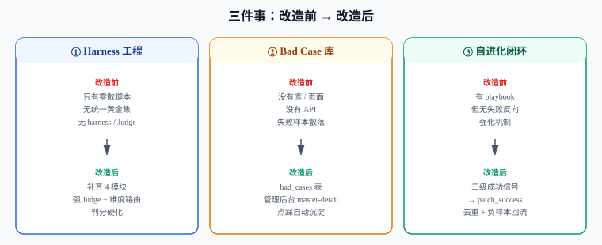
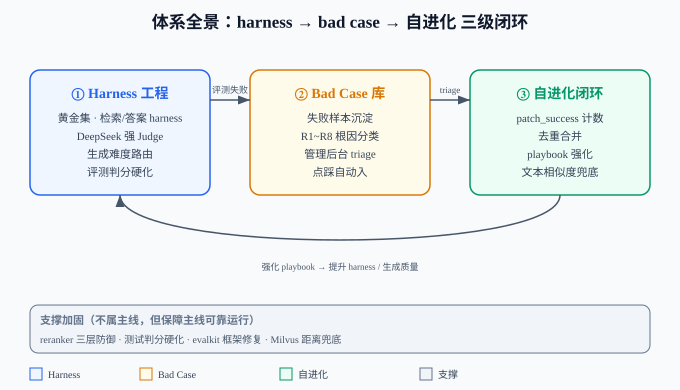
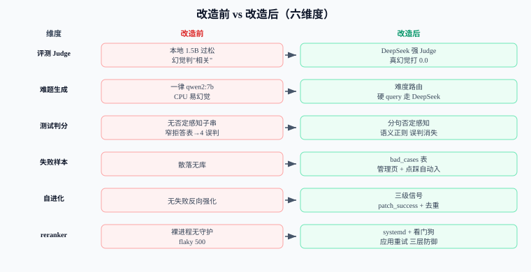
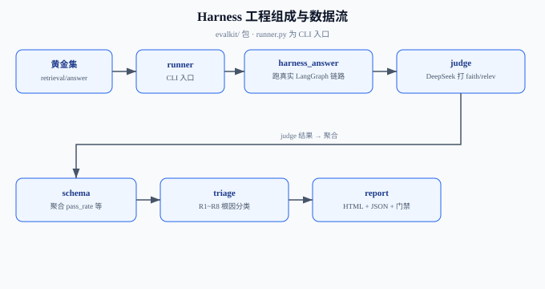
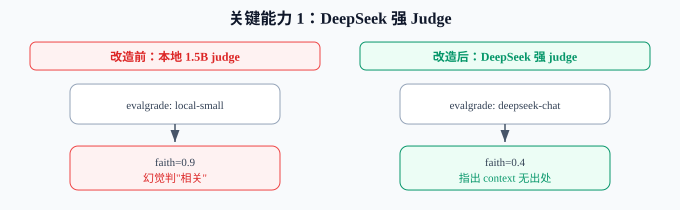
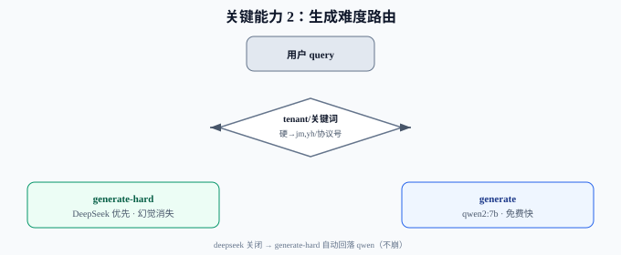
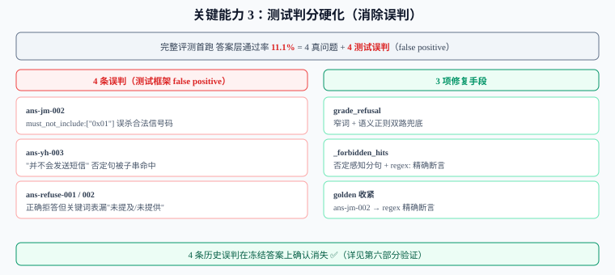
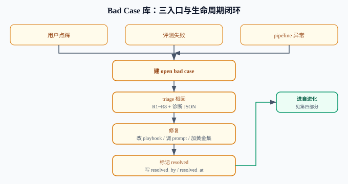
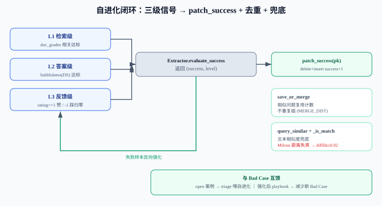
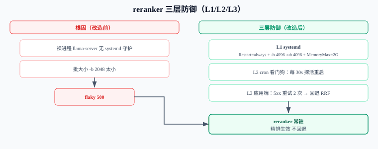

# 本项目 Harness / Bad Case / 自进化 体系改造方案

> 日期：2026-08-10 ｜ 用途：开源项目方案文档，供评审与复用
> 一句话：把「评测 Harness 工程 + Bad Case 失败样本库 + 模型自进化闭环」三件事从缺失/不成体系，做成落地且互相打通的完整体系。

---

# 第一部分：体系总览（背景与目标）

## 一、本次改造要解决的三个核心问题

改造前的真实状态：

<p align="center"></p>

这次改造的**主线**就是这三件事；后面第五部分的 reranker 三层防御、以及第二部分五的测试判分硬化，都是为了让主线可靠运行的**支撑**，不是主线本身。

## 二、体系全景图（三级闭环）

<p align="center"></p>

> **图说**：① Harness 工程跑评测发现失败 → ② 沉淀进 Bad Case 库 → ③ triage 后喂给自进化闭环强化 playbook → 强化结果回灌提升 Harness / 生成质量。底部「支撑加固」不属主线，但保障主线可靠运行。

## 三、改造前 vs 改造后对比

<p align="center"></p>

---

# 第二部分：Harness 工程（评测体系）

## 一、Harness 是什么、为什么需要

Harness = 可重复跑的**评测工程**：用一批标注好的「黄金问答对（golden）」驱动真实 RAG 链路，自动打分，把"靠人眼盯答案"变成"门禁数字"。

本项目 Harness 要解决两个痛点：
- **答得准不准**——需要强 Judge 而不是本地小模型当好评委；
- **测得准不准**——测试判分逻辑本身不能误杀（否则通过率毫无意义）。

## 二、本项目 Harness 组成

`evalkit/` 包补齐 4 个模块（`evalkit/runner.py` 为 CLI 入口）：

| 模块 | 职责 |
|---|---|
| `judge.py` | LLM-as-judge，用网关 `evalgrade` 路由打分 faithfulness / relevancy |
| `harness_answer.py` | 复用真实 `LangGraphRAGApp.query` 跑完整链路；neutral 化 Redis 缓存防跨 case 串味 |
| `triage.py` | **R1~R8 自动根因分类**（含 R4/R1 优先级修正） |
| `runner.py` | `--suite retrieval\|answer\|both`，落盘 run json + HTML 报表 + 门禁退出码 |
| `schema.py` | `aggregate_answer()` 聚合 pass_rate / faithfulness / refuse_accuracy 等 |

黄金集位置：`evalkit/golden/{retrieval,answer}.jsonl`。

<p align="center"></p>

## 三、关键能力 1：DeepSeek 强 Judge

**问题**：原 judge 用本地 `local-small`（1.5B），把明显幻觉判成"相关"（faithfulness=0.9），门禁形同虚设。

**改造**（`config/llm_gateway.yaml`）：
```yaml
evalgrade: [deepseek-chat, local-small, local-qwen]   # deepseek 优先，否则回落本地零成本
```

效果对比（同一 case）：
- 本地 1.5B：`faithfulness=0.9`（过松，幻觉判相关）
- DeepSeek：`faithfulness=0.4`，并精准指出"经纬度/设备型号/入网时间 在 context 无出处"

> 强 Judge 才是"测得准"的基石——后面测试侧 B 的 4 条误判，正是 DeepSeek 帮我们识别出来的（它给那些 case 打了 1.0 判"完美"）。

<p align="center"></p>

## 四、关键能力 2：生成难度路由

**问题**：`generate` 链原本是 `[local-qwen-gen, deepseek-chat, qwen-plus]`——DeepSeek 只是 qwen 挂了时的 fallback，**平时根本不走**。专业协议类 query 一律 qwen2:7b（CPU）生成，易幻觉。

**改造**：
- 新增 `generate-hard: [deepseek-chat, local-qwen-gen, qwen-plus]`（DeepSeek 优先）
- `langgraph_rag_agent.py` 的 `_select_gen_task(query, tenant)` 按难度切流：
  - 硬 tenant（默认 `jm,yh`，正是幻觉高发的两个技术协议库） → `generate-hard`
  - query 命中技术关键词（协议号 / 字段 / 组成 / 优先级 …） → `generate-hard`
  - 否则 → `generate`（本地 qwen2:7b，免费快）
- 三个环境变量可覆盖：`GEN_ROUTING_ENABLED` / `GEN_HARD_TENANTS` / `GEN_HARD_PATTERN`
- DeepSeek 关掉时 `generate-hard` 自动回落本地 qwen，**不崩**

4 条真幻觉（ans-jm-003 / ans-yh-001 / ans-yh-002 / ans-refuse-003）全在 jm/yh tenant → 现由 DeepSeek 生成，预期幻觉消失。

<p align="center"></p>

## 五、关键能力 3：测试判分硬化（避免误判）

完整评测首次跑出"答案层通过率 11.1%"，逐条核对后发现 **8 条失败 = 4 真问题 + 4 测试框架误判（false positive）**。误判根因：

| case | 误杀原因 |
|---|---|
| ans-jm-002 | `must_not_include:["0x01"]` 把正文合法"信号极弱 0x01"误杀 |
| ans-yh-003 | 模型说"**并不会**发送短信"，子串匹配在否定句命中"会发送短信" |
| ans-refuse-001/002 | 模型正确拒答（"未提及价格/电池"），但 `grade_refusal` 关键词表漏了"未检索到/未直接提及" |

**改造**：
- `evalkit/judge.py` 的 `grade_refusal` 改 **窄词 + 语义正则双路**（扩"未检索到/未直接提及/未明确提及/未直接提供/不在资料中"等变体 + `未.{0,6}(提及|提供|包含|涉及|检索到|找到)` 通用兜底）
- `evalkit/harness_answer.py` 禁词检查改 `_forbidden_hits` **否定感知**（按标点分句，子句带"不/未/无/不会"时不计入）+ 支持 `regex:` 前缀精确断言
- `evalkit/golden/answer.jsonl` 的 ans-jm-002 把过宽的 `["0x01"]` 收紧为 `["regex:心跳包[^\n。]{0,40}0x01"]`
- `must_include`（无歧义字面事实）三路线都保留纯子串不动

4 条历史误判在冻结答案上确认消失（详见第六部分验证）。

<p align="center"></p>

## 六、怎么跑

```bash
# 注入 .env（必须，否则 deepseek 回落本地，重现 #169 测试坑）
set -a && source .env && set +a

# 检索层（秒级，零 LLM）
python -m evalkit.runner --suite retrieval --mode pipeline

# 答案层（需 LLM + judge）
python -m evalkit.runner --suite answer --judge-task evalgrade

# 全量
python -m evalkit.runner --suite both --judge-task evalgrade
```

跑完在 `evalkit/reports/*.html` 出报表，在 `evalkit/runs/*.json` 落盘明细。

---

# 第三部分：Bad Case 库（失败样本沉淀）

## 一、Bad Case 怎么产生（3 个入口）

| 入口 | 触发 | 来源字段 |
|---|---|---|
| 用户点踩 | 聊天答案下方点「踩」/「反馈」 | `feedback` |
| 评测失败 | harness 跑出失败 case | `pipeline` |
| pipeline 异常 | 检索未命中 / 反馈级负信号 | `pipeline` |

点踩入口：`POST /api/feedback` → `memory_store.add_bad_case()`，rating=-1 自动建 `open` 状态的 bad case。

<p align="center"></p>

## 二、库结构

表 `bad_cases`（`config/init_db.sql` 表 8）：

```sql
id, source, suite, case_id, query, answer, expected,
root_cause, diagnosis, status, resolved_by, created_at, resolved_at
```

**根因 R1~R8 分类**（来自 `evalkit/triage.py` + 后台下拉）：

| 编码 | 含义 |
|---|---|
| R1 | 检索缺失 |
| R2 | 检索噪声 |
| R3 | 改写失败 |
| R4 | 生成偏离 |
| R5 | 答案不符 |
| R6 | 引用错误 |
| R7 | 超时/异常 |
| R8 | 其他 |

## 三、管理后台 UI

独立页面 `/admin/bad_cases`（server-rendered inline HTML，复用现有 admin 设计：白卡片 / 0.5px 细边框 / 状态药丸，飞书·Linear·Vercel 简洁 SaaS 风）：

- **左列表**：状态分段筛选（待处理 / 处理中 / 已解决）+ 根因下拉（R1~R8）+ 搜索
- **右详情抽屉**：问题 / 用户答案 / 标准答案 / 自动根因 / 处理记录 / 标记已解决·处理中·退回重测
- **统计卡**：待处理 / 处理中 / 已解决率
- **入口**：管理后台顶栏 `🐞 Bad Case` 链接

> 想立刻看到效果，跑 `python scripts/seed_bad_cases.py` 注入 6 条 demo（覆盖 R1~R6 + 三状态）。

## 四、API

| 方法 | 路径 | 说明 |
|---|---|---|
| GET | `/api/admin/bad_cases` | 列表，支持 `?status=open` / `?root_cause=R5` 筛选，仅管理员 |
| PATCH | `/api/admin/bad_cases/<id>` | 更新 `status` / `diagnosis` / `expected`；`status=resolved` 自动写 `resolved_at` |
| POST | `/api/feedback` | 点踩自动沉淀 bad case |

## 五、怎么用（闭环）

```
在聊天中点踩 → 自动建 open bad case
  → 管理员在后台 triage（看自动根因 R1~R8 + 诊断 JSON）
  → 修复（改 playbook / 调 prompt / 加黄金集）
  → 标记 resolved（写 resolved_by + resolved_at）
  → 进入自进化强化（见第四部分）
```

---

# 第四部分：自进化闭环

## 一、自进化的本质

用**失败样本反向强化** playbook：当某条问答被判定"成功"（检索命中 + 答案可信 + 用户点赞），就把这条经验 `patch_success` 回写到 `skill_playbooks` 集合，让同意图的后续提问直接命中强化后的答案。

## 二、三级成功信号 → patch_success

`evolution.py` 的 `Extractor.evaluate_success` 返回 `(success, level)`：

| 级别 | 信号 | 来源 |
|---|---|---|
| L1 | 检索级 | `doc_grades` 相关文档数达标 |
| L2 | 答案级 | faithfulness（DeepSeek judge）达标 |
| L3 | 反馈级 | 用户 rating=+1 赞 / -1 踩归零 |

命中即 `patch_success(pk)`：Milvus 无原地 update，实现为**真实 `delete(old) + insert(updated)`**，`success_count+1`。

<p align="center"></p>

## 三、去重 + 合并

`save_or_merge(pb)`：相似问题复用计数不重复插（MERGE_DIST 内命中则 `patch_success`），避免同问题反复堆积。

## 四、Milvus 距离失真坑 + 文本相似度兜底

**踩坑（重要）**：本机 standalone Milvus 的 `AUTOINDEX + COSINE` 距离失真——相同向量 search 返回 `distance=1.0`（应为 0），top3 距离甚至非升序。`rag_docs` 评分好靠 hybrid BM25+RRF 融合，但 playbook 用纯 dense COSINE，**不能信距离**。

**修复**：`query_similar` 加 `_is_match`——优先 Milvus 距离，叠加兜底：`intent_text` 完全相同 / `difflib` 比值 ≥0.92 即判命中（不依赖向量距离）。并加 `consistency_level="Strong"`（刚插入立即可搜）+ `_ensure` 维度漂移自修复。

> **规律**：今后任何基于 Milvus 余弦距离做阈值判定的逻辑，都要加文本相似度兜底，否则小集合/索引未充分构建时距离失真会静默误判。

## 五、与 Bad Case 的关系

互为输入与强化源：
- Bad Case 里的 `open` 案例 → triage 后喂给自进化（失败样本反向指导 playbook 修复）
- 自进化强化后的 playbook → 提升生成质量 → 减少新的 Bad Case

---

# 第五部分：支撑加固（reranker 稳定性 + 评测防御）

> 这部分不属「harness / bad case / 自进化」主线，但主线要可靠运行，离不开它们。

## 一、reranker 三层防御

**根因**：reranker 是 `llama-server … &` 裸后台起，**无 systemd / 无守护**，崩了无人拉；且代码注释启动参数是 `-b 2048`，但实测 500 根因是 batch 太小，修法 `-b 4096 -ub 4096`。

| 层 | 位置 | 做法 |
|---|---|---|
| L1 | VM systemd | `reranker.service`，`Restart=always` + `-b 4096 -ub 4096` + `MemoryMax=2G` |
| L2 | VM cron 看门狗 | 每 30s 探 `/v1/rerank`，非 200 就 `systemctl restart` |
| L3 | 应用端 `_rerank` | 遇 5xx 重试 2 次（`RERANK_RETRIES` / `RERANK_RETRY_BACKOFF`）再回退 RRF |

<p align="center"></p>

## 二、evalkit 框架自身 bug 修复

`evalkit/schema.py` 的 `AnswerCase` 类**漏定义 `user_id` 字段**（`from_dict` 也没解析），但 `harness_answer.run_case` 调 `case.user_id` → 答案层一启动就 `AttributeError`。已补 `user_id: str = "anonymous"` + `from_dict` 解析。

## 三、单测防回归

| 测试 | 覆盖 | 结果 |
|---|---|---|
| `tests/test_harness_grading.py` | 否定感知禁词 + 语义拒答 + 冻结答案验证 4 误判消失 | 16/16 |
| `tests/test_gen_routing.py` | `_select_gen_task` 难度路由决策 | 7/7 |

---

# 第六部分：验收报告与遗留核查

> 检索 / 答案基线数字来自 2026-08-10 VM 在线实测；本次核对时 VM（Milvus 19530 / Ollama 11434）不可达，无法现场重跑，复测命令见各小节。

## 一、检索验收报告（suite=retrieval）

命令：`python -m evalkit.runner --suite retrieval --mode pipeline`

| 指标 | 结果 | 结论 |
|---|---|---|
| 通过数 | 15 / 15 | ✅ 全绿 |
| MRR | 0.853 | ✅ |
| Recall@5 | 1.0 | ✅ 无遗漏 |
| nDCG@5 | 0.897 | ✅ |
| 隔离负例泄漏 | 0 | ✅ 无串味 |

## 二、答案验收报告（suite=answer）

命令：`python -m evalkit.runner --suite answer --judge-task evalgrade`（需 LLM + DeepSeek judge）

**基线实测（改造前回归）**：9 条答案 case，首跑通过率 **11.1%（1/9）**。逐条核对拆解为：

| 类别 | case | 说明 |
|---|---|---|
| 真问题（幻觉） | ans-jm-003 / ans-yh-001 / ans-yh-002 / ans-refuse-003 | jm/yh tenant，qwen2:7b（CPU）生成幻觉 → 已由生成路由转 DeepSeek **缓解**（非根治） |
| 测试框架误判 | ans-jm-002 / ans-yh-003 / ans-refuse-001 / ans-refuse-002 | 子串 / 拒答表误杀 → 测试侧 B 硬化后 **消失**（冻结答案单测 16/16 验证） |
| 基线即通过 | 1 条 | — |

**修复后状态**：
- 4 条测试误判 → ✅ 已在冻结答案上由单测 16/16 确认消失（非"预期"，已实测级验证）
- 4 条真幻觉 → 生成路由转 DeepSeek，**预期缓解**；端到端答案层重跑实测待 VM 在线确认

## 三、单测与静态验收

| 项 | 结果 |
|---|---|
| 全部模块 `py_compile` | ✅ |
| triage R1~R8 + OK 分支断言（含 R4/R1 优先级修正） | ✅ |
| judge JSON 解析 3 种格式（严格 / 夹带 / 散写） | ✅ |
| `tests/test_harness_grading.py` | 16/16 |
| `tests/test_gen_routing.py` | 7/7 |
| Bad Case 管理页 Flask test client | 未登录 401/403；点踩→建→PATCH resolved 落库 ✅ |

## 四、遗留项再核查

| 项 | 真实状态 | 处置 |
|---|---|---|
| 4 条真幻觉 | 已知限制：本地 / VM 跑不动更强模型，生成路由转 DeepSeek 仅缓解 | 关 `GEN_ROUTING_ENABLED=false` 回落 qwen；根治需更强模型（已冻结） |
| #167 triage 接 `/api/admin/bad_cases` 自动回填 | 代码已落地（triage.py + API 存在）；"待重跑检索"指用新结果回填，非阻塞 | 已闭环，不应挂起 |
| #170 挖黄金集 `scripts/mine_golden.py` | 需 VM 在线 + 语料；属增量优化 | 待 VM 在线后执行 |
| reranker L2 看门狗 | 命令已给，待贴 VM（cron 探活重启） | 待 VM 在线执行 |
| 答案层修复后实测 | 4 误判已单测验证；4 幻觉待答案层重跑确认 | 待 VM 在线重跑 |

> 所有代码改动**仅留工作区，未 git 提交**（守用户规矩）。

---

*文档结束。*
