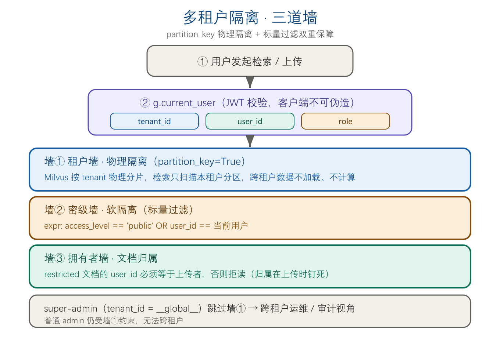
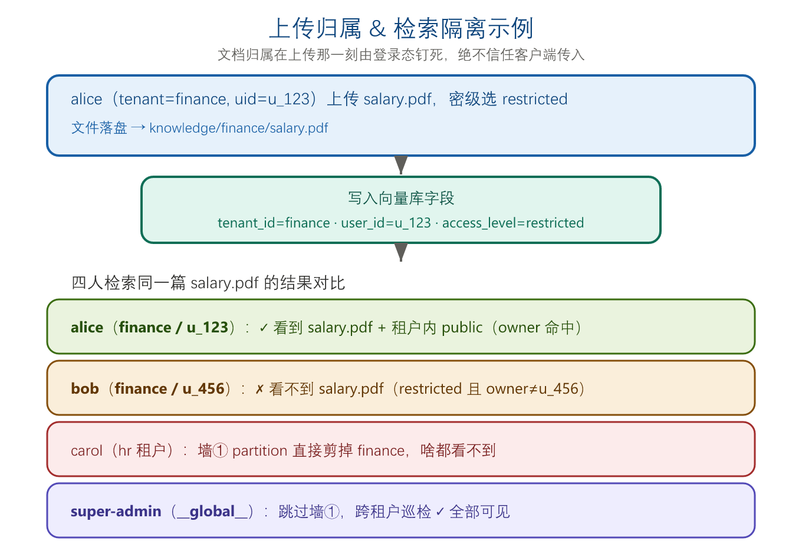
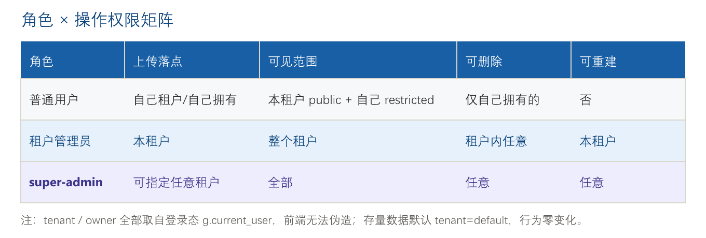

# P0 修复技术方案（单节点 Milvus 友好版）

> ✅ **实现状态：已落地（2026-08-05）**。代码改动见末节「§10 实现落点」，部署后重启服务即自动 drop+rebuild 旧集合（旧集合缺 `tenant_id` 字段，迁移守卫触发），再以 `/kb` 页上传文档 build 验证。

> 范围：修复上次复检定位的两个真 P0
> - **P0-1** 文档管理 Web API 缺失（运营闭环）
> - **P0-2** 多租户 / ACL 仍写死（企业隔离）
>
> 部署前提：已确认本地为 Milvus **standalone 单节点**（`deploy/docker-compose-milvus.yaml` → `milvus run standalone`）。**单节点不影响本方案落地**，理由见 §0。
---

## 0. 为什么单节点不影响本方案

- P0-1 = 纯 HTTP 路由，复用现有 `IngestPipeline`，与向量库拓扑无关。
- P0-2 的权限下推在 `advanced_rag_agent.py:818/866` 用的是 **标量字段 boolean expr 过滤**：
  `(access_level=="public") or (user_id=="{user_id}")`。
  Milvus standalone 与分布式集群对该能力的支持**完全一致**。
- 当前真 bug：`ingest/pipeline.py:158` 写死 `user_id="anonymous"` + `DOC_ACCESS_RULES={}` 空字典 → 过滤形同虚设。**这是逻辑错误，与单/分布式无关。**
- 单节点唯一约束：百万级需 16–32GB 内存；无 HA、QPS 有天花板。属生产加固项，不在 P0。
- 未来迁分布式：standalone→distributed 是纯配置迁移，本方案的 `tenant_id` + `partition_key=True` schema **无需重索引**即可平移。

---

## 1. 总体设计原则

1. **单节点优先**：所有改动在本机可跑、可测，不引入消息队列/独立 worker 服务（长任务用线程 + 锁）。
2. **最小侵入**：复用 `IngestPipeline`、`AccessControlFilter`、`_require_admin`、现有 token 体系，不重写检索内核。
3. **向前兼容**：tenant 默认 `"default"`，存量用户/文档行为不变；多租户在"建第二个租户 + 分配用户 + 按目录 ingest"后才真正生效。
4. **可回滚**：Milvus 数据由 `knowledge/` 源文件可重算；schema 变更走 drop+rebuild（已有 `force=True` 能力），无外部状态风险。

---

## 2. P0-1：文档管理 Web API

### 2.1 路由设计（基于登录态，按角色鉴权）

> **角色感知（非 admin 独占）**：普通用户也能上传，但只能传到自己租户、归属自己、只看自己租户；租户管理员管整个租户；super-admin（`__global__`）可指定 `tenant` 跨租户操作。`tenant`/`owner` 一律取自 `g.current_user`（token 校验得来，客户端不可伪造）。配套 Web 页见 §2.6。

| 方法 | 路由 | 作用 | 实现要点 |
|---|---|---|---|
| GET | `/api/docs` | 列出文档 | 普通用户只看本租户；super-admin 看全部。读指纹清单 + Milvus 按 `file_path` 计数 |
| POST | `/api/docs/upload` | 上传并增量入库 | `tenant`/`owner` 取自身份；落盘 `knowledge/{tenant}/` → `IngestPipeline(files=[path])` |
| DELETE | `/api/docs/{file_id}` | 删除文档 | 普通用户仅能删自己拥有的；super-admin 任意。删源文件 + `store.delete_by_file(path)` |
| POST | `/api/docs/rebuild` | 全量重建 | `IngestPipeline(force=True)`，后台线程跑，返回 job_id |
| GET | `/api/docs/stats` | 统计 | 总数 / 总 chunk 数 / 按 tenant 拆分 |

### 2.2 存储与租户目录

- 上传落盘路径：`knowledge/{tenant}/{safe_filename}`
  - `tenant` 取自上传者 `g.current_user["tenant_id"]`（管理员可带 `?tenant=` 覆盖，仅 super-admin 允许跨租户写）。
  - `safe_filename`：去掉路径分隔符、限制长度、保留原扩展名。
- 已存在的 `knowledge/` 根目录文档归入 `tenant="default"`。

### 2.3 并发控制（单节点足够）

```python
_INGEST_LOCK = threading.Lock()          # 串行化 ingest，避免重入
_INGEST_JOBS: dict[str, dict] = {}        # job_id -> {status, progress, summary}

def _run_ingest(job_id, files=None, force=False):
    with _INGEST_LOCK:
        rep = vector_store.ingest_documents(force=force, files=files)
        _INGEST_JOBS[job_id] = {"status": "done", "summary": rep.summary()}
```

- upload / delete 为轻量操作，持锁同步执行（秒级）。
- rebuild 为重量操作，提交后台线程，前端轮询 `GET /api/docs/stats` 或新增 `GET /api/docs/job/<id>`。

### 2.4 文件校验

- 允许扩展名：`pdf, txt, md, docx, xlsx, pptx, html, csv, json`（与 `ingest/loaders.py` 已支持格式对齐）。
- 单文件大小上限：50MB（可配）。
- 非法扩展名 / 超界 → 400 + 明确错误。

### 2.5 对接现有数据面

- `rag_web_server.py` 已持有 `vector_store` 单例（即 `VectorStoreManager`）。
- upload/delete/rebuild 直接调 `vector_store.ingest_documents(files=..., force=...)` 与 `store.delete_by_file(path)`，**不新写 embedding 逻辑**。
- `IngestPipeline` 已支持单文件增量（`files=[path]`）与按 `file_path` 删除，无需改动 pipeline 内部。

### 2.6 Web 知识库管理页（新增 UI，你要求补的）

现有前端是 Flask server-rendered HTML（`/admin` 即内联大段 HTML + `<script>`），不引前端框架。新增 `/kb` 路由，复用同风格：

- **路由**：`GET /kb` —— 任何已登录用户可访问，内容按角色缩放。
- **页面元素**：
  - 拖拽上传区（`accept` 限 §2.4 扩展名）+ 密级下拉（`public`/`restricted`，默认 `public`）+ 上传按钮；super-admin 额外显示「目标租户」输入框。
  - 文档列表表格：文件名 / 租户 / 拥有者 / 密级 / chunk 数 / 修改时间 / 删除按钮。
  - 重建按钮（super-admin）+ 统计卡片（总数 / chunk / 各租户占比）。
- **角色缩放**：
  - 普通用户：列表仅本租户、仅自己拥有的可删；上传归属自己。
  - 租户管理员：列表为整个租户，可删租户内任意文档。
  - super-admin：租户切换器 + 跨租户列表 + 任意删除 + 重建。
- **前端调用**：上传走 `POST /api/docs/upload`（带 `access_level`，super-admin 带 `tenant`）；列表走 `GET /api/docs`；删除走 `DELETE /api/docs/{id}`；重建走 `POST /api/docs/rebuild`。
- **安全**：页面仅做展示与交互；所有权限判定在服务端路由（§2.1 角色感知）强制，前端无法越权。

---

## 3. P0-2：多租户 / ACL

### 3.1 ACL 规则外置（去掉写死字典）

新增 `access_rules.yaml`（或并入 `.env` / 配置模块）：

```yaml
# access_rules.yaml
default: public
rules:
  - match: "JM-S509"          # 对文件路径做 substring/glob 匹配
    access_level: restricted
  - match: "confidential"
    access_level: restricted
  # 可扩展：按 tenant 限定
  # - match: "salary"
  #   access_level: restricted
  #   tenant: "finance"
```

改动 `ingest/loaders.py`：
- 删除 `DOC_ACCESS_RULES = {}` 硬编码；`AccessControlFilter.get_access_level(source)` 改为从 `access_rules.yaml` 加载（带缓存 + 文件变更热加载）。
- 函数签名不变，调用方（`pipeline.py`、`advanced_rag_agent.py:1000`）零改动。

### 3.2 tenant_id 透传链路（核心）

当前 `user_id` 已从登录态透传到检索（`web:311 → orchestrator.query(user_id=) → app.query → DocSearchSkill.search(user_id=) → _milvus_search(expr)`）。**平行新增 `tenant_id` 透传**：

```
rag_web_server.py  g.current_user["tenant_id"]
   └─ orchestrator.query(..., tenant_id=)
        └─ LangGraphRAGApp.query(..., tenant_id=)  → state["tenant_id"]
             └─ DocSearchSkill.search(..., tenant_id=)
                  └─ VectorStoreManager.similarity_search_with_score(..., tenant_id=)
                       └─ _milvus_search(..., tenant_id)  → expr 追加 tenant 子句
                  └─ _search_figures(..., tenant_id)      → 同上
```

**需改动的签名（全部加 `tenant_id: str = "default"` 参数）：**
- `RAGOrchestrator.query(question, user_role=None, user=None, user_id=None, tenant_id="default")`
- `LangGraphRAGApp.query(question, role=..., user=..., user_id=..., tenant_id="default")`
- `DocSearchSkill.search(self, query, k, filter_role=None, user_id="anonymous", tenant_id="default")`
- `VectorStoreManager.similarity_search_with_score(..., user_id=..., tenant_id="default")`
- `VectorStoreManager._milvus_search(self, query, k, filter_role, user_id, tenant_id)`
- `VectorStoreManager._search_figures(self, ..., user_id=..., tenant_id=...)`

### 3.3 鉴权层补 tenant_id（最小改动）

- `auth.login()` 返回体增加 `tenant_id`（默认 `"default"`）。
- `auth.verify_token()` → `g.current_user` 增加 `tenant_id`。
- 用户存储（无论 dict 还是 DB）增加 `tenant_id` 列，存量用户默认 `"default"` → **行为零变化**。
- super-admin 标识：`tenant_id == "__global__"` 时跳过 tenant 子句（见 3.5）。

### 3.4 Schema 演进

在 `advanced_rag_agent.py:690` 的 fields 中新增：

```python
FieldSchema("tenant_id", DataType.VARCHAR, max_length=64, is_partition_key=True),
```

- **`is_partition_key=True`**：Milvus 2.4+ 支持（你的镜像 `v2.5.0` ✅），standalone 也支持，提供**物理分区隔离**，是官方推荐多租户模式。
- 启用后每次 insert **必须带 `tenant_id`**（否则报错）——正好迫使写入真实租户。
- `enable_dynamic_field=True` 保留不变。

**写入侧（`ingest/pipeline.py:150-165`）改为：**

```python
tenant_id = c.tenant_id or "default"     # 由文件路径 / upload 参数解析
entities.append({
    ...
    "tenant_id": tenant_id,
    "user_id": c.owner_id or "anonymous",   # 真实上传者，不再写死 anonymous
    "access_level": c.access_level,
    ...
})
```

`IngestPipeline` 新增：
- `default_tenant` 参数；`derive_tenant(file_path)`：`knowledge/{tenant}/...` → 取目录名，否则 `default_tenant`。
- 每个 chunk 携带 `tenant_id` + `owner_id`（CLI 可用 `--owner`，upload API 用上传者 `user_id`）。

### 3.5 检索下推新 expr

`_milvus_search` / `_search_figures` 中：

```python
parts = []
if tenant_id != "__global__":                      # super-admin 跨租户
    parts.append(f'tenant_id == "{tenant_id}"')
if filter_role != "admin":                         # admin 本租户内仍受 access_level 约束
    parts.append(f'(access_level == "public") or (user_id == "{user_id}")')
expr = " and ".join(parts) if parts else ""
```

效果：
- 普通用户：只能看**自己租户**内 `public` 或**自己上传**的 `restricted` 文档。
- 跨租户文档：物理 + 逻辑双重不可见（partition_key 直接剪枝，连计算都不发生）。
- super-admin（`__global__`）：可跨租户巡检（仅用于运维/审计）。

### 3.6 迁移 / 重建策略

- `tenant_id` 为新增必填字段 + partition_key → **必须 drop_collection 后重建**（Milvus 不支持给存量 collection 追加 partition_key）。
- 重建安全：源文件在 `knowledge/`，重启服务自动走 `IngestPipeline(force=True)` 重算，无外部状态丢失。
- 过渡期兼容：若暂不启用 `partition_key`，可先加 `tenant_id` 普通字段（非必填、默认 `"default"`），用标量过滤隔离；待择机再升级 partition_key。**隔离效果两种方案一致，partition_key 仅多一层物理剪枝。**

---

## 4. 改动文件清单

| 文件 | 改动 |
|---|---|
| `rag_web_server.py` | +5 路由（§2.1，角色感知）；`/kb` 知识库管理页（§2.6）；`query` 调 `orchestrator.query(tenant_id=)`；`g.current_user` 透传 `tenant_id` |
| `auth.py`（或等价模块） | `login/verify_token` 增加 `tenant_id`（默认 `"default"`）|
| `advanced_rag_agent.py` | schema +`tenant_id`(partition_key)；`_milvus_search/_search_figures` expr 追加 tenant；`similarity_search_with_score` 签名加 `tenant_id` |
| `langgraph_rag_agent.py` | `query` 签名加 `tenant_id` → state → `DocSearchSkill.search(tenant_id=)` |
| `ingest/pipeline.py` | 去 `anonymous` 写死；加 `tenant_id`/`owner_id` 解析与写入；`default_tenant` 参数 |
| `ingest/loaders.py` | `DOC_ACCESS_RULES` → `access_rules.yaml` 外置加载 |
| `access_rules.yaml` | 新增（ACL 规则配置） |
| `tenants.yaml` | 新增：租户清单（id + 名称），super-admin 可增删 |
| `tests/test_kb_page.py` | 新增：Flask 测试客户端验证 `/kb` 角色缩放 + 上传闭环 |
| `tests/test_api.py` | 新增：上传→列出→删除 闭环 |
| `tests/test_multitenant.py` | 新增：租户隔离 + restricted 不可见 |
| `tests/test_ingest.py` | 扩展：断言 `tenant_id`/`user_id` 非 `anonymous` |

---

## 5. 验收标准

1. **P0-1**
   - [ ] `/api/docs/upload` 上传 PDF → `/api/docs` 出现该文件且 chunk 数 > 0 → 对话能检索到。
   - [ ] `/api/docs/{id}` 删除后 → 列表消失且对话检索不到（Milvus 已删）。
   - [ ] `/api/docs/rebuild` 触发后台重建，stats 总数恢复。
   - [ ] 普通用户调用写接口越权（删他人文档 / 跨租户写）→ 403。
   - [ ] `GET /kb` 页面：普通用户只见本租户、仅自己文档可删；super-admin 见跨租户切换。
2. **P0-2**
   - [ ] ingest 后 Milvus 实体 `tenant_id` ≠ `anonymous`，`user_id` = 真实上传者。
   - [ ] tenant A 用户查询 → 结果集不含 tenant B 任何文档（含 `restricted`）。
   - [ ] 普通用户看不到他人 `restricted` 文档；本人/管理员可见。
   - [ ] super-admin（`__global__`）可跨租户检索。
3. **回归**
   - [ ] 现有对话/图检索/父子检索用例不退化（存量 tenant=`default` 行为不变）。

---

## 6. 风险与回滚

- **drop+rebuild 风险**：低。`knowledge/` 为唯一真源，重建可重算；操作前 `cp -r knowledge/ knowledge.bak` 即可。
- **partition_key 启用失败**：回退为 `tenant_id` 普通字段（非 partition_key）+ 标量过滤，隔离效果不变，仅少物理剪枝。
- **tenant_id 透传漏改某层**：检索 expr 缺 tenant 子句 → 跨租户泄漏。验收 §5.2 专项覆盖，且有 partition_key 物理兜底（即使 expr 漏写，standalone 仍按分区剪枝——前提是写入真实 tenant）。
- **回滚**：git revert 本批提交；Milvus 删库重启即回退到单租户。

---

## 7. 明确不在本次范围（P1，仅记录）

- Cross-Encoder reranker（当前 MMR 可接受）
- RAG 评测/回归集（Recall@k）
- 检索侧可观测性（命中率/rerank 增益/缓存命中）
- 异步任务队列（当前线程锁够用，高并发再上）
- HA / 分布式集群（单节点前提下不触发）

---

## 8. 已拍板的决策点（用户 2026-08-05 确认）

1. ✅ **启用 `partition_key=True`**：standalone 支持，未来迁分布式免重索引；代价是本次 drop+rebuild 一次集合。
2. ✅ **开放 super-admin 跨租户巡检**：`tenant_id="__global__"` 跳过 tenant 子句，仅运维/审计用。
3. ✅ **补充 Web 上传页 + 角色感知上传**（用户追问新增）：普通用户也能上传，文档归属在上传时由登录态钉死（见 §9）；并新增 `tenants.yaml` 租户清单。

---

## 9. 隔离模型详解：三道墙 + 文档归属如何确定（针对追问）

### 9.1 三道隔离墙

1. **租户墙（硬隔离，partition_key）**
   - `tenant_id` 设 `partition_key=True`，Milvus 在物理上按租户分片。查 `tenant=A` 时引擎**只扫描 A 的分区**，B/C 的数据连加载和计算都不发生。这是引擎级保证，不是 app 逻辑——即便过滤表达式写错，跨租户也漏不出来。这是部门之间的"墙"。

2. **密级墙（软隔离，租户内 ACL）**
   - 租户内每篇文档 `public` / `restricted`。
   - `public`：同租户任何人可读。
   - `restricted`：仅**拥有者**（`user_id`）+ 管理员可读。
   - 表达式：`(access_level=="public") or (user_id=="{uid}")`。

3. **拥有者（谁传的）**
   - `user_id` = 上传者的登录身份。这正是隔离成立的关键——`restricted` 之所以有意义，是因为系统知道“这篇是谁的”。



### 9.2 文档到底归谁？在上传那一刻钉死（绝不信客户端）

> 原方案的漏洞：把上传写成"仅管理员"，等于所有文档 owner 都是 admin，`user_id` 永远是 admin，普通用户的 `(user_id=="{uid}")` 分支永不命中，隔离名存实亡。**改正：上传必须经过 web 登录态，tenant + owner 直接从 `g.current_user`（token 校验得来，客户端伪造不了）取。**

示例（租户 `finance`）：
- `alice`（租户 finance，uid `u_123`）传 `salary.pdf`，选 `restricted`：
  - 落盘 `knowledge/finance/salary.pdf`
  - 写入 `tenant_id=finance, user_id=u_123, access_level=restricted`
- alice 查询：`tenant_id==finance and (public or user_id==u_123)` → 看到自己 restricted + 租户内 public。✓
- bob（同租户 finance，uid `u_456`）查询：`tenant_id==finance and (public or user_id==u_456)` → 看不到 alice 的 `salary.pdf`（restricted 且 owner≠u_456）。✓
- carol（租户 hr）查询：`tenant_id==hr` → partition 直接剪掉 finance，啥都看不到。✓
- super-admin（`__global__`）：expr 去掉 tenant 子句 → 跨租户巡检。✓



### 9.3 租户从哪来（租户注册表）

- `tenants.yaml`：租户清单（`id` + `display_name`）。用户存储每个用户挂 `tenant_id`（默认 `default`）。
- super-admin 可增删租户：本质是建/删 `knowledge/{tenant}/` 目录 + 登记清单。
- 存量 `knowledge/` 根目录文档 → 归入 `default` 租户、owner `anonymous`（历史遗留，行为不变）。

### 9.4 角色 × 操作矩阵

| 角色 | 上传落点 | 可见范围 | 可删 | 可重建 |
|---|---|---|---|---|
| 普通用户 | 自己租户 / 自己拥有 | 本租户 public + 自己 restricted | 仅自己拥有的 | 否 |
| 租户管理员 | 本租户 | 整个租户 | 租户内任意 | 本租户 |
| super-admin | 可指定任意租户 | 全部（跨租户） | 任意 | 任意 |



---

## 10. 实现落点（2026-08-05 已提交代码，未 commit）

| 文件 | 改动 |
|---|---|
| `advanced_rag_agent.py` | 新增 `ROLE_SUPER_ADMIN`；Milvus schema 增 `tenant_id` 字段且 `partition_key=True`；`_ensure_collection` 迁移守卫（缺 `tenant_id` 即 drop+rebuild）；`_milvus_search`/`search_figure_pages`/`similarity_search_with_score` 增加 `tenant_id` 参数并按「super-admin 全可见 / admin 本租户 / user 本租户+自己」构造 expr；`DocSearchSkill` 透传 `tenant_id`；`AccessControlFilter` 放行 super_admin |
| `langgraph_rag_agent.py` | `LangGraphRAGApp.query` 增 `tenant_id` 参数并写入 `self.tenant_id`；检索节点与 figure 召回把 `user_id`/`tenant_id` 透传到 `similarity_search_with_score`/`search_figure_pages` |
| `rag_web_server.py` | `LangGraphEngine.query` 透传 `tenant_id`；问答路由注入 `g.current_user["tenant_id"]`；`/api/docs`(列表)、`/api/docs/upload`(上传)、`/api/docs/<id>`(删除)、`/api/docs/rebuild`(重建)、`/api/docs/stats`(统计) 五个路由；`/kb` 知识库管理页；登录/me 响应带回 `tenant_id`；`_require_admin` 放行 super_admin |
| `prompt_manager.py` | `admin_users` 表增 `tenant_id` 列（含老库 ALTER 迁移）；`login` 把 `tenant_id` 写入 session 与返回体 |
| `ingest/pipeline.py` | 构造参数增 `tenant_id`/`user_id`（默认 default/anonymous）；实体写入真实 `tenant_id`（从 `knowledge/{tenant}/` 路径推断）+ `user_id`（去掉写死 anonymous）；新增 `_derive_tenant` |
| `ingest/loaders.py` | `DOC_ACCESS_RULES` 改为从 `access_rules.yaml` 加载（缺失/yaml 不可用则退化为全 public） |
| `access_rules.yaml` / `tenants.yaml` | 新增：ACL 文件名规则、租户登记 |

> 部署命令（VM 上）：拉最新代码 → `python rag_web_server.py` 启动即触发旧集合 drop+rebuild → 浏览器打开 `/kb` 登录后上传文档验证。如需手动强制 drop，可在 VM 跑：`python -c "from pymilvus import MilvusClient; c=MilvusClient(uri='http://192.168.200.128:19530'); c.drop_collection('rag_docs'); print('dropped')"`（集合名以 `MILVUS_COLLECTION` 环境变量为准）。
