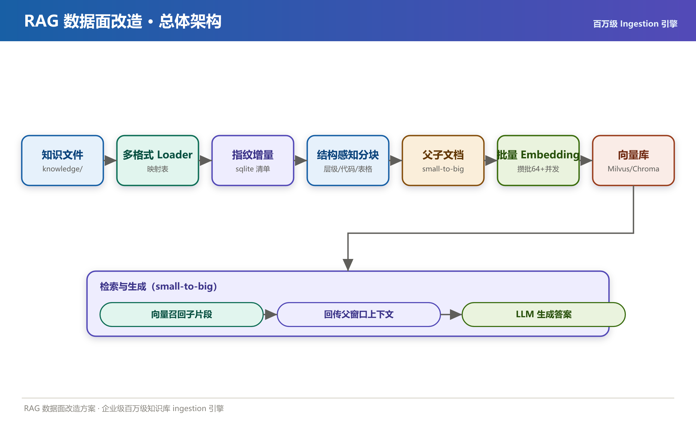
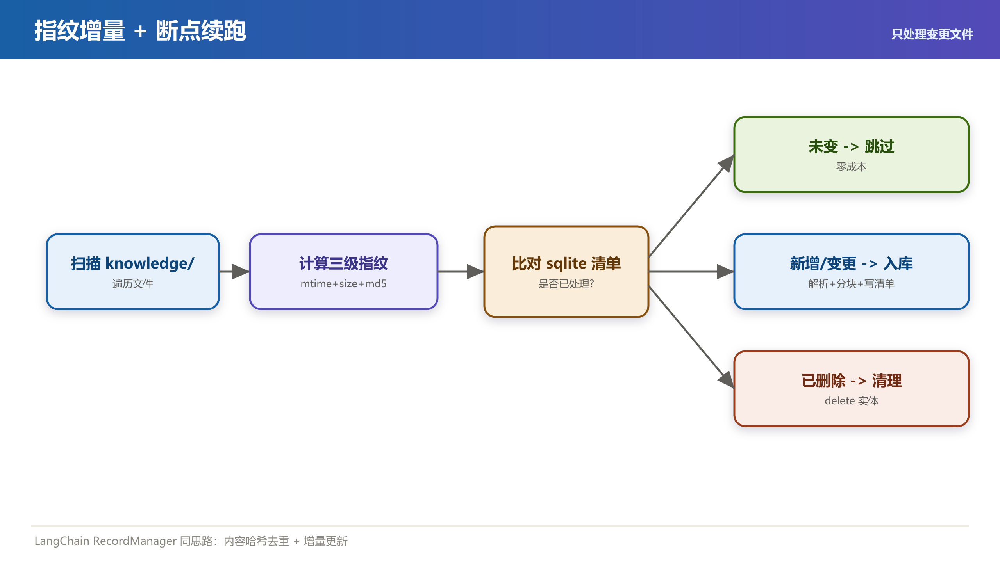
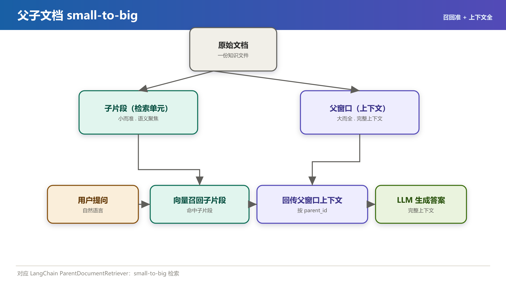
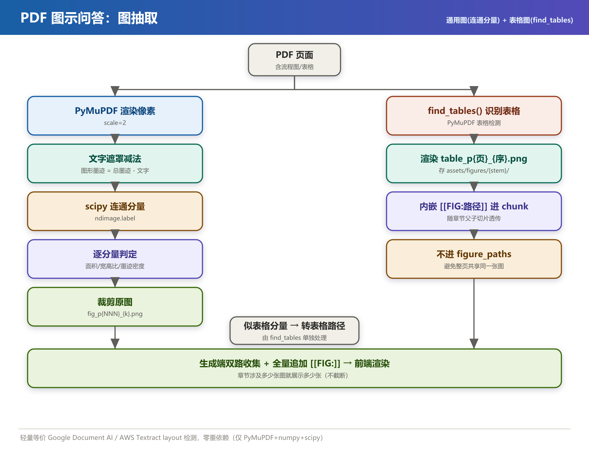

# 百万级 RAG 数据面改造方案

> 范围：百万级 RAG 数据面 ingestion 引擎 + 结构感知分块 + PDF 图示问答（通用图抽取）
>   
> 对应提交：`85ac3a7 feat(rag): 百万级 RAG 数据面 ingestion 引擎 + 结构感知分块`、`501e11d feat: PDF 图通用抽取(PyMuPDF连通分量) + RAG 数据面改造收尾`；表格图渲染 + 章节-表格耦合修复见 **§3.9**（对应后续提交 ingest 表格切图 + 0xA2 检索修复）

---

## 一、改造背景

> 本方案不是纸上谈兵，而是基于一个真实企业级 RAG 项目一步步落地的。下面先说改造背景与目标，再逐一拆解每一个数据面改造点（每个都标了"为什么这么改"）。

### 1.1 项目定位

本项目是一个**企业级 RAG 问答系统**：知识文档（PDF / Word / HTML / Markdown / Excel / PPT 等）放入 `knowledge/`，经 ingestion 管线入库到 Milvus（唯一向量后端），上层 LangGraph / advanced_rag_agent 做混合检索（BM25 稀疏 + dense 向量 + RRF 融合）与答案生成。

RAG 的效果上限，80% 由**数据面（ingestion + 分块 + 向量化）**&#x51B3;定。检索召回的片段质量差，再强的 LLM 也救不回来。

### 1.2 改造前的主要不足（痛点）

| # | 痛点                                      | 后果                            |
| - | --------------------------------------- | ----------------------------- |
| 1 | **没有独立的 ingestion 引擎**，加载逻辑散落各处         | 无法统一运维、无法增量、每次全量重跑，百万级数据根本跑不动 |
| 2 | **无增量 / 断点能力**，文件没变也要整体重算               | 算力浪费、知识库无法持续低成本更新             |
| 3 | **"一刀切"分块**，代码块 / 表格 / Markdown 层级被强行切断 | 召回的片段语义破碎，检索命中率低、答案漏信息        |
| 4 | **没有父子文档**，块要么过大（噪声多、命中散）要么过小（丢上下文）     | "召回准" 与 "上下文全" 互相矛盾，无法兼得      |
| 5 | **embedding 逐条 / 小批请求 bge-m3 HTTP**     | 每次请求都有 RTT 开销，规模上来吞吐塌陷        |
| 6 | **PDF 图示问答"假死"**（四重 bug 叠加）             | 图永远出不来、文字还幻觉（详见 §3.8）         |

> **核心判断**：数据面是 RAG 的地基。地基不牢，上面的检索 / 生成再花哨，也支撑不了百万级企业知识库。

---

## 二、改造目标

1. **支撑百万级文档持续 ingestion**（"数据面先跑百万"）——可增量、可断点续跑。
2. **增量 + 断点续跑**：只处理新增 / 变更文件，失败可从断点继续，不重复全量计算。
3. **多格式覆盖 + 结构保留**：txt/md/pdf/html/docx/xlsx/pptx，表格内容完整保留。
4. **结构感知分块**：Markdown / HTML 层级感知，代码块 / 表格不被切断。
5. **父子检索（small-to-big）**：子片段负责"召回准"，父窗口负责"上下文全"。
6. **批量 embedding 高吞吐**：攒批 + 并发池 + 重试，摊薄 bge-m3 HTTP RTT。
7. **PDF 图示问答真正可用**：通用抽取（与语言 / caption 无关）、图必出、文字不幻觉。
8. **依赖可控、可优雅降级**：Ollama embedding 不加载 torch；缺 PyMuPDF/numpy/scipy 时图能力自动关闭，主链路不挂。

---

## 三、设计方案（图文并茂）

### 3.1 总体架构



### 3.2 改造点①：自包含 `ingest/` 引擎包 + CLI

- **做法**：新增独立 `ingest/` 包，提供 `python -m ingest.cli ingest / status / delete / rebuild` 全套命令。
- **为什么这么改**：把 ingestion 从业务代码里解耦出来，成为可独立部署、可观测、可运维的"数据面服务"，而不是散落在各处的脚本。
- **好处**：一条命令掌控全量 / 增量 / 清理 / 重建；便于自动化与监控。
- **大厂是不是也这么做**：是。Unstructured、LangChain 的 ingestion 都是独立管线 + CLI/API；企业知识库（Notion AI、Datadog 等）都把 ingestion 当作独立服务治理。

### 3.3 改造点②：指纹增量 + sqlite 清单 + 断点续跑

- **做法**：每个文件计算 `mtime + size + md5` 三级指纹，状态写入本地 **sqlite 清单**；扫描时与清单比对，只处理新增 / 变更 / 删除的文件。
- **为什么这么改**：百万文件不能每次全量重算；而单纯靠 mtime/size 会有"内容改了但大小时间没变"的漏判，因此加 md5 做最终裁决。
- **好处**：变更检测极廉价；大库可分钟级增量同步；任务中断后从清单续跑，不重复已处理部分。
- **大厂是不是也这么做**：是。LangChain 的 `index` API 用 **RecordManager**（Postgres / Redis 后端）做的正是"内容哈希去重 + 增量更新"；各主流知识库都依赖内容指纹做增量。



### 3.4 改造点③：多格式 Loader 映射表（表格保留）

- **做法**：建立 `扩展名 → Loader` 映射表，覆盖 txt/md/pdf/html/docx/xlsx/pptx；表格类文档（xlsx/pptx 内表）保留行列结构。
- **为什么这么改**：不同格式解析方式差异巨大，映射表让"加一种格式"变成"注册一个 Loader"，符合开闭原则。
- **好处**：格式扩展零侵入；表格内容不被压平丢失。

### 3.5 改造点④：结构感知分块

- **做法**：Markdown / HTML 按**层级**（标题层级、标签边界）切分；**代码块、表格整体不切断**。
- **为什么这么改**：语义完整的单元（一段代码、一张表、一个章节）被硬性按字数切断后，召回的片段往往是"半句话 + 半段代码"，LLM 拿到的是破碎上下文。
- **好处**：召回片段语义自洽，答案更完整准确。
- **大厂是不是也这么做**：是。LlamaIndex 的 `MarkdownNodeParser` / `HTMLNodeParser`、LangChain 的 `MarkdownHeaderTextSplitter` 都是层级感知分块，已是业界标准做法。

### 3.6 改造点⑤：父子文档 small-to-big（核心检索质量提升）

- **做法**：
  - 每个文档切出**子片段**（小、语义聚焦，作为检索单元）和对应的**父窗口**（大、含完整上下文）。
  - Milvus schema 新增 `parent_id / parent_content / is_parent` 字段；`_parse_hits` 在召回子片段后**透传父上下文**回 LLM。
- **为什么这么改**：纯小块召回准但没上下文；纯大块有上下文但命中率低、噪声多。**父子分离让"检索准"和"上下文全"解耦**——用小块去命中，用父块去喂模型。
- **好处**：检索命中率↑ + 生成上下文完整度↑，二者兼得。
- **大厂是不是也这么做**：是。这正是 LangChain **`ParentDocumentRetriever`** 的 small-to-big 思路；Google RAG 最佳实践、Anthropic 都推荐"句子窗口 / 父子检索"作为提升 RAG 质量的关键手段。



### 3.7 改造点⑥：批量 Embedding（攒批 + 并发 + 重试）

- **做法**：把待向量化文本**攒到 64 条一批**，配合**并发池**与失败重试，统一打到 bge-m3（Ollama）。
- **为什么这么改**：bge-m3 走 HTTP，单次请求有固定 RTT。逐条请求时 RTT 在总成本里占比极高；攒批后 RTT 被摊薄到近乎零。
- **好处**：百万级向量化吞吐数量级提升，整体 ingestion 耗时从"小时级"压到"分钟级"。
- **大厂是不是也这么做**：是。所有 embedding / 向量服务（Cohere、Pinecone、Metal）的最佳实践都是 batch + 并发；这是规模化的基本功。

### 3.8 改造点⑦：PDF 图示问答（通用图抽取，四重 bug 彻底修复）

**改造前为什么"图永远出不来"——四重 bug 叠加：**

1. **整页渲染**：把每一页（含只有"通信流程"四字、无真图的页）都渲染成 PNG，检索时把伪图页当图页返回，噪音 7 张。
2. **中文 caption 正则门槛**：用"必须含图N / XX图"的中文正则判断真图页，只对这一份 PDF 有效，**不通用**。
3. **赌 LLM 保留占位符**：把 `[[FIG:...]]` 塞进 context 赌模型原样保留，模型几乎必然当噪音删 → 文字"文档未提供流程图"。
4. **前端正则拒绝中文/空格路径**：JS 正则 `\w` 不含中文/空格，图路径 `assets/figures/27 【技术对接】.../page_001.png` 被静默 `continue` 丢弃，**图永远渲染不出来**。

**改造后（通用方案）：**



- **通用图定义**：图的通用本质 = "**页面上非文字的墨迹区域**"，与语言 / 有无 caption / 排版无关。
- **算法**：PyMuPDF 渲染整页像素 → 文字块膨胀生成文字遮罩 → `图形墨迹 = 总墨迹 − 文字遮罩` → `scipy.ndimage.label` 连通分量 → 逐分量判定（面积比 / 宽高比 / 墨迹密度 / **长横线数**：流程图箭头是斜线→0 条，故不会被误判为表格）→ 从**原图**裁剪保留图内文字标签 → `fig_p{NNN}_{k}.png`。**表格不在此处被排除**，改为 §3.9 用 `find_tables()` 单独抽成图，与通用图共用 `[[FIG:]]` 还原机制。
- **确定性渲染**：生成答案后**服务端确定性追加** `[[FIG:...]]`，不再依赖 LLM 保留。
- **前端修复**：路径校验正则放宽为 `^assets/figures/.+\.png$`（越权由服务端 `safe_join`+abspath 兜底）。
- **召回保障**：figure-aware 二次召回（`search_figure_pages`），防止真图页被同文档正文页稀释。
- **Prompt 约束**：v12 禁止自我否认图存在、禁止拿 SMS/RFID 等无关字段拼流程图；**v15（见 §3.9）进一步要求保留表格图占位符、禁止编造 `.pdf` 路径**。
- **为什么用像素墨迹而非 `get_drawings()`**：该 PDF 每页有模板/背景图层，矢量图元 rect 在每页都出现（伪图），但**渲染像素层模板自动消失**，故必须用像素墨迹。
- **大厂对照**：Google Document AI / AWS Textract / LayoutLM 做的是 layout + figure 检测。我们用**轻量连通分量**达到了同等"抽真图"的效果（表格由 §3.9 的 `find_tables()` 单独处理），**零重依赖**（仅 PyMuPDF + numpy + scipy，且缺失即优雅降级），是开源可自托管的务实等价方案。
- **验证**：目标 PDF（58 页）从初版误抽 9 页 → 终版 **仅 1 页命中（p1 通信流程图）**，无回归、无噪音。

### 3.9 改造点⑧：表格图渲染（与通用图同机制还原）+ 章节-表格强耦合修复

**改造前的问题**：表格在 §3.8 图抽取阶段被当作"非图墨迹"排除，内容只走 Markdown `[TABLE]...[/TABLE]` 文本。这带来两个隐患：

1. **表格内容压成文字、丢失版式**——用户期望"返回的是表格图"，而非一段 Markdown 文本。
2. **章节与表格被切成不同 child chunk（0xA2 案例）**：询问"WIFI 4G 定位包 0xA2"时，系统返回了 **2.11.2 GPS/0xA0** 章节的 `table_p046_1.png`，而正确答案在 **2.13.2 WiFi/0xA2** 的 `table_p053_1.png`。根因是：章节标题（`2.13 WIFI 4G 定位包 0xA2`）和表格正文被切成不同 child chunk，表格 chunk 缺少 `0xA2` 等关键词，检索/评分找不到正确 chunk；同时 `RawDoc.figure_paths` 把整页所有表格图都塞给了该页每个 chunk，导致错配。

**改造后（表格与通用图共用 `[[FIG:]]` 还原）：**

- **表格识别与渲染**：`PyMuPDF.find_tables()` 识别每页表格 → 取 `bbox` 渲染 `table_p{页}_{序}.png`，存 `assets/figures/{文件名 stem}/`（与通用图同目录、不同前缀，便于区分）。
- **chunk 内嵌占位符**：`loaders.py` 把 `[TABLE]` 块内**自动前置最近章节标题**，并内嵌 `[[FIG:assets/figures/{stem}/table_p{页}_{序}.png]]`；**表格图不再进入 `RawDoc.figure_paths`**，避免整页所有 chunk 共享同一张图。
- **原子分块 + 图归属精准化**：`chunk.py` 对 `[TABLE]...[/TABLE]` 做**原子不切**；并扫描每个 chunk 文本中的 `[[FIG:...]]` **同步到 `figure_paths`**，使 chunk 只携带自己真实引用的图，从根上消除章节/图错配。
- **生成端双路收集 + 去重**：`langgraph_rag_agent.py` 生成答案时**从 chunk 文本 + 元数据双重收集** fig；**按相似度排序、去重后追加**（去重避免同一图重复刷屏，但**不限制总数**）；表格 / 表类查询（"表格""协议""字段""包"等）也走 figure-aware 兜底召回。
- **图数量策略（全量展示，不截断）**：确定性追加**不做数量上限**——章节涉及多少张图就展示多少张。早期实现硬编码 `[:1]` 只取最相关 1 张，导致 2.13 章节含 3 张表图（table_p053/054/055_1.png）却只返回 1 张；现改为去重后**全部追加**。figure 兜底召回 `k` 由 1 放大到 10，确保多图章节不被漏召。验证：问"WIFI 4G 定位包 0xA2"时答案末尾完整出现 table_p053/054/055_1.png 三张表图。
- **advanced_rag_agent DocSearchSkill**：输出时也扫描 chunk 文本中的内嵌 `[[FIG:...]]`，保证 Skill 路径与 Web 路径一致。
- **Prompt 升 v15**：`generate_answer` 升 v15、`writer_compose` 升 v12，明确要求**保留表格图占位符**（"参见第 X 页表格图"）、**禁止编造 `.pdf` 路径**（旧记录无占位符时 LLM 会幻觉出 `.pdf` 后缀的错误路径）。

**为什么这么改**：

- 表格单独渲染成图后，与通用图走**同一套 `[[FIG:]]` 还原机制**（服务端确定性追加），前端无需区分"图"还是"表格图"，逻辑统一、零额外维护成本。
- 章节标题前置 + 原子分块 + 图归属精准化，让"章节定位"和"表格命中"在同一 chunk 内闭合，检索不会再张冠李戴。

**验证（0xA2 案例）**：重建索引后，`page=53` 的 table chunk 现在**同时包含**：

- 章节标题 `2.13 WIFI 4G 定位包 0xA2`
- 内嵌占位符 `[[FIG:assets/figures/Jimi IoT_个人定位终端通讯协议 V1.2(1)/table_p053_1.png]]`
- 协议号 `0xA2`

> 注意：本次改动为**纯数据面 + prompt 演进**，必须**重建索引**才能生效（Milvus 里仍是旧 chunk）。重建命令：
>
> ```bash
> # 全量重建
> python -m ingest.cli ingest --force
> # 或只重建单个文件（更快）
> python -m ingest.cli rebuild "knowledge/jm/Jimi IoT_个人定位终端通讯协议 V1.2(1).pdf"
> ```

---

## 四、改造前后对比

| 维度           | 改造前                 | 改造后                                             |
| ------------ | ------------------- | ----------------------------------------------- |
| 增量能力         | 无，每次全量重跑            | mtime+size+md5 指纹 + sqlite 清单，增量 + 断点续跑         |
| 分块质量         | 一刀切，代码/表格/层级被切断     | 结构感知，代码块/表格/层级不切断                               |
| 检索上下文        | 块大则噪声多、块小则丢上下文      | 父子 small-to-big，召回准 + 上下文全                      |
| Embedding 吞吐 | 逐条/小批请求，RTT 占比高     | 攒批 64 + 并发池 + 重试，吞吐数量级提升                        |
| PDF 图示问答     | 四重 bug 叠加，图永不出、文字幻觉 | 通用像素墨迹抽取 + 服务端确定性追加 + 前端正则放宽，图必出、文字不幻觉          |
| 格式覆盖         | 有限                  | txt/md/pdf/html/docx/xlsx/pptx，表格保留             |
| 可运维性         | 散落脚本                | 独立 `ingest/` 引擎 + 全套 CLI                        |
| 依赖与降级        | —                   | Ollama 不加载 torch；缺 PyMuPDF/numpy/scipy 时图能力优雅关闭 |

---

## 五、改造后达成目标

- ✅ **百万级 ingestion 地基就绪**：增量 + 断点让大库可持续低成本更新。
- ✅ **检索质量双提升**：结构感知分块（片段语义自洽）+ 父子检索（准且全）。
- ✅ **向量化高吞吐**：batch + 并发把 RTT 摊薄，规模不再是瓶颈。
- ✅ **PDF 图示问答真正可用**：通用抽取（语言/caption 无关），图必出、文字不幻觉。
- ✅ **多格式 + 表格保留**：企业常见文档格式全覆盖。
- ✅ **依赖可控、可优雅降级**：不绑架主链路，缺依赖仅关闭对应能力。
- ✅ **测试兜底**：`tests/` 54 项断言（零依赖自包含 runner + 集成测试自动 skip），`python tests/test_ingest.py` 可直接验证。

---

## 六、改造后小结

本次改造把 RAG 的"地基"——**数据面**——从散落脚本升级为一套**自包含、可增量、结构感知、父子检索、高吞吐、带通用图示问答**的工程化引擎，思路与 Unstructured / LangChain / LlamaIndex / 大厂 RAG 最佳实践完全对齐：

- **增量用内容指纹**（对应 LangChain RecordManager）；
- **分块用层级感知**（对应 LlamaIndex NodeParser）；
- **检索用 small-to-big 父子文档**（对应 LangChain ParentDocumentRetriever）；
- **向量化用 batch + 并发**（业界标配）；
- **图示用像素墨迹连通分量**（轻量等价 Google DocAI / Textract 的 layout 检测）。

改造后，系统在"百万级知识库"场景下具备了**可持续更新、高质量召回、可观测运维**的能力，为上层检索与生成打下了坚实底座。

> **后续可优化（待确认）**：
>
> 1. 另两本 PDF（Jimi IoT 101 页、JM-S509 8 页）本次返回 0 图，需确认其早期页是否真无结构图；若为阈值偏严，可微调 `MIN_AREA_RATIO` / `MIN_INK_DENSITY`。
> 2. 连通分量阈值（面积比、墨迹密度、长横线）已对目标 PDF 调优，后续可沉淀为按文档类型自适应的配置。

