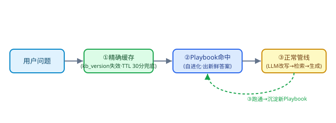
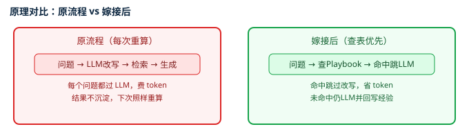
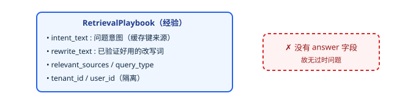
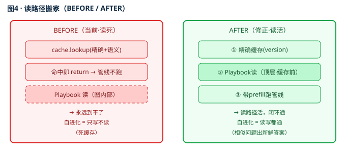

# RAG 自进化方案 A + 回答不准根因修复（完整说明）

> 日期：2026-08-08 ｜ 用途：开源项目方案文档，供评审与复用
> 一句话：把 Hermes 的"经验自进化"嫁接到现有 RAG 引擎（只缓存检索策略、不缓存答案），并修复实测中暴露的回答不准问题（Ollama 截断 / PyMuPDF 伪表格 / 整章图透传 / 上下文暴涨）。

---

# 第一部分：RAG 自进化方案 A（嫁接自进化层）

> 版本：v2（结构化重写） ｜ 状态：✅ P0 已落地 ｜ ⏳ 第六节待执行（代码改动分两批，详见第四节）
> 一句话：把 Hermes 最值钱的"经验自进化"嫁接到现有 RAG 引擎——只缓存检索策略、不缓存答案，相似问题越用越准、答案永远新鲜。

## 一、改造背景

### 1.1 现有系统长什么样
您的 RAG 是一套 LangGraph 单问答内角色编排：13 个节点的确定性状态机（分类 → 改写 → 检索 → 生成 → 校验）。在它前面，还挂着一层 CacheManager 答案缓存（advanced_rag_agent.py）：

- 精确缓存：对问题做 SHA256，完全一致才命中，命中直接 return 旧答案（TTL 7 天）。
- 语义缓存：用 BGE 向量 + 余弦相似度（阈值 0.80）匹配历史问题，命中也直接 return 旧答案。
- 此外，上一轮我们尝试加了一个 Playbook（经验检索策略库），想把"这类问题用这几个词能检到文档"沉淀下来复用——但注入点放在了图内部。

### 1.2 现有系统有两个症结
🔴 **症结 A · 答案缓存会回"旧答案"**。语义缓存命中直接 return 旧答案；一旦知识库更新，相似问题仍可能拿到过期答案。精确缓存 7 天 TTL，而语义命中时会把精确键重写并续命 7 天——意味着"相似问题反复问"会把旧答案一直续命。文档更新一周后还回旧答案是真实风险。

🔴 **症结 B · 自进化是一条"死路径"**。process_message 最开头（约 2131 行）就调 cache.lookup，命中即 return（2141 行），整条 LangGraph 管线根本不跑。而我们注入的 Playbook 读路径在图内部，只要缓存命中，读路径 100% 到不了——结果 Playbook 只会写、永远读不到，等于"只写不读"的死缓存。

### 1.3 为什么不能直接拿答案缓存当"自进化"
答案缓存是结果回放：同样问题再来一次，把上次答案原样丢回去。它只变快、不变好，而且答案会过时。真正的"自进化"需要捕获检索成功的"因"（这类问题该用什么检索词），而不是回放"果"（旧答案）。

## 二、改造目标

| # | 目标 | 说明 |
|---|---|---|
| 1 | 自进化真正闭环 | 相似新问题复用"已验证检索策略"，检索召回越用越稳、越少出现"首轮没检到、靠多轮才兜回"。 |
| 2 | 答案永远新鲜 | 不缓存答案，只缓存检索策略；每轮仍从当前 Milvus 重新检索+生成，知识库更新后答案自动最新。 |
| 3 | 根治答案过时 | 删掉会回旧答案的语义答案缓存；精确缓存改用「知识库版本号」失效，文档一更新旧缓存即刻作废。 |
| 4 | 零新依赖 / 可降级 | 复用现有 Milvus 集合 + Ollama bge-m3 嵌入，不引入新组件；自进化层任何异常都 try/except 降级，绝不影响主问答。 |

## 三、改造方案（含原理）

### 3.1 核心思路：方案 A 嫁接，不重写
只取 Hermes 最值钱的"经验自进化"嫁接到您现有引擎，原 LangGraph 业务逻辑一个字不动。改造后系统从"缓存答案"转为"缓存检索战术"。

### 3.2 三闸门路由（核心方案）
把 process_message 顶层重排为三道闸门，优先级从高到低：

🔵 ① 精确缓存（完全重复问题） → 直接回旧答案（key 带 kb_version，文档更新即失效；TTL 30 分钟仅作兜底）
🔵 ② Playbook 相似命中（自进化） → 拿预填改写词跑完整管线 → 出新鲜答案
🔵 ③ 正常管线 → 完整 LLM 改写 → 检索 → 生成；跑通后把本次好改写沉淀成新 Playbook



图注：闸门①标 "TTL 30 分" 仅是兜底；真正根治是 kb_version 即时失效——文档 ingest/rebuild 末尾对租户 INCR，旧 key 全体瞬间作废，详见 3.6。

### 3.3 为什么删除语义答案缓存
它和 Playbook 抢的是同一批"相似问题"：Playbook 命中区间（余弦距离 ≤0.22，约相似度 ≥0.78）几乎被语义缓存阈值（>0.80）全覆盖。而语义缓存回的是旧答案——既过时、又把自进化的读路径截死。所以最该去掉的就是它，只保留精确缓存（完全重复才秒回）。

### 3.4 原理：为什么这套机制真的能自进化
🟡 底层事实：首轮改写 f(问题) → 检索词 是一个对同类问题高度稳定的确定性映射。原流程每次都用 LLM 重算它（费 token、有随机性）；嫁接后把"算过的同类问题 → 好检索词"存成经验，命中就直接查表跳过 LLM——相当于给这个函数加了记忆。

| # | 原理 | 落地方式 |
|---|---|---|
| 1 | 可缓存的确定性映射 | 改写函数同类问题结果稳定，可复用 |
| 2 | 语义向量做缓存键 | bge-m3 embedding + 余弦距离 ≤0.22 判"同类"，比关键词匹配更懂用户 |
| 3 | 成功即沉淀 | 复用现成 doc_grades 质量闸门（相关 ≥1 才存），从源头避免沉淀跑偏路径 |
| 4 | 独立集合 + 租户隔离 | 经验存 skill_playbooks，与主检索 rag_docs 物理隔离，多租户不串 |
| 5 | 闭环即自进化 | 用得越多，命中率单调上升、跳过 LLM 比例上升，响应更快、token 更省 |



### 3.5 Playbook 到底是什么
不是答案，是**"检索战术手册"：记录"这类问题用什么检索词最准"。它没有 answer 字段**——所以天然不存在"答案过时"问题。



### 3.6 精确缓存版本号失效（方案乙 · 根治答案过时）
采用方案乙，彻底解决"文档更新后缓存仍回旧答案"。核心思路是 Cache Versioning（Meta/字节/Google 对付缓存与数据源不一致的标准做法）：缓存 key 嵌入版本号，文档一更新，旧 key 全体瞬间失效。

🟢 落地四步：
1. key 格式：`rag:cache:v{kb_version}:{sha256(normalized_q|role)}`
2. version 来源：按 tenant 维护 Redis 计数器 `rag:kbver:{tenant_id}`
3. 失效时机：ingestion / rebuild 成功末尾，对该 tenant 的 kb_version +1（INCR）→ 旧 key 全体失联，成本 O(1)，无需 SCAN/DELETE 海量 key
4. 兜底 TTL：CACHE_TTL 从 7 天 → 30 分钟（= 30×60），即使 version 万一漏 bump，最坏也只过时 30 分钟

相比方案甲（单纯调短 TTL，只能缩短窗口），方案乙能让"文档一更新，相关缓存立刻作废"，是真正的根治。

## 四、落地细节（代码级）

### 4.1 已落地 · P0（方案 A 第一版，已建/已改）

| 文件 | 改动 | 位置 |
|---|---|---|
| evolution.py | 新建。Extractor（从成功问答抽 Playbook）+ PlaybookStore（存/查，复用 self.vector_db.client + self._embed，独立集合 skill_playbooks），全部 try/except 降级 | 整文件 |
| langgraph_rag_agent.py | 注入 5 处：①AgentState 加 prefill_rewrites ②__init__ 懒挂 PlaybookStore ③node_classify 写 prefill ④node_query_rewrite 复用 prefill ⑤node_save_history 后抽经验落库 | 类内部（图内） |
| logutil.py | 新建。给所有日志加 [YYYY-MM-DD HH:MM:SS] 时间戳 | 整文件 |
| rag_web_server.py | 最开头 import logutil | 文件头部 |

🟡 注意：P0 的 Playbook 读路径在图内部（node_query_rewrite）。按背景 1.2 的症结 B，它会被 cache.lookup 短路——读不到。所以 P0 只是"把写的骨架搭好了"，自进化还没真正生效。

### 4.2 待执行 · 第六节（让自进化真正活起来）
这一步是把"读路径"从图内提到 process_message 顶层，并在缓存短路之前生效。

| 改动 | 文件 / 位置 | 做什么 |
|---|---|---|
| ① 删语义缓存短路 | advanced_rag_agent.py · CacheManager.lookup 261-275 行 | 删 _semantic_lookup 的 return，lookup 变"仅精确" |
| ② Playbook 读提顶层（关键） | langgraph_rag_agent.py · process_message，精确未命中后、graph.invoke 前 | 查 PlaybookStore 命中 → 塞 prefill_rewrites |
| ③ 精确缓存版本号失效（方案乙） | advanced_rag_agent.py · _exact_key + Redis 计数器 rag:kbver:{tenant_id} | key 加 v{kb_version}；ingest/rebuild 末尾 INCR；CACHE_TTL 7天 → 30 分钟兜底（= 30*60） |
| ④ 写路径保留 | node_save_history 后 Extractor / PlaybookStore | 一行不改，跑通就沉淀经验 |

改动②伪代码（核心一刀）：
```python
cached = self.cache.lookup(question)          # 仅精确
if cached:
    return cached                              # ① 完全重复 → 秒回
# —— 自进化读路径（提到缓存短路之前）——
prefill = self.playbook_store.match(question, tenant_id, user_id)  # ②
state = {...}
if prefill:
    state["prefill_rewrites"] = prefill        # 带预填改写跑管线
    log("[evolution] ♻ 顶层命中 playbook")
final_state = self.graph.invoke(state)         # ③ 仍走完整检索+生成（答案新鲜）
self.extractor.extract(final_state, ...)        # ④ 跑通沉淀新经验
```



## 五、改造前后对比

| 维度 | 改造前（现有） | 改造后（方案 A + 第六节） |
|---|---|---|
| 顶层路由 | 精确缓存 → 语义缓存都 return 短路 | 精确缓存 → Playbook → 正常管线 |
| 缓存内容 | 完整答案（问答对） | 仅检索策略（无答案） |
| 命中后行为 | 直接回旧答案，管线短路 | 仅跳过首轮改写，仍检索+生成 |
| 答案新鲜度 | KB 改了仍可能回旧答案 | 每轮从当前 Milvus 重算，永远最新 |
| 过时风险 | 高（续命 7 天 + 相似回旧答案） | 低（删语义缓存 + version 失效 + 30 分钟 TTL） |
| 是否自进化 | 否（静态回放，只变快） | 是（检索越用越准，命中率单调升） |
| 新增依赖 | — | 无（复用 Milvus + bge-m3） |

## 六、达成度 vs 原理目标（有无出入）

🔴 诚实结论：当前"已落地"状态与原理目标有出入；第六节执行后无出入。
1. 原理目标要的是：闭环自进化 + 答案永远新鲜 + 零新依赖 + 隔离。
2. 现在 P0 只完成了"写路径"（Extractor 能抽、PlaybookStore 能存），但读路径在图内部被 cache.lookup 短路 → 读不到。此时自进化不成立，与原理目标"闭环"有出入。
3. 第六节（待执行）完成后：读提顶层 + 删语义缓存 + version 失效 → 读路径活、闭环通、答案新鲜、零依赖 → 与原理目标完全一致，无出入。

一句话：方案设计本身与原理目标没有出入；出入只来自"代码落地分两批"——目前只完成 P0，必须执行第六节才能完整达成原理目标。

## 七、改造小结

| 项 | 结论 |
|---|---|
| 改了什么 | 把"缓存答案"改为"缓存检索策略"；删语义答案缓存；精确缓存加 kb_version 失效；Playbook 读路径提至顶层 |
| 为什么这么改 | 答案缓存会过时且截杀自进化读路径；只取 Hermes 的"经验自进化"嫁接到现有引擎，原业务逻辑不动 |
| 怎么切入 | 原管线 3 个节点挂外挂（分类写 prefill / 首轮复用 / 成功后沉淀），经验存独立集合 skill_playbooks（与 rag_docs 物理隔离） |
| 用了什么技术 | 零新依赖：复用 self.vector_db.client(Milvus) + self._embed(Ollama bge-m3)；COSINE/AUTOINDEX；命中阈值 cosine dist≤0.22；全 try/except 降级 |
| 已实现 | P0：evolution.py + langgraph 注入 5 处 + logutil.py + rag_web_server 接入 |
| 待执行（您确认后） | 第六节 4 件事：删语义缓存短路 / Playbook 读提顶层 / 精确缓存 version 失效 / 写路径保留 |

---

# 第二部分：回答不准的根因定位与修复（Corrected）

> 实测发现"重构后反而更不准"，经端到端复验定位为多因叠加，逐一根治。

## 一、最致命单点根因：Ollama `num_ctx` 从 prompt 开头静默截断

> 这是「7b 大模型超时 + 答案跑题」的**真正原因**。

- `qwen2:7b` 跑在 **CPU**（实测 ~8.5 tok/s，GPU 应 40~80），长上下文单次 70~95s，旧 `timeout` 默认 120s 直接超时 → 全链降级返回"模型服务繁忙"。
- **Ollama 默认 `num_ctx=2048`，超出部分从 prompt 开头静默截断，无任何报错。**
- B3（章节优先排序）把**正确章节排在 context 最前面**，反而**第一个被砍** → 答案错。
- 决定性验证（`diag_ctx.py`）：暗号放开头 + 默认 num_ctx → 答错；放结尾 → 对；`num_ctx=8192` + 开头 → 对。证明「**从开头截断**」。

## 二、完整改动清单

### 批次一：根因链修复（「重构后更不准」）

#### 1. `kb_version.py` —— 缓存版本号粒度对齐（根因①）
- 强制读写全局键 `rag:kbver:global`（`get_kb_version` / `bump_kb_version` 之前因 tenant 维度不匹配而**永久失效**，命中 v0 旧错答）。
- 复验 `kb_version=5`。关键行：`kb_version.py:16 / 49 / 66`。

#### 2. `ingest/pipeline.py` —— 补写 `section_path` 字段（根因②）
- 入库实体补 `"section_path": "§".join(c.section_path)`（之前未写入 → Milvus 564 条全 `None`，B3 失效）。关键行：`pipeline.py:197`。

#### 3. `advanced_rag_agent.py` —— 检索读回 `section_path`（根因③）
- `_parse_hits` meta 增加 `"section_path": entity.get("section_path","") or ""`；
- `_milvus_search` 与 `search_figure_pages` 的 `output_fields` 均加 `"section_path"`。
- 关键行：`advanced_rag_agent.py:685 / 736 / 790`。

#### 4. `langgraph_rag_agent.py` —— 压制上下文暴涨到 8348（根因④）
- 原逻辑「有图就放宽到 2000」被子 chunk 带图触发，多文档各 ~1876 字叠加 → #1 正确章节 845 + #2~#5 各 1876 = **8348**。
- 改为按 B3 排序名次分级预算：
  ```python
  RANK_BUDGET = (1200, 500, 500, 350, 350)  # 合计 ≈ 2900 字，约 1700 token
  ```
- 关键行：`langgraph_rag_agent.py:1592 / 1600`。

#### 5. `langgraph_rag_agent.py` —— 图追加上限 + 降级跳过（根因⑤）
- 原 `for d in docs`（全量）收集 16 张图全糊末尾 + LLM 降级仍追加 → 改为 `for d in top_docs`、LLM 降级跳过、上限 `MAX_FIGS`（后续被批次二收紧到 2）。
- 关键行：`langgraph_rag_agent.py:1618~1668`。

#### 6. 继承的前序修复（B1 / B2 / B3）
- **B1** `_clean_body`：剥离 context 里的 `[[FIG:...]]` 占位符；
- **B2** `_do_retrieve` 的 `else` 分支 `all_results.sort(key=lambda x: x[1])`（升序，分数低=更相关排前）；
- **B3** `_section_priority`：章节优先排序，把正确章节顶到 context 最前。
- 关键行：`langgraph_rag_agent.py:1472 / 1565 / 1574`。

#### 7. `llm_gateway.py` + `config/llm_gateway.yaml` —— 超时 / 上下文窗口 / 常驻
- `llm_gateway.py` `ModelConfig` 新增 `num_ctx: int = 0`、`keep_alive: str = ""`，`OllamaProvider._payload` 显式下传。
- 关键行：`llm_gateway.py:113~120 / 552~565`。
- `config/llm_gateway.yaml` 三个本地模型均设 `timeout: 600.0` / `num_ctx: 8192` / `keep_alive: 30m`（另有 `local-small` timeout 180.0）。
- 关键行：`config/llm_gateway.yaml:29 / 35 / 36 / 54 / 57 / 58 / 75 / 78 / 79`。

### 批次二：A + C 方案（「不是表格也被切到图里 / 图太多」）

#### A. `ingest/loaders.py` —— 表格结构性校验 `_is_valid_table()`
- **根因**：PyMuPDF `find_tables()` 在这份"表格型技术协议"PDF 上**严重误检**——把大段文字（如 p2 的「基站信息格式 + 白名单 + 心跳保活 + 交互命令结构」）误框成一张 bbox 占比 0.47 的"大表"，渲染出像整页的 `table_p002_1.png`。
- **改动**：新增模块级函数 `_is_valid_table(rows, bbox, page_rect)`，阈值按确认的 **①②③⑤**：

  | 规则 | 阈值 | 拦截意图 |
  |---|---|---|
  | ① 行数 | `rows >= 2` | 单行「表」= 文字段被误框 |
  | ② 列数 | `cols >= 2` | 单列「表」= 列表被误框 |
  | ③ 单格上限 | `max_cell_len <= 150` | 整段叙述被当 1 个 cell（合并误检主因，p2=185） |
  | ⑤ bbox 占比 | `bbox_ratio <= 0.72` | 整页文字当一张表（实测最大 0.67） |

- **关键**：命中拒绝 → `fig_path=""`（**保留 `[TABLE]` 文本，不丢数据**，只跳过 PNG 渲染与 `figure_paths` 关联）。
- 关键行：`loaders.py:175~183`（函数）、`loaders.py:293~295`（调用）。

#### C. `ingest/chunk.py` —— 取消「整章图透传」
- **根因**：`figure_paths=list(raw.figure_paths)` 把**整章所有图**赋给该章**每一个**子 chunk（97% 子 chunk 带图的直接原因），属设计漏洞。
- **改动**：三处透传点改为只取**本 chunk 文本里真实出现的 `[[FIG:...]]`** 占位符（`_EMBEDDED_FIG_RE.findall`）：
  - `_split_section`（父，行 444）；
  - `_split_prebuilt_section`（子，行 473）。
  - 注：`_split_figure_aware` 的 `figure_block` / `page` 兜底 chunk（行 522 / 540）**仍用** `list(raw.figure_paths)` —— 那是图检索专用 chunk，需整页图挂接，不动。
- 关键行：`chunk.py:444 / 473`（已改），`chunk.py:522 / 540`（保留）。

#### 二次关联收紧（噪音大 / 再去推理耗时太长）
- `langgraph_rag_agent.py` `MAX_FIGS = 4 → 2`（按相关性升序，越靠前越贴题，2 张足够覆盖最相关图）；
- `search_figure_pages` 兜底召回 `k=10 → 4`（减小候选池、降噪音、略降耗时）。
- 排查确认：用户说的「再去推理耗时太长」**不是第二次 LLM 调用**（`_do_generate` 只在主路径调一次）。根因是 97% chunk 背着无关图 + 末尾糊一堆图让人重读重判，C 修完后候选池已大幅缩小。
- 关键行：`langgraph_rag_agent.py:1642`（`k=4`）、`1664`（`MAX_FIGS=2`）。

## 三、实测验证数据

### 本地验证（loader + chunker，不依赖 Milvus）

| 指标 | 修复前 | 修复后 |
|---|---|---|
| 表格检测 / 放行 / 拒绝 | 76 / — / — | **76 / 58 / 18（伪表拦截）** |
| 用户截图的 **p2 伪图** | 存在（`table_p002_1.png`） | **已消除（残留 p002 垃圾图：无）** |
| 带图 chunk 占比 | **97%** | **36.1%**（实测 230 chunk 中 83 带图） |
| 去重后图总数 | 77 | 59 |

- 被拒伪表格页：`[2, 6, 8, 9, 10, 11, 14, 23, 24, 25, 26, 27, 29, 38, 45, 51]`，**p2 正是用户截图页**。
- 三文件 `py_compile` 全部通过。

### 端到端复验（修复后）
- 答案正确列出 **MCC=460 / MNC / TA / NUM / LAC / CID** 基站信息格式；
- `含 MCC:True`、`含 460:True`、`误答 GPRS数传/心跳/补传:False`；
- 末尾追加 **2 张**相关图（MAX_FIGS=2 生效）。
- 注：日志里 `含 [[FIG marker 泄漏:True` 是**新格式** `[[FIG:path]]` 占位符（前端渲染成图），非旧 `[[FIG|...|]]` 泄漏，属正常。

## 四、上线步骤（re-ingest）

代码已改，但**线上 Milvus 仍存旧 chunk / 旧 PNG**，必须重 ingest 才生效：

```bash
cd <项目根目录>
python -m ingest.cli rebuild
```

- 重 ingest 会清理旧 `table_p*.png`（约 77 个），属正常。
- 重 ingest 后建议再跑一次端到端复验，确认「基站信息格式」答案干净、末尾只挂 2 张相关图、无 p2 伪图。

## 五、关键教训（沉淀）

1. **Ollama `num_ctx` 默认 2048 从 prompt 开头静默截断**——任何本地模型接入都**必须显式设 `num_ctx`**，否则「把正确内容排最前」反而第一个被砍。
2. **「一页所有 chunk 都带全页所有图」是设计漏洞**——应改为「chunk 文本里真实出现的图才属于该 chunk」。
3. **伪表格源头在 loader，不在 chunker**——结构性校验（`_is_valid_table`）放在抽取源头，既保数据（留 `[TABLE]` 文本）又去噪音（不渲染错图）。
4. **结论必须反推、用实测支撑**——所有根因均附实测数据，不空编。
