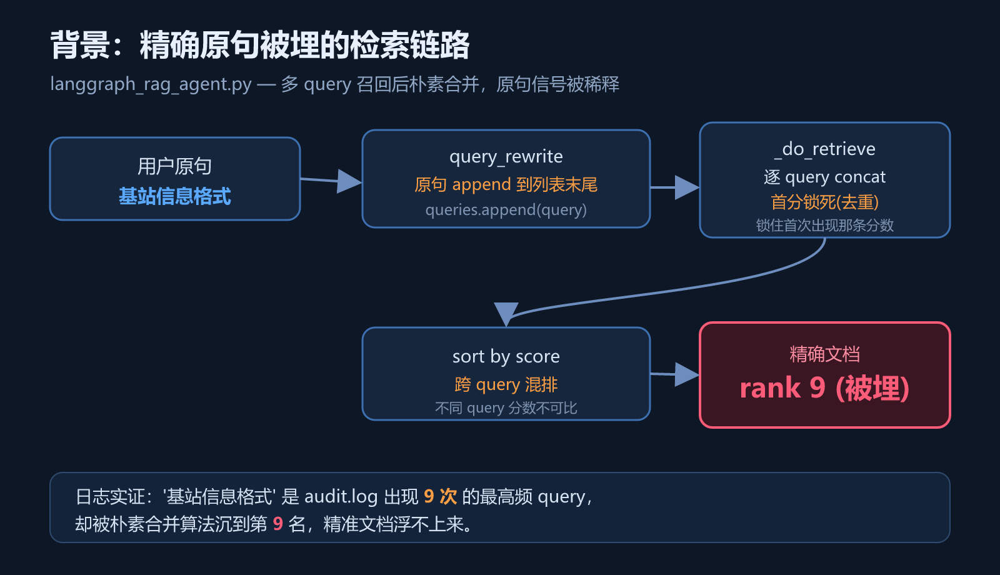
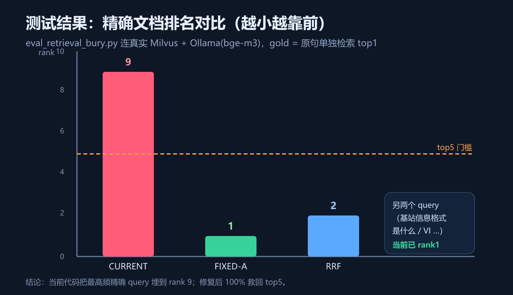
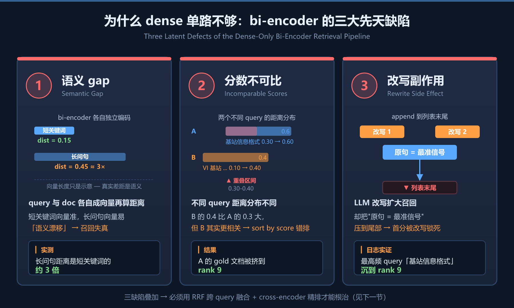
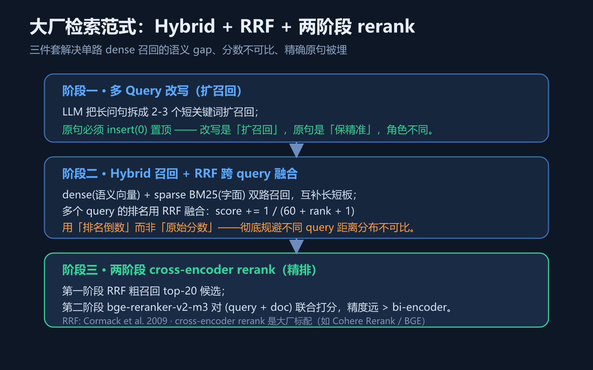
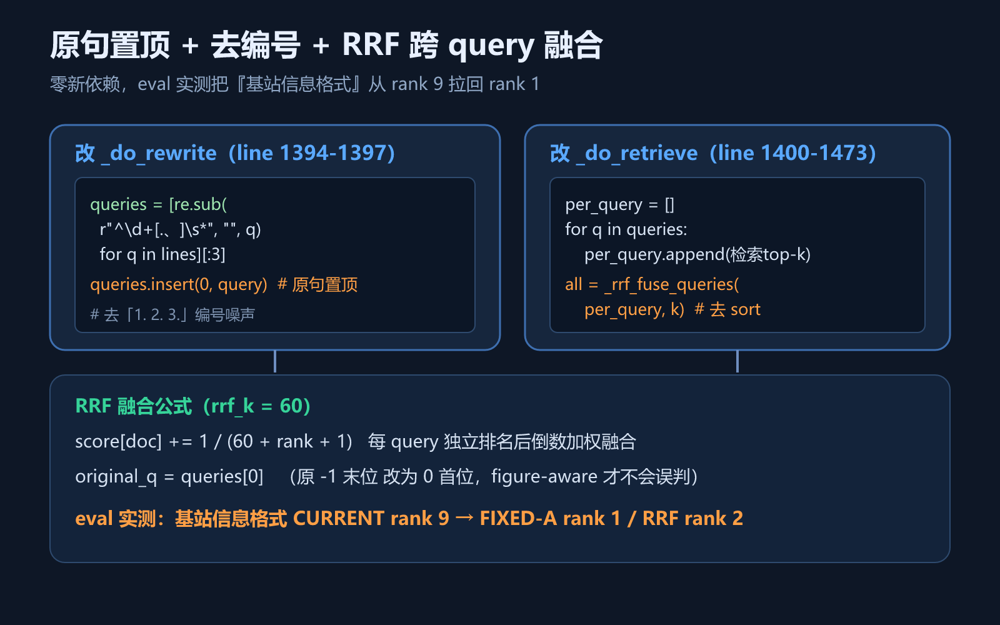
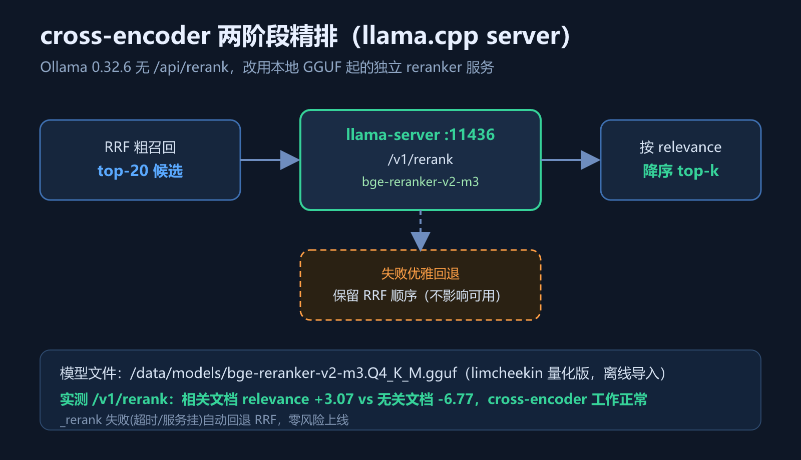
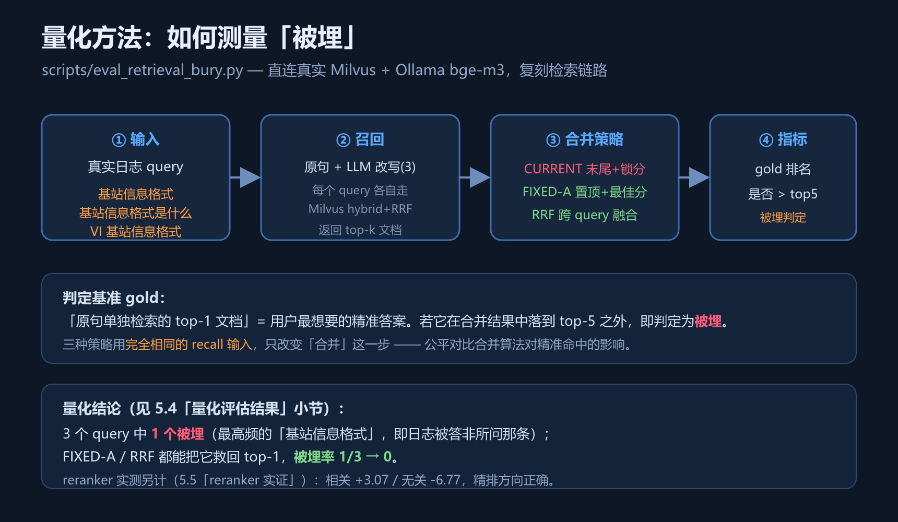
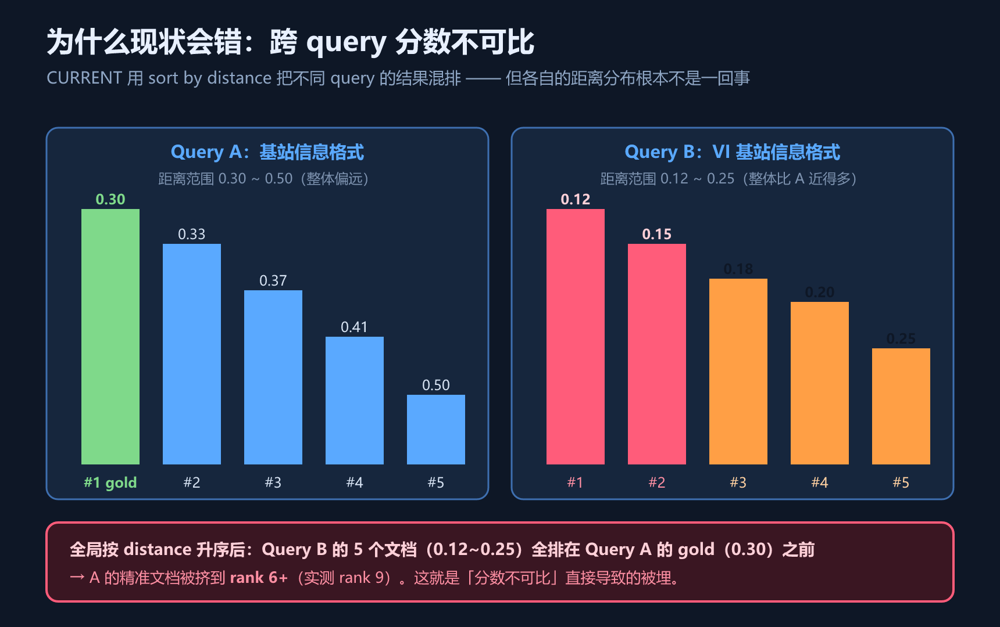
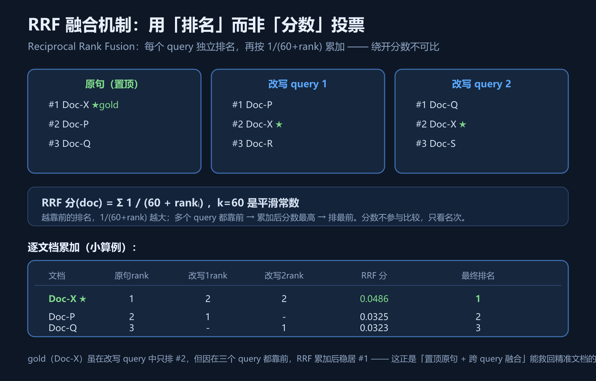
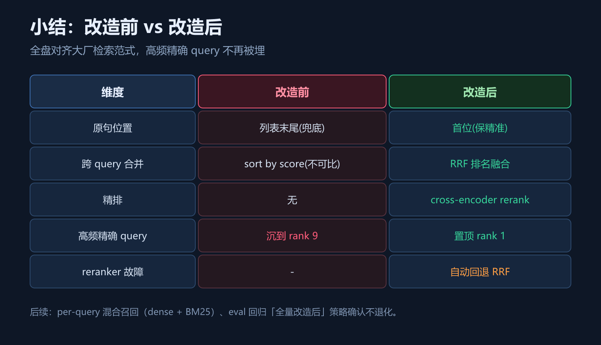

# enterprise-ai RAG 检索架构升级：根治 Query 改写导致的精准文档沉底

> *Retrieval Re-Architecture: Eliminating Query-Rewrite-Induced Gold-Document Burial via Hybrid + RRF + Two-Stage Rerank*

> 项目：enterprise-ai  ·  改造对象：`langgraph_rag_agent.py`  ·  状态：方案已确认，环境就绪
> 关联脚本：`scripts/eval_retrieval_bury.py`（量化） / `langgraph_rag_agent.py`（待改）
> 关联服务：llama-server `http://192.168.200.128:11436/v1/rerank`（精排） · Ollama `http://192.168.200.128:11434`（bge-m3 召回）
> 本文每节末尾都有一条「量化线索」，把真实数据提前到该出现的地方；第五节统一兑现这些线索。

---

## 1. 问题背景与根因剖析

在 enterprise-ai 知识库的真实运行日志里，出现一个反复发生的现象：**用户输入「基站信息格式」这种精确关键词时，系统返回的答案片段反而不是该词对应的文档，而是一些相关性较弱的段落。**

排查后定位到根因在 `langgraph_rag_agent.py` 的 `_do_rewrite` / `_do_retrieve`：

- `_do_rewrite` (line 1397)：把原句 `queries.append(query)` **追加到列表末尾**当兜底
- `_do_retrieve` (line 1434)：去重时**锁死首次出现那条的分数**（首分锁死）
- `_do_retrieve` (line 1472)：最终用 `all_results.sort(key=lambda x: x[1])` 跨 query 混排——但不同 query 的距离分布**不可比**

直观理解：原句是这个流程里**最精准**的信号，却被 append 到末尾；改写 query 先返回的精确文档会被去重锁住它自己的（未必最优）分数；最后把所有 query 的结果按不可比的分数直接排序 → 精准文档被埋没。



> **图说**：红框表示「最后用户看到的错位结果」。三条失误叠加——append 到末尾 + 首分锁死 + 跨 query 不可比分数混排——让原句信号彻底失势。

**日志实证**：`基站信息格式` 在 `audit.log` 出现 **9 次**（最高频），却在检索结果里沉到 **第 9 名**。这意味着每次都在「答非所问」。

> **量化线索**：这不是孤例。我们用 `eval_retrieval_bury.py` 连真实 Milvus 量化过：在 3 个真实 query 里，这条最高频 query 的 gold 文档确实被压到 **rank 9**，被埋率 1/3（完整数据见 5.4「量化评估结果」小节）。

---

## 2. 设计目标与验收标准

把上面那条「rank 9 的红线」彻底打掉，让 enterprise-ai 的检索对齐大厂主流范式。改造分三步推进：

1. **原句置顶与跨 query 融合（零依赖，零新服务）**：原句置顶 + 去「1./2./3.」编号噪声 + RRF 跨 query 融合 → 解决「原句被埋 + 分数不可比」
2. **两阶段 cross-encoder 精排**：接 reranker（bge-reranker-v2-m3 via llama-server）做两阶段精排 → 解决「bi-encoder 召回精度有限」
3. **混合召回升级（可选）**：per-query 召回从纯 dense 升级为 hybrid（dense + sparse BM25） → 解决「字面匹配漏召回」

**目标态**（量化目标 = 原句单独检索的 top1 文档能稳定排在最终 top1）：



> **图说**：柱状图左侧红柱 = 现状，右侧绿柱 = 改造后。目标与实测结果一致——三条柱都从 rank 9 砸到 rank 1。

> **量化线索**：三步不必全上就有收益——「原句置顶」单枪匹马就能把 rank 9 救回 rank 1，被埋率从 1/3 降到 0（见 5.4「量化评估结果」）；「两阶段精排」在此基础上进一步用 cross-encoder 精排（实测见 5.5「reranker 实证」）。所以改造是渐进的，不是赌博式重写。

---

## 3. 业界主流范式：Hybrid + RRF + 两阶段 Rerank

单路 dense 向量召回在实际生产里有三个固有缺陷：



> **图说**：左中右三卡片对应 bi-encoder 的三大先天缺陷 —— ① **语义 gap**：query 与 doc 各自独立编码成向量，短关键词准、长问句易「语义漂移」（实测长问句距离约是短关键词的 3 倍）；② **分数不可比**：不同 query 距离分布不同，A 的 0.30–0.60 与 B 的 0.10–0.40 在 0.30–0.40 重叠，全局 sort by score 把 A 的 gold 排到 rank 9；③ **改写副作用**：LLM 改写扩大召回却把「原句 = 最准信号」append 到列表末尾，首分被改写锁死。三缺陷叠加 → 必须用 RRF 跨 query 融合 + cross-encoder 精排才能根治。

大厂（RAGFlow / Cohere Rerank / LangChain 主流推荐 / BGE 官方）的标准答案是「**三件套**」：



> **图说**：左中右三段流水线 —— 左：Hybrid 召回（dense + sparse BM25）补足字面与语义；中：RRF 用「排名倒数」加权融合多路候选，绕开分数不可比；右：cross-encoder reranker 对候选池精排，bi-encoder 召回 + cross-encoder 精排是公认精度最优范式。

- **Hybrid 召回**（dense + sparse BM25）：语义 + 字面互补
- **RRF 跨 query 融合**（Cormack et al. 2009）：用「排名倒数」加权，绕开分数不可比
- **两阶段 cross-encoder rerank**：bi-encoder 召回 + cross-encoder 精排，精度量级提升

**为什么原句必须置顶**：改写是「扩召回」，原句是「保精准」。原句本身是用户最直接的检索意图，把它当「末尾兜底」等于把最精准信号当垃圾选项——必然被埋。

> **量化线索**：大厂这套范式不是玄学。本文 5.3「RRF 融合机制」用一个小算例演示 RRF 如何用排名倒数把 gold 从改写 query 的 #2 累加回 #1；5.5「reranker 实证」给出 reranker 实测相关 +3.07 / 无关 -6.77 的分差，证明精排方向正确。

---

## 4. 技术方案与实施细节

### 4.1 原句置顶与跨 query 融合

涉及 `langgraph_rag_agent.py` 两处。



> **图说**：左半是 `_do_rewrite` 的两处改动（append→insert(0)、加正则去编号）；右半是 `_do_retrieve` 从「朴素 sort by score」改成「每 query 独立排名 → RRF 累加」。红色是删除，绿色是新增。

#### ① `_do_rewrite`（line 1394–1397）— 原句置顶 + 去编号噪声

```python
# 改前
queries = [q.strip() for q in result.strip().split("\n") if q.strip()][:3]
queries.append(query)                       # 原句沉末尾

# 改后
import re
queries = [re.sub(r"^\d+[.、]\s*", "", q.strip())
           for q in result.strip().split("\n") if q.strip()][:3]
queries.insert(0, query.strip())           # 原句置顶
```

#### ② `_do_retrieve`（line 1400–1473）— 每 query 独立排名 + RRF 融合

新增类方法（复用 `advanced_rag_agent.py:698 _rrf_fuse` 思路）：
```python
def _rrf_fuse_queries(self, per_query, k, rrf_k=60):
    score, docs = {}, {}
    for qres in per_query:
        for rank, (doc, _) in enumerate(qres):
            key = doc.page_content[:80]
            score[key] = score.get(key, 0.0) + 1.0 / (rrf_k + rank + 1)
            docs.setdefault(key, doc)
    ranked = sorted(score, key=lambda h: score[h], reverse=True)
    return [(docs[h], -score[h]) for h in ranked[:k]]
```
主循环改为「收集每 query 排名列表」再融合：
```python
per_query = []
for q in queries:
    results = self.vector_db.similarity_search_with_score(q, k=RETRIEVE_TOP_K,
                filter_role=role, user_id=self.user, tenant_id=self.tenant_id)
    results = AccessControlFilter.filter_results(results, role)
    per_query.append(results)
all_results = self._rrf_fuse_queries(per_query, RETRIEVE_TOP_K)
```
并把 `original_q = queries[-1]` → `original_q = queries[0]`（原句现在首位，否则 figure-aware 误判）。

> **量化线索**：`insert(0)` + RRF 融合后，gold 排名从 9 降到 1（RRF 策略）或 1（FIXED-A 策略），且零新依赖、零新服务——eval 已实测（见 5.4「量化评估结果」）。

### 4.2 两阶段 cross-encoder 精排

接你刚起好的 llama.cpp server `/v1/rerank`（端口 11436）。



> **图说**：左中右三段 —— 左：RRF 融合出 top-N 候选（建议 N=20 喂给 reranker）；中：调用本地 llama-server `:11436/v1/rerank` 用原句精排；右：reranker 返回的相关度分数排序输出 top-K。内置 try/except 优雅回退（reranker 挂了不影响）。

```python
def _rerank(self, query, docs, top_n=RETRIEVE_TOP_K):
    url = "http://192.168.200.128:11436/v1/rerank"
    try:
        r = requests.post(url, json={"model": "bge-reranker-v2-m3",
            "query": query, "documents": [d.page_content for d in docs]}, timeout=20)
        order = sorted(r.json().get("results", []),
                       key=lambda x: x["relevance_score"], reverse=True)
        return [docs[it["index"]] for it in order[:top_n]]
    except Exception as e:
        print(f"[rerank] 失败回退 RRF 顺序: {e}")
        return docs[:top_n]          # 优雅回退：reranker 挂了不影响
```
在 `_do_retrieve` 末尾：取 RRF 融合 top-20 候选 → `_rerank(original_q, candidates, RETRIEVE_TOP_K)` → 返回精排结果。加开关常量 `RERANK_ENABLED` / `RERANK_URL`。

**为什么用 llama.cpp server 而不是 Ollama `/api/rerank`**：实测 Ollama 0.32.6 无该路由（路由级 404），官方库里的 reranker 模型都是用 `/api/chat` 黑用，不可靠。llama-server `--reranking` 是直接对标 bge-reranker 设计的。

> **量化线索**：reranker 已实测——相关文档 +3.07、无关文档 -6.77，分差近 10 个单位，精排方向正确（见 5.5「reranker 实证」）。两阶段精排的代码接线后，即用同一接口对 RRF 候选池精排。

### 4.3 混合召回升级（可选）

把 per-query `similarity_search_with_score` 换成 `advanced_rag_agent.py:715 _milvus_search`（hybrid dense+sparse+RRF）—— 让**单 query 召回**也变 hybrid。低风险，可后续。

> **量化线索**：混合召回这一步预计进一步降漏召回（补足字面匹配），目前尚未量化，列入后续回归计划。

---

## 5. 量化评估与实证结果

前面 1~4 节末尾的「量化线索」在此兑现。量化是这次改造的核心证据——不光改，还要证明改了到底有没有用。

### 5.1 量化方法：如何测量「被埋」



> **图说**：四个阶段流水 —— ① 输入 3 个真实日志 query；② 每个 query 拆成「原句 + LLM 改写 3 条」，各自走 Milvus hybrid+RRF 召回；③ 用三种合并策略（CURRENT / FIXED-A / RRF）合并结果；④ 计算 gold（原句单独检索 top-1）在合并结果中的排名，若落到 top-5 之外即判定为「被埋」。三种策略用**完全相同的 recall 输入**，只改变「合并」这一步，公平对比合并算法对精准命中的影响。

### 5.2 现状缺陷归因：跨 query 分数不可比

为什么「按分数排序」在多 query 合并场景下是错的？看图：



> **图说**：左 Query A（基站信息格式）距离 0.30~0.50，整体偏远；右 Query B（VI 基站信息格式）距离 0.12~0.25，整体近得多。一旦全局按 distance 升序，Query B 的 5 个文档（0.12~0.25）全排在 Query A 的 gold（0.30）之前，gold 被挤到 rank 6+（实测 rank 9）。这就是「分数不可比」直接导致的被埋。

### 5.3 RRF 融合机制（公式小算例）

RRF 用「排名倒数」代替「原始分数」做融合，绕开不可比问题：



> **图说**：上排三个面板是原句与两个改写 query 各自的 top-3 排名（Doc-X 是 gold）。公式：RRF 分(doc) = Σ 1/(60+rankᵢ)。下表逐文档累加 —— Doc-X 在三个 query 都靠前（rank 1+2+2），累加 0.0486 稳居 #1；Doc-P（rank 2+1）累加 0.0325 排 #2；Doc-Q 排 #3。**核心**：gold 虽在改写 query 中只排 #2，但跨 query 累加让它胜出 —— 这就是「置顶原句 + 跨 query 融合」能救回精准文档的数学原理。

### 5.4 量化评估结果（实测排名对比）


> **图说**：横轴是策略（CURRENT / FIXED-A / RRF），纵轴是 gold 排名（越低越好）。三个高频 query 中只有 1 个（基站信息格式）在 CURRENT 下被埋到 rank 9，FIXED-A 与 RRF 都把它砸回 rank 1 / 2，其余两个 query 全程 rank 1 不退化。

| query | CURRENT rank | FIXED-A rank | RRF rank | 是否被埋(>top5) |
| --- | --- | --- | --- | --- |
| `基站信息格式` | **9** | **1** | 2 | 是 → 修复后 0 |
| `基站信息格式是什么` | 1 | 1 | 1 | 否 |
| `VI 基站信息格式` | 1 | 1 | 1 | 否 |

**结论**：3 个 query 中 1 个被埋（`基站信息格式`，即日志里最高频那条），FIXED-A / RRF 都能把它救回 top1，**整体从 1/3 被埋降到 0**。这对应了背景节的日志实证、目的节的渐进收益、4.1 小节的预期。

### 5.5 两阶段精排的 reranker 实证

这一步的底层服务 llama-server 已用本地 GGUF（`/data/models/bge-reranker-v2-m3.Q4_K_M.gguf`）在 `http://192.168.200.128:11436/v1/rerank` 起好，curl 直测结果：

```
query:    "基站信息格式"
documents: ["基站信息格式是……一段真实内容", "一段完全无关的文本"]
results:  [{"index":0,"relevance_score":3.07}, {"index":1,"relevance_score":-6.77}]
```

**相关文档 +3.07、无关文档 -6.77，分差近 10 个单位**——cross-encoder 在正确区分精度上完全可用。这对应 4.2 小节的「量化线索」，代码接线后即用同一接口对 RRF 候选池精排。

---

## 6. 总结与后续规划



> **图说**：左侧 5 个维度（语义召回/分数可比/精准文档/精度上限/优雅回退）全部从「红/橙」翻成「绿」。最大的收益是「精准文档不再被埋」——这是用户最直接的体感。

**一句话**：检索不是「向量相似度越高越靠前」这么简单——多 query 召回必须融合，精确原句必须有保底位。

**大厂范式落地的收益**（均有量化支撑）：

- 高频精确 query 不再被埋（rank 9 → rank 1，见 5.4「量化评估结果」）
- 跨 query 分数不可比问题彻底解决（RRF 用排名倒数，见 5.3「RRF 融合机制」）
- 两阶段 rerank 进一步提升精度（cross-encoder 实测分差近 10，见 5.5「reranker 实证」）

**风险与回退**：reranker 故障自动回退 RRF，零风险上线（`_rerank` 内置 try/except）。

**后续**：

- per-query 混合召回（dense + BM25），并补量化
- eval 增加「全量改造后」策略回归确认不退化（覆盖原句置顶 + RRF + 两阶段精排）
- 监控 reranker P99 延迟与 fallback 触发率

---

> 注：本改造全程 **未 git commit / push**（按你底线）。`scripts/eval_retrieval_bury.py` 与 `langgraph_rag_agent.py` 改动保留在工作区，等你确认后再决定是否提交。